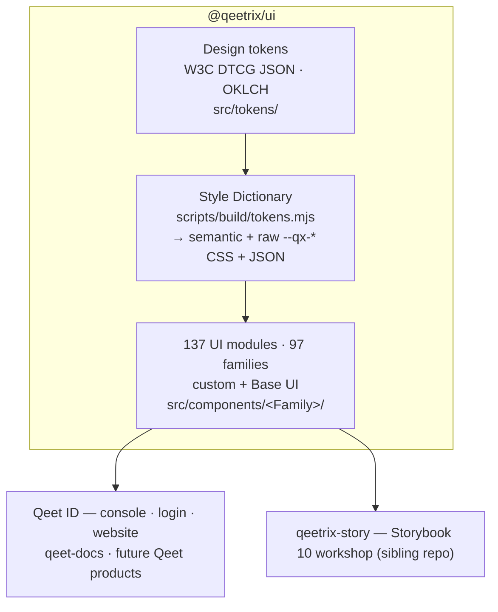

<div align="center">

# 🎨 Qeetrix

### The Qeet Group design system — one package, every surface

*Premium · Accessible · Token-driven · Built on Base UI + Tailwind v4*

<br>

[](./.github/workflows/ci.yml)
[](https://react.dev)
[](https://tailwindcss.com)
[](https://base-ui.com)
[](https://storybook.js.org)
[](https://bun.sh)

**[🚀 Install](#-install--use)** · **[🏗 Architecture](#-architecture)** · **[🧩 Components](#-whats-inside)** · **[🎨 Tokens](#-design-tokens)** · **[📖 Storybook](#-develop)** · **[🚢 Release](#-release)**

</div>

---

<div align="center">

| 🧩 137 UI modules | 📦 1 install | 🎨 WCAG-AA tokens | 🌗 Light + dark | ⚛️ React 19 |
|:---:|:---:|:---:|:---:|:---:|
| shadcn + Base UI | `@qeetrix/ui` | OKLCH · Style Dictionary | `.dark` class | Tailwind v4 |

</div>

> **Status — 1.0.3, standalone.** Tokens + brand ship inside `@qeetrix/ui`. Already a live dependency of **Qeet ID** (console · login · website) and **qeet-docs**.

---

## ✨ Why Qeetrix

|  |  |
|:--|:--|
| 📦 **One design-system package** | `@qeetrix/ui` ships components **+ design tokens + brand**; React 19 and Tailwind 4 remain explicit peers |
| ♿ **Accessible by construction** | Built on **Base UI** (WAI-ARIA APG behavior) + axe-tested stories; visible focus, reduced-motion, AA contrast |
| 🎨 **Token-driven theming** | W3C DTCG JSON → Style Dictionary → CSS + JSON; OKLCH colour, light/dark via the `.dark` class |
| 💎 **Premium by default** | Layered elevation, refined focus rings, tasteful hover-lift micro-interactions, self-hosted Cal Sans |
| 🌗 **First-class dark mode** | Every component themed through semantic tokens — no hard-coded greys |
| 🏢 **Enterprise breadth** | Data tables, command palette, rich-text editor, charts, sidebar shells, date/time pickers, and more |
| 🧱 **Consistent foundation** | Shared `cva` + `cn()` conventions, `data-slot` hooks, tree-shakeable named exports |
| 🔒 **Quality-gated** | Typecheck, Biome, Vitest + axe, real-browser tests, coverage, WCAG contrast, architecture, API, manifest, bundle and performance gates — all on every PR |

---

## 🏗 Architecture

A **standalone Bun package**. Tokens are the source of truth; everything downstream is generated or composed from them. Components live in `src/components/<Family>/`, but the *published* import paths stay flat — `dist` carries a generated façade, so a component can move family without breaking a single consumer.



**Build pipeline:** `clean` → `tokens` (Style Dictionary) → `manifest` → `tsc` → `tsc-alias` → `subpath-shims` → `postbuild` (CSS entry, fonts, tokens, manifest).

### Source layout

```
src/
├── tokens/            DTCG token source — primitive · semantic · component · theme overlays
├── components/        97 family folders (Accordion/, Button/, …), each with index.ts + __tests__/
├── internal/          helpers several families share; never imported by consumers
├── contracts/         component contract: types + closed vocabularies + the layer table
├── manifests/         the manifest's type, and the declarations it is generated from
├── providers/         theme · density · direction · messages
├── blocks/ patterns/  copy-paste blocks and patterns built on the package — never published
├── hooks/ lib/        public hooks and helpers; lib/token-values.ts is GENERATED from src/tokens/
├── runtime/ fonts/
├── styles/            index.css (entry) + generated token CSS/JSON
└── __tests__/         global harness: setup, axe smoke, SSR, hydration, token governance
scripts/
├── build/             tokens · manifest · subpath-shims · postbuild · clean
├── config/            component-map (family → slugs) · themes
└── lib/               shared analysis: layer graph, token graph, TS literal reader, component source
docs/
├── architecture/      overview · component-layers · dependency-rules
├── standards/         component API, manifest, tokens, accessibility, testing, …
└── governance/        component status · deprecations · versioning · release
```

Layers flow one way — `tokens → runtime / internal → components`, with blocks and patterns on top of the package entry — and
dependencies are **deny by default**. The allow-list lives in [`src/contracts/layers.ts`](src/contracts/layers.ts).
No check enforces it at the moment (the architecture checker was removed with the other
`scripts/check/` scripts), so it is a reviewed contract rather than a gate. See
[docs/architecture/](docs/architecture/overview.md).

### Import paths

Every published path is **enumerated** in the `exports` map — there are no wildcards over
`hooks/`, `lib/`, `providers/` or `blocks/`, so a new module in one of those folders is internal
until someone adds it to the map. The build's subpath-shim step fails on a compiled component
module the map does not name; nothing tests the packed tarball itself.

| Specifier | Resolves to |
|:--|:--|
| `@qeetrix/ui` | the full barrel — every component, provider and helper |
| `@qeetrix/ui/components/button` | one component — **stable regardless of its family folder** |
| `@qeetrix/ui/components/Pagination` | a whole family (`Pagination`, `PaginationBar`) |
| `@qeetrix/ui/providers` · `/providers/theme-provider` | the providers |
| `@qeetrix/ui/hooks/use-media-query` · `/use-mobile` · `/use-motion` · `/use-prefers-reduced-motion` | the public hooks (also on the barrel) |
| `@qeetrix/ui/lib/utils` · `/motion` · `/responsive` · `/token-values` | the public helpers (also on the barrel) |
| `@qeetrix/ui/styles.css` · `/qeetrix.css` · `/tokens.css` · `/tokens.json` | styles + tokens |
| `@qeetrix/ui/manifest.json` | the machine-readable component catalog + governance contract |
| `@qeetrix/ui/components/ui/button` | legacy pre-1.0 path, kept resolvable |

**Not published** — these resolve to nothing, deliberately:
`@qeetrix/ui/hooks/use-controllable-state` (it is on the barrel) and anything under
`contracts/`, `manifests/`, `runtime/` or `internal/`.

**Resolvable but unsupported** — the `components/*` wildcard also reaches
`@qeetrix/ui/components/<Family>/<slug>` and `@qeetrix/ui/components/index`. The family folder is
an implementation detail: use the flat `components/<slug>` path, or the barrel.

---

## 🚀 Install & use

```bash
bun add @qeetrix/ui react react-dom tailwindcss
# peers: React/React DOM >=19, Tailwind CSS >=4
```

In your Tailwind v4 global stylesheet:

```css
@import "@qeetrix/ui/styles.css";              /* tokens + fonts + base layer */
@source "../node_modules/@qeetrix/ui/dist/**/*.js";   /* let Tailwind see component classes */
```

Then wrap the app and compose:

```tsx
import { ThemeProvider, Button, Card, CardContent } from "@qeetrix/ui";
import { QeetLogo } from "@qeetrix/icons";

export function App() {
  return (
    <ThemeProvider defaultTheme="system">
      <Card>
        <CardContent className="flex items-center gap-3">
          <QeetLogo height={28} aria-label="Qeet" />
          <Button>Authenticate with Qeet</Button>
        </CardContent>
      </Card>
    </ThemeProvider>
  );
}
```

Light/dark is driven by the `.dark` class (managed by `ThemeProvider`). Its keyboard shortcut is disabled by default; `enableKeyboardShortcut` opts into `Ctrl/Meta+Shift+D`. Need raw values? `@qeetrix/ui/tokens.css` (the `--qx-*` ramp) and `@qeetrix/ui/tokens.json`.

**Import surfaces:** see the table in [Architecture](#-architecture). The pre-1.0 `@qeetrix/ui/components/ui/<slug>` path still resolves.

---

## 🧩 What's inside

> 137 React UI modules across 97 families; **every one** has a Vitest/axe test in its family's `__tests__/`, and stories cover the public catalog.

- **Overlays** — Dialog · Sheet · Drawer · Popover · DropdownMenu · ContextMenu · Menubar · HoverCard · Tooltip · CommandPalette · NavigationMenu
- **Inputs & controls** — Button · Input · Textarea · Select · Combobox · MultiSelect · Autocomplete · Checkbox · Radio · Switch · Toggle · Slider · AngleSlider · OTPInput · NumberField · Field / Form · Chip · SegmentedControl · ColorPicker · Date / Time / Timezone pickers
- **Data & navigation** — Table · DataTable · Tabs · Breadcrumb · Pagination · Sidebar · Tree · Timeline · Accordion · Collapsible · Listbox · TableOfContents · Carousel · Charts
- **Enterprise operations** — accessible ChartDataTable fallbacks · responsive ScheduleCalendar agenda · CopyableSecret · DataState
- **Feedback & surfaces** — Card · Alert · Banner · Notification · Toast · Stat · Badge · StatusPill · Skeleton · Progress · Meter · EmptyState · Feed · Spoiler · Marquee
- **Content & typography** — Typography / Prose · Blockquote · Highlight · Kbd · CodeBlock · JSONTree · RichTextEditor · NumberFormatter · RollingNumber
- **Brand** — the Qeet logos come from [`@qeetrix/icons`](https://www.npmjs.com/package/@qeetrix/icons) (`QeetLogo`, `QeetWordmarkLogo`), like every other icon
- **Blocks & patterns** — copy-paste source in [`src/blocks/`](./src/blocks) and [`src/patterns/`](./src/patterns), built from these components and not part of the package: access review, audit event, comment thread, logo uploader, notification center, notification preferences, security item; master–detail

---

## 🎨 Design tokens

The single source of truth lives in [`src/tokens/`](src/tokens/) as **W3C DTCG JSON**, in four layers — **primitive** (values) → **semantic** (meaning) → **component** (per-component mapping, including the shadcn bridge) → component styles. [Style Dictionary](scripts/build/tokens.mjs) compiles them to:

- `@qeetrix/ui/styles.css` — the full entry (`:root` / `.dark`, `@theme` mappings, fonts, base layer)
- `@qeetrix/ui/qeetrix.css` — the semantic + component layers, as `--qx-*` vars
- `@qeetrix/ui/tokens.css` — everything including the primitive ramps · `@qeetrix/ui/tokens.json` — resolved per theme
- `src/lib/token-values.ts` — the few values JavaScript reads (durations, easings, icon sizes, component geometry), typed and generated; published as `@qeetrix/ui/lib/token-values`

The **primitive layer is not published to the stylesheet components render against**, so a component physically cannot resolve a palette value — the ownership rule is a fact, not a convention. Full detail: [docs/standards/tokens.md](docs/standards/tokens.md).

Colour is authored in **OKLCH**; elevation uses a **layered shadow ladder** (rest · hover · popover · modal). Every semantic text/surface pair is held to **WCAG-AA contrast** in both themes by the token-governance test (part of `bun run test`).

Re-branding is one alias hop: re-point the thirteen `color.brand.*` aliases and every semantic token, component token and component follows. Retuning corners is one variable (`--radius`).

---

## 🛠 Develop

**Toolchain:** Node ≥ 20 · **Bun ≥ 1.3**.

```bash
bun install
bun run dev              # regenerate tokens, then tsc --watch
bun run build            # tokens → manifest → tsc → aliases → subpath shims → assets
bun run typecheck        # the package, all of src (tests, blocks, patterns) and the playground
bun run lint             # Biome: format and lint
bun run test             # Vitest + vitest-axe
bun run playground       # the component workbench
bun run format           # biome check --write
```

CI ([`ci.yml`](.github/workflows/ci.yml)) runs `build`, `typecheck`, `lint` and `test` on pushes to
`main` and on every pull request. What those hold:

| Command | Enforces |
|:--|:--|
| `lint` | formatting and lint rules; blocks and patterns import only `@qeetrix/ui` and the `@qeetrix/icons` root |
| `typecheck` | types across the package, every test, the blocks, the patterns and the playground |
| `test` | each component's suite (behaviour plus an axe check), SSR and hydration, the token graph and WCAG-AA contrast in both themes (`token-governance.test.ts`), and a playground example for every manifest module |
| `build` | the manifest generates, and no compiled component module is missing from `scripts/config/component-map.json` |

Not enforced by anything today: the layer boundaries, a public-API lock, a scan for raw values in
component source, the packed-tarball contents, bundle budgets and coverage floors. Their scripts
under `scripts/check/` were removed on 2026-08-23.

**Adding a component?** Create `src/components/<Family>/<slug>.tsx` (`cva` + `cn()`, `data-slot`, Base UI for anything interactive), list the slug under its family in [`scripts/config/component-map.json`](scripts/config/component-map.json), export it from the family's `index.ts`, add `__tests__/<slug>.test.tsx` with an axe check, declare its status + ARIA pattern in [`src/manifests/component-registry.ts`](src/manifests/component-registry.ts), add a playground example, then run `bun run build && bun run typecheck && bun run lint && bun run test`. Raise the version and add the changelog entry. See [CONTRIBUTING.md](./CONTRIBUTING.md) and [docs/standards/component-api.md](docs/standards/component-api.md).

---

## 🚢 Release

Releasing is merging — the same flow as `@qeetrix/icons`, in three workflows
([docs/governance/release.md](docs/governance/release.md)):

| Workflow | Trigger | What it does |
|:--|:--|:--|
| [`version.yml`](.github/workflows/version.yml) | PR opened or pushed | Bumps the patch version on your branch, unless you already raised it |
| [`release.yml`](.github/workflows/release.yml) | Merge to `main` | Runs build · typecheck · lint · test, publishes to npm, **then** tags `vX.Y.Z` and opens a GitHub Release |
| [`rollback.yml`](.github/workflows/rollback.yml) | Manual | Points npm's `latest` back at an older version |

For a **minor or major**, set `version` in `package.json` by hand in the PR; the bump leaves a
raised version alone. A merge that does not change the version publishes nothing, and there is no
`bun run release`.

**Supported development environments: macOS and Linux.** The scripts use Node's filesystem and
path APIs rather than a POSIX shell, but only Linux is exercised in CI, so Windows is unverified
rather than supported.

---

## 📚 Documentation · 🤝 Contributing · 📄 License

| Topic | Where |
|:--|:--|
| 🏗 Architecture · layers · dependency rules | [docs/architecture/](docs/architecture/overview.md) |
| 📐 API conventions · manifest schema | [docs/standards/](docs/standards/component-api.md) |
| 🎨 Tokens · theming · density · motion · RTL | [docs/standards/tokens.md](docs/standards/tokens.md) |
| 🏛 Component status · deprecation · versioning | [docs/governance/](docs/governance/component-status.md) |
| 🧱 Component workshop | the sibling `qeetrix-story` repo → <http://localhost:6006> |
| 🗺 Component backlog | the sibling `qeetrix-files` repo → `COMPONENT-PROPOSALS.md` |
| 🔧 Contributing | [CONTRIBUTING.md](./CONTRIBUTING.md) |

Part of the **Qeet Group** workspace. Licensed **UNLICENSED** (private to Qeet Group) pending the
public-release decision, although the package is published publicly on npm — see
[docs/governance/release.md](docs/governance/release.md#open-decisions).

