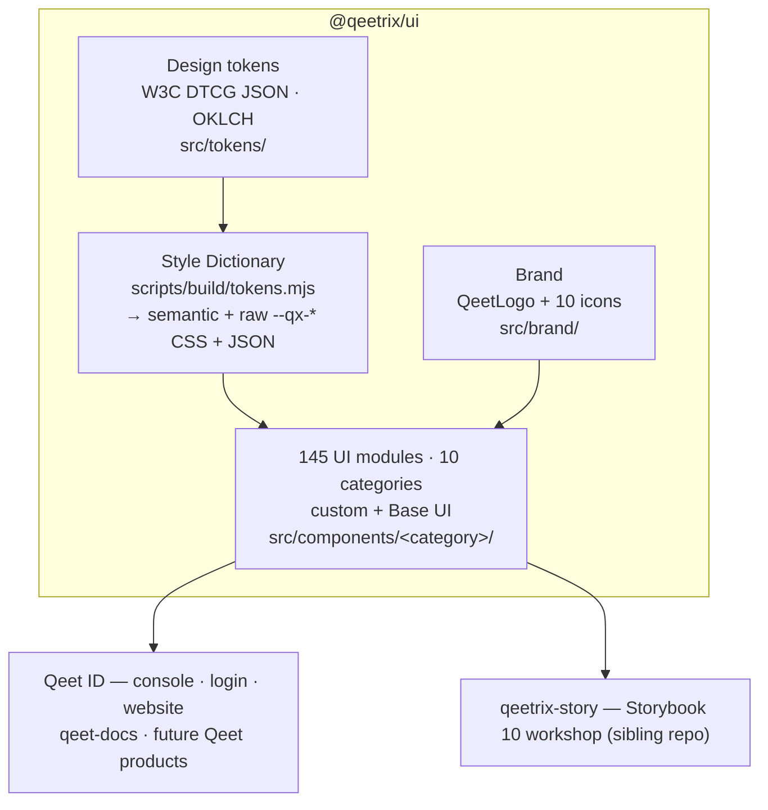

<div align="center">

# 🎨 Qeetrix

### The Qeet Group design system — one package, every surface

*Premium · Accessible · Token-driven · Built on Base UI + Tailwind v4*

<br>

[](./.github/workflows/ci.yml)
[](https://react.dev)
[](https://tailwindcss.com)
[](https://base-ui.com)
[](https://storybook.js.org)
[](https://bun.sh)

**[🚀 Install](#-install--use)** · **[🏗 Architecture](#-architecture)** · **[🧩 Components](#-whats-inside)** · **[🎨 Tokens](#-design-tokens)** · **[📖 Storybook](#-develop)** · **[🚢 Release](#-release)**

</div>

---

<div align="center">

| 🧩 145 UI modules | 📦 1 install | 🎨 WCAG-AA tokens | 🌗 Light + dark | ⚛️ React 19 |
|:---:|:---:|:---:|:---:|:---:|
| shadcn + Base UI | `@qeetrix/ui` | OKLCH · Style Dictionary | `.dark` class | Tailwind v4 |

</div>

> **Status — 1.0.3, standalone.** Tokens + brand ship inside `@qeetrix/ui`. Already a live dependency of **Qeet ID** (console · login · website) and **qeet-docs**.

---

## ✨ Why Qeetrix

|  |  |
|:--|:--|
| 📦 **One design-system package** | `@qeetrix/ui` ships components **+ design tokens + brand**; React 19 and Tailwind 4 remain explicit peers |
| ♿ **Accessible by construction** | Built on **Base UI** (WAI-ARIA APG behavior) + axe-tested stories; visible focus, reduced-motion, AA contrast |
| 🎨 **Token-driven theming** | W3C DTCG JSON → Style Dictionary → CSS + JSON; OKLCH colour, light/dark via the `.dark` class |
| 💎 **Premium by default** | Layered elevation, refined focus rings, tasteful hover-lift micro-interactions, self-hosted Cal Sans |
| 🌗 **First-class dark mode** | Every component themed through semantic tokens — no hard-coded greys |
| 🏢 **Enterprise breadth** | Data tables, command palette, rich-text editor, charts, sidebar shells, date/time pickers, and more |
| 🧱 **Consistent foundation** | Shared `cva` + `cn()` conventions, `data-slot` hooks, tree-shakeable named exports |
| 🔒 **Quality-gated** | Typecheck + ESLint + Vitest/axe + WCAG contrast + Storybook build run in CI on every PR |

---

## 🏗 Architecture

A **standalone Bun package**. Tokens are the source of truth; everything downstream is generated or composed from them. Components live in `src/components/<category>/`, but the *published* import paths stay flat — `dist` carries a generated façade, so a component can move category without breaking a single consumer.



**Build pipeline:** `clean` → `tokens` (Style Dictionary) → `manifest` → `tsc` → `tsc-alias` → `subpath-shims` → `postbuild` (CSS entry, fonts, tokens, manifest).

### Source layout

```
src/
├── tokens/            DTCG token source (primitive + light/dark theme)
├── components/        11 category folders, each with index.ts + __tests__/
│   ├── actions/ inputs/ selection/ pickers/ navigation/
│   └── feedback/ surfaces/ data-display/ layout/ utility/
├── providers/         theme · density · direction
├── blocks/ brand/ hooks/ lib/ fonts/
├── styles/            index.css (entry) + generated token CSS/JSON
└── __tests__/         global harness: setup, a11y smoke, client boundaries, API lock
scripts/
├── build/             tokens · manifest · subpath-shims · postbuild · logos
└── check/             architecture · exports · a11y-coverage · token-usage · contrast · package
```

### Import paths

| Specifier | Resolves to |
|:--|:--|
| `@qeetrix/ui` | the full barrel (680 exports) |
| `@qeetrix/ui/components/button` | one component — **stable regardless of its category** |
| `@qeetrix/ui/components/actions` | a whole category |
| `@qeetrix/ui/providers` · `/providers/theme-provider` | the providers |
| `@qeetrix/ui/brand` · `/blocks` | brand assets · page-level blocks |
| `@qeetrix/ui/styles.css` · `/qeetrix.css` · `/tokens.css` · `/tokens.json` | styles + tokens |
| `@qeetrix/ui/manifest.json` | the machine-readable component catalog |

---

## 🚀 Install & use

```bash
bun add @qeetrix/ui react react-dom tailwindcss
# peers: React/React DOM >=19, Tailwind CSS >=4
```

In your Tailwind v4 global stylesheet:

```css
@import "@qeetrix/ui/styles.css";              /* tokens + fonts + base layer */
@source "../node_modules/@qeetrix/ui/dist/**/*.js";   /* let Tailwind see component classes */
```

Then wrap the app and compose:

```tsx
import { ThemeProvider, Button, Card, CardContent } from "@qeetrix/ui";
import { QeetLogo } from "@qeetrix/ui/brand";

export function App() {
  return (
    <ThemeProvider defaultTheme="system">
      <Card>
        <CardContent className="flex items-center gap-3">
          <QeetLogo size={28} />
          <Button>Authenticate with Qeet</Button>
        </CardContent>
      </Card>
    </ThemeProvider>
  );
}
```

Light/dark is driven by the `.dark` class (managed by `ThemeProvider`). Its keyboard shortcut is disabled by default; `enableKeyboardShortcut` opts into `Ctrl/Meta+Shift+D`. Need raw values? `@qeetrix/ui/tokens.css` (the `--qx-*` ramp) and `@qeetrix/ui/tokens.json`.

**Import surfaces:** see the table in [Architecture](#-architecture). The pre-1.0 `@qeetrix/ui/components/ui/<slug>` path still resolves.

---

## 🧩 What's inside

> 145 React UI modules across ten categories; **every one** has a Vitest/axe test in its category's `__tests__/`, and stories cover the public catalog.

- **Overlays** — Dialog · Sheet · Drawer · Popover · DropdownMenu · ContextMenu · Menubar · HoverCard · Tooltip · CommandPalette · NavigationMenu
- **Inputs & controls** — Button · Input · Textarea · Select · Combobox · MultiSelect · Autocomplete · Checkbox · Radio · Switch · Toggle · Slider · AngleSlider · OTPInput · NumberField · Field / Form · Chip · SegmentedControl · ColorPicker · Date / Time / Timezone pickers
- **Data & navigation** — Table · DataTable · Tabs · Breadcrumb · Pagination · Sidebar · Tree · Timeline · Accordion · Collapsible · Listbox · TableOfContents · Carousel · Charts
- **Enterprise operations** — AccessReview · AuditLog / AuditEvent · SecurityItem · accessible ChartDataTable fallbacks · responsive ScheduleCalendar agenda
- **Feedback & surfaces** — Card · Alert · Banner · Notification · Toast · Stat · Badge · StatusPill · Skeleton · Progress · Meter · EmptyState · Feed · Spoiler · Marquee
- **Content & typography** — Typography / Prose · Blockquote · Highlight · Kbd · CodeBlock · JSONTree · RichTextEditor · NumberFormatter · RollingNumber
- **Brand** — `QeetLogo` (theme-adaptive) + 10 custom Qeet icons, at `@qeetrix/ui/brand`
- **Blocks** — auth, dashboard shell, settings layout, onboarding wizard, pricing table

---

## 🎨 Design tokens

The single source of truth lives in [`src/tokens/`](src/tokens/) as **W3C DTCG JSON** (primitives → light/dark semantic + shadcn bridge). [Style Dictionary](scripts/build/tokens.mjs) compiles them to:

- `@qeetrix/ui/styles.css` — the full entry (semantic `:root` / `.dark` vars, baked in)
- `@qeetrix/ui/tokens.css` — the raw `--qx-*` ramp · `@qeetrix/ui/tokens.json` — resolved per theme
- `@qeetrix/ui/qeetrix.css` — semantic layer only

Colour is authored in **OKLCH**; elevation uses a **layered shadow ladder** (rest · hover · popover · modal). Every semantic text/surface pair is held to **WCAG-AA contrast** by a build gate (part of `bun run verify`).

> The brand palette (`OD-DS-03`) is a documented open decision — tokens stay neutral until it lands; the Qeet orange (`#F26D0E`) is the leading candidate.

---

## 🛠 Develop

**Toolchain:** Node ≥ 20 · **Bun ≥ 1.3**.

```bash
bun install
bun run dev              # regenerate tokens, then tsc --watch
bun run build            # tokens → manifest → tsc → aliases → subpath shims → assets
bun run test             # Vitest + vitest-axe
bun run verify           # typecheck · lint · test · architecture · API lock · a11y · tokens · contrast
bun run verify:package   # build, pack, and compile real consumers against the tarball
bun run format           # biome check --write
```

`verify` is the gate to run before pushing. Its five structural checks are what keep the category layout honest:

| Check | Enforces |
|:--|:--|
| `architecture` | category map ↔ filesystem, complete barrels, no barrel imports, kebab-case, tests in `__tests__/` |
| `exports` | the published API surface matches `src/__tests__/public-api.json` — nothing added or removed by accident |
| `a11y-coverage` | every component has an axe test (currently **145/145**) |
| `token-usage` | no raw colours, z-indexes or shadows outside documented exemptions |
| `contrast` | WCAG-AA on every semantic text/surface pair, both themes |

**Adding a component?** Create `src/components/<category>/<slug>.tsx` (`cva` + `cn()`, `data-slot`, Base UI for anything interactive), list the slug in [`scripts/config/category-map.json`](scripts/config/category-map.json), export it from the category `index.ts`, add `__tests__/<slug>.test.tsx`, then run `bun run verify` — it will tell you exactly what is missing. Re-snapshot the API with `node scripts/check/exports.mjs --update` and record a changeset. See [CONTRIBUTING.md](./CONTRIBUTING.md).

---

## 🚢 Release

Versioning + npm publishing run on [Changesets](.changeset/README.md):

```bash
bun run changeset          # record a change + bump level
bun run version-packages   # apply bumps + changelog (usually CI)
bun run release            # build, then publish
```

CI runs `verify` on every PR; merging the **Version Packages** PR publishes to the `@qeetrix` npm org (needs `NPM_TOKEN`).

---

## 📚 Documentation · 🤝 Contributing · 📄 License

| Topic | Where |
|:--|:--|
| 🧱 Component workshop | the sibling `qeetrix-story` repo → <http://localhost:6006> |
| 🗺 Component backlog | the sibling `qeetrix-files` repo → `COMPONENT-PROPOSALS.md` |
| 🔧 Contributing | [CONTRIBUTING.md](./CONTRIBUTING.md) |

Part of the **Qeet Group** workspace. Licensed **UNLICENSED** (private to Qeet Group) pending the public-release decision.

