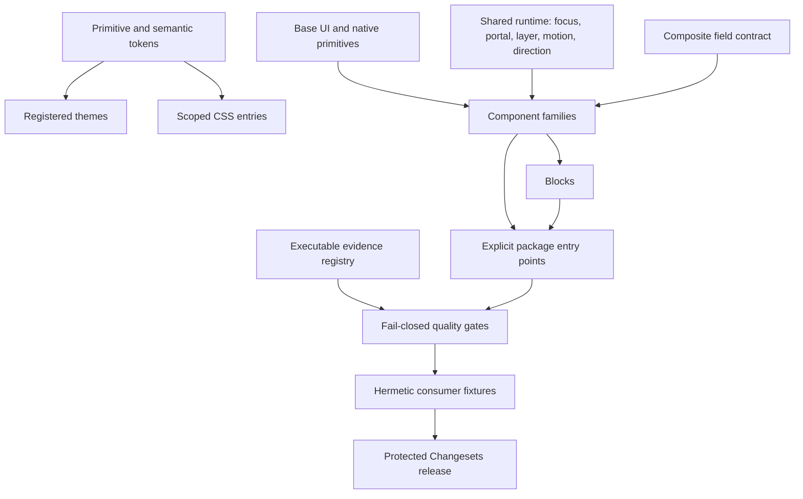

# Qeetrix UI Enterprise Gap Analysis

Audit date: 2026-08-22  
Repository: `qeetrix-ui`  
Audited snapshot: working tree on `develop` at `e7d3978`  
Package: `@qeetrix/ui@1.0.3`

This document is the canonical current-state gap analysis for Qeetrix UI. It is an
engineering maturity assessment, not an industry certification. Findings describe the
working tree that existed during the audit, including uncommitted work already present.
No production source, package metadata, generated asset, or sibling repository was changed
as part of this audit.

## Executive Summary

Qeetrix UI is a substantial, structured design system rather than a prototype. It has 145
manifest-governed component families, strict TypeScript, Base UI-backed primitives, a layered
token graph, generated metadata, architecture checks, Changesets, and a broad Vitest suite.
Those are real strengths. The architecture and token system are materially more mature than
the runtime assurance around them.

The library is **Level 3 — Production Design System** with a weighted maturity score of
**55/100**. It is not yet a Level 4 enterprise design system. The principal blockers are:

1. Confirmed security defects in chart style generation and CSV export.
2. Confirmed SSR and hydration defects, including an open Tour server-render crash.
3. High-risk accessibility gaps in custom modal, carousel, virtualized table, and focus-trap
   behavior despite strong-looking accessibility metadata.
4. Public API and package verification that do not lock the full published contract.
5. No in-repository browser, visual-regression, responsive, or performance gate.
6. Environment-dependent manifest generation and release automation/documentation mismatch.
7. Time-zone correctness and localization architecture that are not ready for distributed,
   international enterprise applications.

No P0 issue was established. There are **19 P1**, **27 P2**, and **4 P3** findings. P1 does
not mean every consumer is currently failing; it means the evidence shows a broad or severe
risk that should be resolved before enterprise adoption is claimed.

## Current Repository Snapshot

| Measure | Current state | Evidence |
|---|---:|---|
| Manifest component families | 145 | [`component-manifest.json`](../component-manifest.json#L1-L26) |
| Categories | 10 | 7 actions, 27 data display, 15 feedback, 20 inputs, 11 layout, 16 navigation, 10 pickers, 12 selection, 9 surfaces, 18 utility |
| Lifecycle status | 144 stable, 1 deprecated | [`component-manifest.json`](../component-manifest.json#L17-L22); deprecated component is `PaginationBar` |
| Accessibility status | 72 audited, 6 partial, 67 not audited | [`component-manifest.json`](../component-manifest.json#L23-L28) |
| Public blocks | 6 | Auth, DashboardShell, OnboardingWizard, PageState, PricingTable, SettingsLayout |
| Public brand modules | 4 | Qeet icon set and three logo variants |
| Providers | 3 | Theme, density, direction |
| Source test files | 173 | Current filesystem census; no coverage percentage inferred |
| Locked API symbols | 689 | 643 root, 18 brand, 28 blocks in [`public-api.json`](../src/__tests__/public-api.json) |
| Runtime dependencies | 17 plus 3 peers | [`package.json`](../package.json#L105-L143) |
| Runtime baseline | React/React DOM >=19, Tailwind >=4 | [`package.json`](../package.json#L124-L128) |
| Engines | Node >=20, Bun >=1.3 | [`package.json`](../package.json#L8-L12) |
| CSS side effects | All `*.css` retained | [`package.json`](../package.json#L13-L15) |
| Visual regression in this repository | None detected | Vitest is jsdom-only; no browser/VRT project is configured |
| Bundle size and runtime performance | Not measured | No in-repository bundle budget or benchmark gate |

### Areas inspected

The audit inspected package/configuration files, `src/index.ts`, every component category,
blocks, brand, hooks, libraries, providers, styles, token inputs and generated outputs,
contracts, manifests, runtime utilities, primitives, foundations, representative component
implementations, all test files, all build/check/config scripts, Changesets, CI, README,
CONTRIBUTING, CHANGELOG, and architecture/governance/standards documentation. Sibling
repositories were not inspected.

### Assessment vocabulary

- **Confirmed:** directly established from current source, a test, a static probe, or a
  reproduced runtime result.
- **Likely:** a concrete high-risk pattern exists, but impact was not benchmarked or exercised
  in a real browser/assistive-technology combination.
- **Not measured:** the repository provides no result and this audit does not invent one.
- **Effort XS:** isolated change; **S:** one local surface; **M:** coordinated component/tests;
  **L:** cross-cutting project; **XL:** multi-package or architectural program.

## Enterprise Readiness Level

**Current: Level 3 — Production Design System.**

| Level | Definition used by this audit |
|---|---|
| 0 | Prototype: exploratory UI without stable contracts |
| 1 | Functional Library: reusable components with local tests |
| 2 | Structured Design System: categories, tokens, conventions, and package structure |
| 3 | Production Design System: versioned package, broad tests, governance, and repeatable build |
| 4 | Enterprise Design System: fail-closed assurance, security/a11y/browser evidence, scalable theming and localization, controlled releases |
| 5 | Enterprise Platform: multi-product lifecycle, telemetry, automated compatibility and migration support |

Qeetrix qualifies for Level 3 because it has a versioned package, explicit layers, token
generation, 145 governed component families, strict compilation, release metadata, and broad
tests. It does not qualify for Level 4 because critical assurance is incomplete or fail-open:
the full public API is not locked, package integration can skip, visual/browser behavior is not
gated, 67 component families remain accessibility-not-audited, security defects are confirmed,
and publication governance is internally contradictory.

## Overall Maturity Score

The score is a weighted engineering judgment based on repository evidence. Each dimension is
scored from 0 to 10; weights total 100. The weighted score is
`sum(score * weight) / 10`, rounded to the nearest whole number. A strong file count does not
raise a score unless implementation and enforcement support it.

**Weighted result: 55/100.**

## Scorecard

| Dimension | Weight | Score /10 | Evidence-based rationale |
|---|---:|---:|---|
| Architecture | 8% | 8.0 | Deny-by-default TypeScript layer graph and cycle checks; some import/CSS blind spots |
| Component APIs | 8% | 6.0 | Broad typed surface; incomplete signature lock and composite-form inconsistencies |
| Tokens | 7% | 8.0 | Strong graph, parity, contrast, and usage checks; palette utilities evade enforcement |
| Accessibility | 12% | 5.0 | Strong primitives and growing audits; material custom-widget defects and misleading coverage gate |
| Interaction | 8% | 5.0 | Good Tabs/menu/tree examples; uneven custom keyboard/focus behavior |
| Theming | 5% | 6.0 | Central light/dark variables; closed theme model and stale API documentation |
| Internationalization | 5% | 4.0 | Useful `Intl` usage; embedded English, locale parsing, and time-zone correctness gaps |
| SSR/hydration | 6% | 4.5 | SSR-aware helpers exist; confirmed Tour, random-render, storage, and locale risks |
| Performance | 6% | 4.5 | Virtualization exists; no budgets and a confirmed quadratic diff path |
| Testing | 10% | 6.0 | Large assertion-based suite; no browser/VRT/coverage/performance gate |
| Security | 8% | 4.0 | Safe text rendering in many areas; confirmed CSS and spreadsheet injection |
| Packaging | 6% | 4.0 | ESM/types/package checks exist; integration skips, release gaps, no lockfile |
| Developer Experience | 4% | 6.0 | Good scripts and standards; stale docs and broad accidental deep-import surface |
| Governance | 4% | 5.0 | Registry, manifest, Changesets; stable-by-default and weak promotion enforcement |
| Documentation | 3% | 5.0 | Substantial docs; several factual contradictions and stale generated counts |

## Critical Findings

No P0 finding was established. The adoption-blocking set is the 19 P1 findings:
`SEC-001`, `SEC-002`, `SSR-001`, `FOCUS-001`, `A11Y-001` through `A11Y-005`,
`I18N-001`, `PERF-001`, `INPUT-001`, `API-001`, `API-002`, `PKG-001`, `REL-001`,
`MAN-001`, `TEST-001`, and `META-001`.

The most urgent are the two injection defects, the Tour SSR/modal failures, virtualized table
semantics, and the package/release gates that can report success without exercising supported
consumer configurations.

## Gap Summary

| Severity | Count |
|---|---:|
| P0 — critical | 0 |
| P1 — high | 19 |
| P2 — medium | 27 |
| P3 — low | 4 |
| **Total** | **50** |

| Primary area | Findings |
|---|---:|
| Architecture and public boundaries | 2 |
| Component API, forms, state, CVA | 5 |
| Security | 2 |
| Accessibility, keyboard, focus, contrast | 13 |
| Tokens, theming, density, CSS | 4 |
| RTL, internationalization, motion, responsive | 5 |
| SSR, overlay, asynchronous runtime | 4 |
| Testing | 2 |
| Performance, bundle, dependencies | 4 |
| Packaging, release, build, portability | 5 |
| Governance, manifest, documentation | 3 |
| Code quality | 1 |

## Architecture Gaps

### API-001 — Wildcard exports publish undocumented internals

- **Category:** Architecture / Public API
- **Severity:** P1
- **Area:** Package export map
- **Component(s):** Components, hooks, libraries, providers, blocks
- **Current state:** `./components/*`, `./hooks/*`, and `./lib/*` are wildcard exports.
- **Evidence:** [`package.json`](../package.json#L38-L77) exposes nested implementation paths;
  the architecture documentation describes a narrower intended surface in
  [`overview.md`](architecture/overview.md#L69-L79).
- **Gap:** Paths such as category internals and `useControllableState` can become supported by
  accident. Moving files can break consumers even when the documented API is unchanged.
- **Impact:** Semver ambiguity, internal coupling, and difficult refactoring.
- **Recommendation:** Generate explicit exports from an allowlist, preserve only intentional
  compatibility aliases, and test every published path.
- **Effort:** M
- **Dependencies:** API-002, PKG-001, migration/Changeset policy.

### ARCH-001 — Architecture enforcement omits relevant dependency forms

- **Category:** Architecture
- **Severity:** P2
- **Area:** Layer and category checker
- **Component(s):** All source layers
- **Current state:** Traversal covers TypeScript modules, while CSS/JSON dependencies are outside
  the graph; cross-category detection relies partly on relative-path patterns.
- **Evidence:** [`layers.mjs`](../scripts/lib/layers.mjs#L22-L33) filters extensions;
  [`architecture.mjs`](../scripts/check/architecture.mjs#L48-L58) builds the component inventory
  and its category check is implemented at
  [`architecture.mjs`](../scripts/check/architecture.mjs#L106-L122).
- **Gap:** Some legal/illegal dependencies can evade the documented layer model.
- **Impact:** Architectural drift can pass the gate while the TypeScript graph still appears clean.
- **Recommendation:** Resolve imports to canonical module/category identities, add checker tests,
  and govern non-TypeScript production inputs explicitly.
- **Effort:** M
- **Dependencies:** None.

## Component/API Gaps

### API-002 — Public API locking does not protect the full contract

- **Category:** Public API
- **Severity:** P1
- **Area:** Export and declaration compatibility
- **Component(s):** All public modules
- **Current state:** The snapshot covers only `.`, `./brand`, and `./blocks`, and prop comparison
  records names rather than complete declaration signatures.
- **Evidence:** Entry selection is at [`exports.mjs`](../scripts/check/exports.mjs#L44-L48);
  member extraction is at [`exports.mjs`](../scripts/check/exports.mjs#L86-L124) and comparison at
  [`exports.mjs`](../scripts/check/exports.mjs#L193-L214).
- **Gap:** Requiredness, types, literal unions, generics, callbacks, providers, and wildcard
  subpaths can break without a failing API gate.
- **Impact:** Source-compatible-looking releases can be TypeScript or runtime breaking changes.
- **Recommendation:** Snapshot normalized emitted declarations for every explicit package export,
  including providers and supported deep paths, using an API compatibility tool or equivalent.
- **Effort:** L
- **Dependencies:** API-001 and a reviewed baseline.

### INPUT-001 — `TimePicker.minuteStep` can create a non-terminating render

- **Category:** Component API / Reliability
- **Severity:** P1
- **Area:** Input validation
- **Component(s):** TimePicker, TimeRangePicker, DateTimePicker
- **Current state:** The range helper increments by consumer-supplied `minuteStep` without proving
  that it is finite and greater than zero.
- **Evidence:** [`time-picker.tsx`](../src/components/pickers/time-picker.tsx#L13-L19) implements
  the loop; the prop reaches it at
  [`time-picker.tsx`](../src/components/pickers/time-picker.tsx#L103-L106).
- **Gap:** `0`, a negative number, or a non-finite value can hang rendering.
- **Impact:** Main-thread denial of service from an invalid but type-correct prop.
- **Recommendation:** Validate and normalize a finite positive integer, document divisibility and
  bounds, and add invalid-value tests.
- **Effort:** S
- **Dependencies:** None.

### API-003 — Composite controls lack one Field/native-form contract

- **Category:** Forms / API consistency
- **Severity:** P2
- **Area:** IDs, naming, validation, and submission
- **Component(s):** DatePicker, ColorPicker, OTPInput, Rating, RichTextEditor, FileUpload
- **Current state:** Native Input/Textarea inherit browser form props, while several composite
  controls omit consistent `name`, `form`, `required`, `readOnly`, `aria-invalid`,
  `aria-describedby`, and canonical hidden-value behavior.
- **Evidence:** Compare [`date-picker.tsx`](../src/components/pickers/date-picker.tsx#L15-L25),
  [`color-picker.tsx`](../src/components/pickers/color-picker.tsx#L5-L13),
  [`otp-input.tsx`](../src/components/inputs/otp-input.tsx#L5-L20), and
  [`rich-text-editor.tsx`](../src/components/inputs/rich-text-editor.tsx#L18-L36) with native
  [`input.tsx`](../src/components/inputs/input.tsx).
- **Gap:** Similar form controls integrate differently with Field and native submission.
- **Impact:** Values or error relationships can be omitted without a type error.
- **Recommendation:** Define a composite-field contract and apply it incrementally, including
  hidden canonical values only when native submission is promised.
- **Effort:** L
- **Dependencies:** Field/Form architecture and API-002.

### API-004 — Controlled/uncontrolled behavior is not comprehensively contract-tested

- **Category:** State management
- **Severity:** P2
- **Area:** Controlled authority, defaults, and transitions
- **Component(s):** Stateful component families
- **Current state:** A shared `useControllableState` exists, but only a small subset receives
  centralized tests proving both controlled authority and uncontrolled ownership.
- **Evidence:** Shared implementation is in
  [`use-controllable-state.ts`](../src/hooks/use-controllable-state.ts#L1-L64); centralized cases
  are in [`component-api.test.tsx`](../src/__tests__/component-api.test.tsx#L145-L238).
- **Gap:** Callback tests alone do not prove that a controlled prop remains authoritative or that
  a changed default is correctly ignored.
- **Impact:** State desynchronization and controlled/uncontrolled regressions can vary by component.
- **Recommendation:** Generate a contract-test matrix for every manifest-declared controlled axis,
  including Strict Mode and controlled-to-uncontrolled warnings.
- **Effort:** M
- **Dependencies:** Manifest schema and API-002.

### CVA-001 — Variant governance is only partly machine-readable

- **Category:** CVA / Variant architecture
- **Severity:** P3
- **Area:** Variant definitions and metadata
- **Component(s):** Components with variant, size, tone, or domain axes
- **Current state:** CVA is effective on core atoms, but most components use direct class logic or
  expose no machine-readable variant definition.
- **Evidence:** Button’s canonical CVA appears at
  [`button.tsx`](../src/components/actions/button.tsx#L6-L43); manifest entries commonly report
  null variant fields, as visible in [`component-manifest.json`](../component-manifest.json#L47-L54).
- **Gap:** The repository does not consistently distinguish “no design axis” from “axis not
  recorded,” and aliases/domain axes are not uniformly governed.
- **Impact:** Documentation and API consistency checks cannot reliably compare component variants.
- **Recommendation:** Keep CVA optional, but require explicit manifest axis metadata for public
  variant APIs and documented exemptions for components with no axes.
- **Effort:** M
- **Dependencies:** MAN-001.

## Design Token Gaps

### TOKEN-001 — Token usage enforcement misses Tailwind palette utilities

- **Category:** Design tokens / Tailwind
- **Severity:** P2
- **Area:** Semantic color enforcement
- **Component(s):** CodeBlock, JSONTree, Rating
- **Current state:** The scanner catches raw hex/functions but not named Tailwind palette classes.
- **Evidence:** Matcher scope is at
  [`token-usage.mjs`](../scripts/check/token-usage.mjs#L38-L41); examples pass through in
  [`code-block.tsx`](../src/components/data-display/code-block.tsx#L43-L58),
  [`json-tree.tsx`](../src/components/data-display/json-tree.tsx#L21-L37), and
  [`rating.tsx`](../src/components/inputs/rating.tsx#L114-L128).
- **Gap:** Components can bypass semantic roles while `check:token-usage` reports zero violations.
- **Impact:** Brand themes, forced colors, and contrast maintenance require component edits.
- **Recommendation:** Detect palette utilities and require semantic syntax/rating roles or a
  documented domain exemption.
- **Effort:** M
- **Dependencies:** Token naming decision for syntax and rating semantics.

The primitive/semantic/component token graph, reference validation, cycle detection, theme parity,
and required text/focus/chart contrast checks are otherwise strong and should be preserved.

## Accessibility Gaps

### A11Y-001 — Accessibility coverage gate measures files and metadata, not proof

- **Category:** Accessibility assurance
- **Severity:** P1
- **Area:** Coverage checker and manifest
- **Component(s):** All 145 component families
- **Current state:** A matching test filename or smoke-harness import satisfies baseline coverage;
  audit totals are aggregated rather than locked per component/dimension.
- **Evidence:** File/import heuristics are at
  [`a11y-coverage.mjs`](../scripts/check/a11y-coverage.mjs#L53-L76); aggregate audit ratchet is at
  [`a11y-coverage.mjs`](../scripts/check/a11y-coverage.mjs#L201-L213).
- **Gap:** Removing meaningful axe/keyboard assertions can leave the gate green, and one audited
  component can replace another without detecting regression.
- **Impact:** The repository can communicate stronger accessibility assurance than its tests prove.
- **Recommendation:** Link each manifest dimension to an executable test ID, inspect assertion
  presence, and snapshot per-slug/per-dimension status.
- **Effort:** M
- **Dependencies:** MAN-001 and TEST-001.

### A11Y-002 — Tour advertises modality without isolating background content

- **Category:** Accessibility / Overlays
- **Severity:** P1
- **Area:** Modal semantics and focus containment
- **Component(s):** Tour
- **Current state:** Tour declares `aria-modal="true"`, uses the custom FocusTrap, and renders an
  `aria-hidden` backdrop, but does not inert the page or lock scroll.
- **Evidence:** [`tour.tsx`](../src/components/feedback/tour.tsx#L197-L230) defines the modal and
  trap; backdrop is at [`tour.tsx`](../src/components/feedback/tour.tsx#L338-L360). The test can
  focus an underlying input at
  [`tour.test.tsx`](../src/components/feedback/__tests__/tour.test.tsx#L97-L111).
- **Gap:** The behavior does not match the declared modal accessibility contract.
- **Impact:** Keyboard, scripted-focus, and virtual-cursor users can reach obscured page content.
- **Recommendation:** Build Tour on the shared Dialog/modal manager or add stack-aware inerting,
  scroll lock, robust containment, restoration, and nested-overlay tests.
- **Effort:** L
- **Dependencies:** FOCUS-001 and OVERLAY-001.

### A11Y-003 — Default modal layouts can make content unreachable

- **Category:** Accessibility / Responsive overlays
- **Severity:** P1
- **Area:** Reflow, zoom, and overflow
- **Component(s):** Dialog, AlertDialog, Drawer, Sheet
- **Current state:** Centered modal content lacks a consistent viewport-bounded scrolling region;
  Drawer has a height cap but no complete shared contract.
- **Evidence:** [`dialog.tsx`](../src/components/surfaces/dialog.tsx#L48-L61),
  [`alert-dialog.tsx`](../src/components/surfaces/alert-dialog.tsx#L35-L46),
  [`sheet.tsx`](../src/components/surfaces/sheet.tsx#L49-L70), and
  [`drawer.tsx`](../src/components/surfaces/drawer.tsx#L36-L49).
- **Gap:** Long content is not guaranteed reachable at small viewport heights, mobile keyboard
  display, enlarged text, or 200% zoom.
- **Impact:** Critical controls can be clipped outside the operable viewport.
- **Recommendation:** Standardize `dvh` bounds and an explicit scrollable content region; verify
  reflow and keyboard reachability in real browsers.
- **Effort:** M
- **Dependencies:** TEST-001 and overlay layout contract.

### A11Y-004 — Carousel leaves offscreen slides operable and ignores direction/motion

- **Category:** Accessibility / Keyboard / Motion
- **Severity:** P1
- **Area:** Slide visibility, autoplay, RTL
- **Component(s):** Carousel
- **Current state:** All slides remain mounted without inert/hidden state; horizontal key mapping is
  LTR-specific; Embla movement/autoplay does not consume reduced-motion state.
- **Evidence:** Embla setup is at [`carousel.tsx`](../src/components/data-display/carousel.tsx#L58-L76),
  keys at [`carousel.tsx`](../src/components/data-display/carousel.tsx#L87-L101), and slide output
  at [`carousel.tsx`](../src/components/data-display/carousel.tsx#L158-L174). The keyboard test
  only proves no exception at
  [`carousel.test.tsx`](../src/components/data-display/__tests__/carousel.test.tsx#L59-L68).
- **Gap:** Invisible controls remain reachable, movement preferences are bypassed, and RTL spatial
  behavior is wrong or undefined.
- **Impact:** Confusing focus order, motion harm, and incorrect navigation.
- **Recommendation:** Synchronize inert/visibility to Embla state, expose slide position, consume
  direction/reduced motion, and require pause/stop controls for autoplay.
- **Effort:** L
- **Dependencies:** MOTION-001, RTL-001, TEST-001.

### A11Y-005 — Virtualized DataTable exposes misleading table semantics

- **Category:** Accessibility / Data
- **Severity:** P1
- **Area:** Virtual rows and assistive technology
- **Component(s):** DataTable
- **Current state:** Only virtual rows render, with ordinary spacer rows before/after and no total
  row count or stable virtual row index semantics.
- **Evidence:** Virtual range is selected at
  [`data-table.tsx`](../src/components/data-display/data-table.tsx#L513-L522); spacer rows are
  emitted at [`data-table.tsx`](../src/components/data-display/data-table.tsx#L815-L850).
- **Gap:** The DOM table does not communicate the omitted rows or distinguish layout spacers.
- **Impact:** Screen readers can report blank rows and incorrect position/count information.
- **Recommendation:** Disable semantic-table virtualization until a tested ARIA table/grid model
  supplies total counts, row indices, and hidden spacers; test with browser/AT combinations.
- **Effort:** L
- **Dependencies:** DataTable API and TEST-001.

### A11Y-006 — Custom active-descendant widgets do not maintain a robust focus model

- **Category:** Accessibility / Keyboard
- **Severity:** P2
- **Area:** Active option identity, visibility, dismissal, announcements
- **Component(s):** Listbox, MentionInput, CommandPalette
- **Current state:** Listbox derives active state once and embeds values in IDs; MentionInput omits
  complete expanded/dismissal state; CommandPalette does not scroll or announce active results.
- **Evidence:** [`listbox.tsx`](../src/components/selection/listbox.tsx#L41-L72) and
  [`listbox.tsx`](../src/components/selection/listbox.tsx#L122-L135);
  [`mention-input.tsx`](../src/components/inputs/mention-input.tsx#L103-L126);
  [`command-palette.tsx`](../src/components/navigation/command-palette.tsx#L120-L130) and
  [`command-palette.tsx`](../src/components/navigation/command-palette.tsx#L187-L225).
- **Gap:** Active descendants can dangle or disappear outside the viewport, and popup/result state
  is incompletely exposed.
- **Impact:** Keyboard and screen-reader users can lose location or operate stale suggestions.
- **Recommendation:** Generate stable safe IDs, reconcile active values, scroll active options,
  close on focus-out, and add result-count/live status where appropriate.
- **Effort:** M
- **Dependencies:** Shared composite-widget test utilities.

### A11Y-007 — Dense selection grids do not expose their visual relationships

- **Category:** Accessibility / Data-dense controls
- **Severity:** P2
- **Area:** Grid/table navigation and headers
- **Component(s):** AvailabilityGrid, NotificationPreferenceMatrix
- **Current state:** AvailabilityGrid is a large set of independent buttons; the notification
  matrix has no caption and uses data cells rather than row headers.
- **Evidence:** [`availability-grid.tsx`](../src/components/selection/availability-grid.tsx#L44-L78)
  and [`notification-preference-matrix.tsx`](../src/components/selection/notification-preference-matrix.tsx#L41-L69).
- **Gap:** Hundreds of tab stops and missing row/column context do not match the visual model.
- **Impact:** Keyboard navigation is inefficient and table-navigation context is incomplete.
- **Recommendation:** Use an APG-style roving grid for availability; add caption/label and
  `<th scope="row">` relationships to the preference matrix.
- **Effort:** L
- **Dependencies:** Keyboard contract and browser tests.

### A11Y-008 — DataTable controls are ambiguously named and resizing is weakly exposed

- **Category:** Accessibility / DataTable API
- **Severity:** P2
- **Area:** Row actions, resize, caption, busy state
- **Component(s):** DataTable
- **Current state:** Every row checkbox/expander uses the same generic label; the resize control is
  visually one pixel wide and exposes no current/min/max value; no caption/busy contract exists.
- **Evidence:** Row controls at [`data-table.tsx`](../src/components/data-display/data-table.tsx#L419-L451)
  and resize handle at [`data-table.tsx`](../src/components/data-display/data-table.tsx#L773-L790).
- **Gap:** Control purpose and resize state cannot be distinguished reliably.
- **Impact:** Assistive-technology control lists are ambiguous and loading/resize changes are silent.
- **Recommendation:** Accept row-label callbacks, caption/label and busy props, and implement a
  separator/window-splitter value model with a usable hit target.
- **Effort:** M
- **Dependencies:** API-003 and DataTable contract.

### A11Y-009 — RichTextEditor lacks complete editor and toolbar semantics

- **Category:** Accessibility / Forms
- **Severity:** P2
- **Area:** Toolbar, placeholder, read-only, serialization
- **Component(s):** RichTextEditor
- **Current state:** Formatting controls sit in an unlabeled plain container, placeholder text is
  hidden from assistive technology, and read-only mode retains textbox semantics without
  `aria-readonly`.
- **Evidence:** Toolbar construction at
  [`rich-text-editor.tsx`](../src/components/inputs/rich-text-editor.tsx#L54-L112), editor props at
  [`rich-text-editor.tsx`](../src/components/inputs/rich-text-editor.tsx#L174-L184), and wrapper/
  placeholder at [`rich-text-editor.tsx`](../src/components/inputs/rich-text-editor.tsx#L199-L211).
- **Gap:** The component does not expose a complete APG toolbar or Field/native-form relationship.
- **Impact:** Formatting, placeholder, and read-only state are difficult to understand or operate.
- **Recommendation:** Add a labeled roving-focus toolbar, `aria-placeholder`, `aria-readonly`, and
  the composite field contract; test editing, formatting, controlled sync, and serialization.
- **Effort:** M
- **Dependencies:** API-003 and TEST-001.

### A11Y-010 — FileUpload/LogoUploader validation and status are incomplete

- **Category:** Accessibility / Security / Forms
- **Severity:** P2
- **Area:** Drop validation, progress, completion, external previews
- **Component(s):** FileUpload, LogoUploader
- **Current state:** Dropping can bypass single-file intent; LogoUploader does not consistently
  enforce its accept policy and trusts MIME metadata; progress/success lacks a file-associated live
  status.
- **Evidence:** Drop handling is at
  [`file-upload.tsx`](../src/components/inputs/file-upload.tsx#L79-L118), progress/status at
  [`file-upload.tsx`](../src/components/inputs/file-upload.tsx#L214-L264), and logo validation/URL
  handling at [`logo-uploader.tsx`](../src/components/inputs/logo-uploader.tsx#L56-L92).
- **Gap:** Client checks differ by input path and do not communicate upload lifecycle consistently.
- **Impact:** Unexpected files can enter the client flow; users may not hear progress or completion.
- **Recommendation:** Share accept/count validation, cancel stale readers, label progress by file,
  expose polite status, constrain preview URLs, and document mandatory server-side signature/size/
  SVG validation.
- **Effort:** M
- **Dependencies:** Upload security policy and API-003.

### A11Y-011 — Menubar test suppresses a known whole-widget ARIA violation

- **Category:** Accessibility / Base UI integration
- **Severity:** P2
- **Area:** Required child structure and keyboard model
- **Component(s):** Menubar
- **Current state:** The test documents an `aria-required-children` violation and runs axe against a
  narrower popup subtree instead of the whole widget.
- **Evidence:** [`menubar.test.tsx`](../src/components/navigation/__tests__/menubar.test.tsx#L80-L103).
- **Gap:** A scoped passing assertion hides the invalid composed hierarchy; top-level arrow,
  Escape, typeahead, menu-switching, and RTL behavior are also not demonstrated.
- **Impact:** Assistive technology may receive an invalid menu hierarchy.
- **Recommendation:** Resolve the Base UI composition/version issue, restore a full-widget axe test,
  and add the complete menubar keyboard model.
- **Effort:** M
- **Dependencies:** Base UI behavior/version.

### CONTRAST-001 — Non-text control-border contrast is measured but non-blocking

- **Category:** Accessibility / Tokens
- **Severity:** P2
- **Area:** WCAG 1.4.11 non-text contrast
- **Component(s):** Inputs and controls using border affordances
- **Current state:** Required text/focus/chart pairs block, but six low-ratio border pairs are
  informational.
- **Evidence:** Optional pair policy is defined at
  [`contrast.mjs`](../scripts/check/contrast.mjs#L62-L68).
- **Gap:** The gate does not establish whether affected controls have another sufficient visual
  boundary in real rendering.
- **Impact:** Controls can be difficult to perceive even while the contrast script passes.
- **Recommendation:** Identify borders required to perceive controls; make those pairs blocking or
  prove an alternate compliant fill/outline in browser tests.
- **Effort:** M
- **Dependencies:** TEST-001 and design review.

## Keyboard & Focus Gaps

### FOCUS-001 — Public FocusTrap is not a complete containment primitive

- **Category:** Focus management
- **Severity:** P1
- **Area:** Entry, containment, dynamic content, restoration
- **Component(s):** FocusTrap and Tour; any future consumer
- **Current state:** The tabbable selector omits valid focus targets, no fallback focuses an empty
  container, and containment only intercepts Tab events originating inside it.
- **Evidence:** Selector at [`focus-trap.ts`](../src/runtime/focus-trap.ts#L17-L30), activation at
  [`focus-trap.ts`](../src/runtime/focus-trap.ts#L55-L60), and key handling at
  [`focus-trap.ts`](../src/runtime/focus-trap.ts#L62-L93). Tests use ordinary buttons at
  [`focus-trap.test.tsx`](../src/components/utility/__tests__/focus-trap.test.tsx#L15-L54).
- **Gap:** Programmatic focus, empty traps, nested traps, disconnected triggers, and dynamic
  controls are not robustly managed.
- **Impact:** Focus can remain outside or escape a declared modal boundary.
- **Recommendation:** Prefer Base UI’s modal focus manager or a proven tabbable/focus-lock engine;
  otherwise add fallback focus and comprehensive dynamic/nested tests.
- **Effort:** M
- **Dependencies:** A11Y-002 and OVERLAY-001.

Keyboard support is strongest in Button, Tabs, Accordion, DropdownMenu, Tooltip, Checkbox,
Switch, and TreeView. It is weakest or unproven in Carousel, Menubar, AvailabilityGrid,
RichTextEditor toolbar, Resizable, Calendar composition, and several active-descendant widgets.

## Theming Gaps

### THEME-001 — Theme extensibility is closed and documentation overstates the API

- **Category:** Theming
- **Severity:** P2
- **Area:** Provider contract and future brand themes
- **Component(s):** ThemeProvider, token generator, all themed components
- **Current state:** The provider exposes `theme` and `setTheme`, themes are a closed union, and
  token generation is hard-coded around light/dark. Documentation promises `resolvedTheme`.
- **Evidence:** [`theme-provider.tsx`](../src/providers/theme-provider.tsx#L4-L18) and
  [`tokens.mjs`](../scripts/build/tokens.mjs#L189-L219), compared with
  [`theming.md`](standards/theming.md#L55-L67).
- **Gap:** Custom product/brand themes require rebuilding token generation or component-adjacent
  CSS rather than registering a supported theme contract.
- **Impact:** Multi-brand adoption scales through forks or undocumented overrides.
- **Recommendation:** Decide explicitly between build-time-only themes and a supported theme
  registry; align docs/API and make contrast/parity checks operate on every registered theme.
- **Effort:** L
- **Dependencies:** Token governance and product theming requirements.

## Density Gaps

### DENSITY-001 — Density applicability metadata converts uncertainty into success

- **Category:** Density / Manifest
- **Severity:** P2
- **Area:** Density integration coverage
- **Component(s):** All component families
- **Current state:** Detection can map uncertain cases to `not-applicable`; the ratchet counts only
  `unknown`, so the manifest shows no unresolved backlog.
- **Evidence:** Inference is in
  [`component-source.mjs`](../scripts/lib/component-source.mjs#L155-L168); enforcement is in
  [`component-contract.mjs`](../scripts/check/component-contract.mjs#L75-L94).
- **Gap:** Components that should respond to density can be classified away without review.
- **Impact:** Provider existence creates false confidence about library-wide integration.
- **Recommendation:** Require explicit applicability for interactive/layout components and retain
  `unknown` until reviewed; add representative component/provider tests.
- **Effort:** M
- **Dependencies:** MAN-001.

DataTable is a positive example: provider context, scoped attribute, and virtualization estimates
are aligned. Density should not be forced onto content-only components where it is genuinely
irrelevant.

## RTL & Internationalization Gaps

### I18N-001 — ScheduleCalendar mixes host and requested time zones

- **Category:** Internationalization / Date correctness
- **Severity:** P1
- **Area:** Day bucketing, “today,” navigation, formatting
- **Component(s):** ScheduleCalendar
- **Current state:** Calendar boundaries are calculated in the host zone while labels/events are
  formatted in a requested zone.
- **Evidence:** Boundary calculations at
  [`schedule-calendar.tsx`](../src/components/pickers/schedule-calendar.tsx#L38-L50) and zone-aware
  formatting at [`schedule-calendar.tsx`](../src/components/pickers/schedule-calendar.tsx#L92-L105).
- **Gap:** One calendar view uses two time-zone models.
- **Impact:** Events can appear under the wrong day and “today” can be wrong near zone boundaries.
- **Recommendation:** Perform bucketing, boundaries, navigation, and formatting in one explicit
  zone using Temporal or a proven timezone library; expose locale/week-start policy.
- **Effort:** L
- **Dependencies:** Shared date/time architecture.

### RTL-001 — Direction and localization are not cross-cutting runtime contracts

- **Category:** RTL / Internationalization
- **Severity:** P2
- **Area:** Spatial keys, icons, strings, number input
- **Component(s):** Carousel, TreeView, Rating, OTPInput, CurrencyInput, reusable status text
- **Current state:** Several custom widgets hard-code left/right behavior; reusable components embed
  English; CurrencyInput displays locale formatting but accepts only dot-decimal input.
- **Evidence:** Carousel keys at
  [`carousel.tsx`](../src/components/data-display/carousel.tsx#L87-L101), TreeView keys at
  [`tree-view.tsx`](../src/components/navigation/tree-view.tsx#L112-L141), and currency parsing at
  [`currency-input.tsx`](../src/components/inputs/currency-input.tsx#L48-L59).
- **Gap:** DirectionProvider and `Intl` usage do not amount to a complete localization contract.
- **Impact:** RTL behavior and localized input are inconsistent, and host applications must patch
  embedded English.
- **Recommendation:** Define direction-aware spatial-key/icon helpers and an injectable message/
  locale/time-zone contract; parse numbers with locale parts without adding a mandatory i18n framework.
- **Effort:** XL
- **Dependencies:** Product localization requirements and TEST-001.

### DATE-001 — AuditEvent formats invalid `Date` before validating it

- **Category:** Date robustness
- **Severity:** P2
- **Area:** Rendering untrusted timestamps
- **Component(s):** AuditEvent
- **Current state:** `toISOString()` is called for Date instances before invalidity fallback runs.
- **Evidence:** [`audit-event.tsx`](../src/components/data-display/audit-event.tsx#L60-L66).
- **Gap:** `new Date(NaN)` throws during render.
- **Impact:** One malformed audit timestamp can crash the containing React subtree.
- **Recommendation:** Validate first, then create machine-readable `dateTime`; define and test an
  invalid-timestamp fallback.
- **Effort:** XS
- **Dependencies:** None.

## SSR & Hydration Gaps

### SSR-001 — Open Tour crashes server rendering

- **Category:** SSR
- **Severity:** P1
- **Area:** Portal creation during render
- **Component(s):** Tour
- **Current state:** Tour calls `createPortal(..., document.body)` during render when open.
- **Evidence:** [`tour.tsx`](../src/components/feedback/tour.tsx#L338-L360). A direct
  `renderToString` probe with `defaultOpen` reproduced `ReferenceError: document is not defined`.
- **Gap:** The component bypasses the repository’s SSR-safe Portal primitive.
- **Impact:** SSR applications can crash for valid initial state.
- **Recommendation:** Route Tour through the shared mounted Portal or defer portal creation until
  the client; add open-state SSR and hydration tests.
- **Effort:** S
- **Dependencies:** A11Y-002.

### SSR-002 — Hydration determinism is incomplete across random, locale, and storage state

- **Category:** SSR / State
- **Severity:** P2
- **Area:** Deterministic markup and client initialization
- **Component(s):** Sidebar, ThemeProvider, DataTable, DatePicker, DateTimePicker, TimeSince
- **Current state:** Sidebar renders a random width; render-time formatting can use ambient locale/
  time zone; ThemeProvider reads storage during initialization; DataTable persistence does not
  fully handle changed keys or storage failures.
- **Evidence:** [`sidebar.tsx`](../src/components/navigation/sidebar.tsx#L580-L606),
  [`theme-provider.tsx`](../src/providers/theme-provider.tsx#L84-L101),
  [`data-table.tsx`](../src/components/data-display/data-table.tsx#L376-L402),
  [`date-picker.tsx`](../src/components/pickers/date-picker.tsx#L10-L14), and
  [`time-since.tsx`](../src/components/utility/time-since.tsx#L25-L29).
- **Gap:** Server/client environments can produce different attributes or text.
- **Impact:** React hydration warnings, retained mismatched attributes, and unstable initial UI.
- **Recommendation:** Eliminate render-time randomness, establish explicit locale/zone and
  hydration-stable provider defaults, and use a failure-safe storage adapter.
- **Effort:** L
- **Dependencies:** I18N/SSR test matrix.

Only CountryPicker, TimezonePicker, and TimeSince currently receive targeted hydration cases in
[`hydration.test.tsx`](../src/__tests__/hydration.test.tsx#L28-L101); this is not representative of
the manifest’s server-safe/client-boundary claims.

## React 19 Compatibility Gaps

No significant React 19 API incompatibility was identified. Components use function components,
modern ref-as-prop patterns, `useId`, and `useSyncExternalStore` in relevant helpers; strict
TypeScript targets React 19 types. The remaining React 19 risk is evidence coverage rather than a
confirmed deprecated pattern: the repository lacks a systematic Strict Mode and browser hydration
matrix for providers, controlled state, effects, portals, and third-party editors. That work is
captured by `API-004`, `SSR-001`, `SSR-002`, and `TEST-001`.

## Tailwind CSS 4 Gaps

`TOKEN-001` shows that named Tailwind palette utilities bypass semantic token enforcement.
`CSS-001` below shows that the principal CSS entry is a broad host-global contract. Arbitrary
values are not inherently defects; the gap is that enforcement recognizes only part of the syntax
through which raw design decisions can enter components.

## Base UI Integration Gaps

Base UI is appropriately used for Dialog, Tabs, Checkbox, Switch, Select, Popover, menus, and
other behavior-heavy primitives. It should be preserved. Two concrete gaps remain:

- `FOCUS-001`: a separate public FocusTrap duplicates a difficult subset of modal behavior.
- `A11Y-011`: Menubar composition currently has a known ARIA hierarchy violation that is hidden by
  test scoping.

The recommendation is not to replace Base UI. It is to reduce custom duplication where Base UI
already owns behavior and to test wrapper composition rather than assume upstream correctness.

## CVA / Variant Gaps

See `CVA-001`. CVA is useful on Button, Badge, Alert, Notification, Link, Typography, and other
design-axis components. Requiring CVA on every component would add ceremony without value. The
enterprise gap is incomplete metadata and canonical naming, not low raw CVA adoption.

## Form Gaps

The Field/Form relationship model, stable IDs, merged descriptions/errors, native Input/Textarea
wrappers, and first-invalid focus behavior are strong. Remaining gaps are `INPUT-001`, `API-003`,
`API-004`, `A11Y-009`, and `A11Y-010`. Native form serialization for Base UI Select/Combobox and
composite controls was not established through `FormData` tests.

## Overlay Gaps

### OVERLAY-001 — Overlay implementations do not use the published stacking model

- **Category:** Overlay architecture / Z-index
- **Severity:** P2
- **Area:** Portal ordering and nested surfaces
- **Component(s):** Dialog, Sheet, Popover, menus, Tooltip, FloatingWindow, ActionBar
- **Current state:** Named layer tokens define a 1000–2100 ladder, while many overlays use `z-50`.
- **Evidence:** Layer constants at
  [`token-values.ts`](../src/foundations/token-values.ts#L42-L59); Dialog’s direct class usage at
  [`dialog.tsx`](../src/components/surfaces/dialog.tsx#L28-L55) is representative.
- **Gap:** The token contract and actual stacking contexts diverge.
- **Impact:** Nested overlays depend on portal insertion order and local stacking contexts.
- **Recommendation:** Map every overlay/backdrop/fixed surface to named layer roles and add nested
  overlay tests for focus, dismissal, and stacking.
- **Effort:** M
- **Dependencies:** FOCUS-001 and TEST-001.

Focus management is centralized for Base UI-backed overlays but duplicated by Tour/FocusTrap and
custom positioned surfaces. Dismissal, scroll lock, removed-trigger restoration, and nested modal/
popover/menu combinations are not proven in a real browser.

## Data Component Gaps

`A11Y-005` and `A11Y-008` cover DataTable semantics and controls. `PERF-001` covers DiffViewer.
Additional data-component risk is **not measured** rather than asserted: TreeView, OrgChart,
JSONTree, Feed, Timeline, and ScheduleCalendar tests use small fixtures and define no supported
scale ceilings. DataTable has sorting, filtering, pagination, selection, persistence, and optional
virtualization, but loading/error/empty/caption contracts are not equally integrated.

## Performance Gaps

### PERF-001 — DiffViewer performs quadratic work during render

- **Category:** Performance
- **Severity:** P1
- **Area:** Diff algorithm and rendering
- **Component(s):** DiffViewer
- **Current state:** A full longest-common-subsequence matrix is allocated on the main render path;
  split mode renders the result twice.
- **Evidence:** [`diff-viewer.tsx`](../src/components/data-display/diff-viewer.tsx#L8-L40).
- **Gap:** Complexity is $O(nm)$ in line counts with no input ceiling or off-thread execution.
- **Impact:** Large inputs can block interaction or exhaust memory.
- **Recommendation:** Adopt Myers/patience diff, enforce documented input limits, compute large
  diffs off-thread, virtualize output, and add scale benchmarks.
- **Effort:** L
- **Dependencies:** Benchmark infrastructure.

### PERF-002 — Scalability assumptions are not budgeted or measured

- **Category:** Performance
- **Severity:** P3
- **Area:** Virtualizers, eager trees, observers
- **Component(s):** DataTable, TreeView, OrgChart, JSONTree, Feed, ScheduleCalendar
- **Current state:** DataTable constructs its virtualizer even when disabled; several recursive/list
  components render eagerly; tests use small fixtures.
- **Evidence:** [`data-table.tsx`](../src/components/data-display/data-table.tsx#L511-L522) and the
  absence of a performance project in [`vitest.config.ts`](../vitest.config.ts#L1-L18).
- **Gap:** There are no input-size contracts, render budgets, listener/observer budgets, or
  representative large-data benchmarks.
- **Impact:** Regressions are discovered by consumers rather than CI.
- **Recommendation:** Disable unused machinery, publish scale ceilings, and benchmark only the
  components whose expected datasets justify it.
- **Effort:** L
- **Dependencies:** TEST-001.

## Bundle / Tree-Shaking Gaps

### DEP-001 — Advanced feature dependencies and fonts are not governed by budgets

- **Category:** Dependency governance / Bundle
- **Severity:** P2
- **Area:** Installation and feature isolation
- **Component(s):** Chart, DataTable, RichTextEditor, Calendar, Carousel, Resizable, QRCode
- **Current state:** All feature libraries are runtime dependencies of one package. Heavy features
  are module-isolated, but no packed, parsed, or gzip budget proves consumer cost; postbuild copies
  the full font folder.
- **Evidence:** Runtime dependency list at [`package.json`](../package.json#L105-L123); representative
  static imports at [`chart.tsx`](../src/components/data-display/chart.tsx#L1-L8),
  [`data-table.tsx`](../src/components/data-display/data-table.tsx#L1-L28), and
  [`rich-text-editor.tsx`](../src/components/inputs/rich-text-editor.tsx#L1-L8); font copy at
  [`postbuild.mjs`](../scripts/build/postbuild.mjs#L25-L35).
- **Gap:** Optional-feature isolation is assumed from ESM rather than measured across supported
  bundlers.
- **Impact:** Consumers may pay installation, analysis, or bundle costs unrelated to used features.
- **Recommendation:** Add pack/import-cost budgets first; split entry points or optional peers only
  where measurement demonstrates benefit; prune unreferenced fonts.
- **Effort:** XL
- **Dependencies:** BUNDLE-001 and consumer fixture matrix.

### BUNDLE-001 — Root barrel cost is unmeasured

- **Category:** Tree-shaking
- **Severity:** P3
- **Area:** Root import graph
- **Component(s):** Root package entry
- **Current state:** `src/index.ts` traverses barrels that statically re-export advanced features.
  CSS-only side effects permit bundler elimination in principle.
- **Evidence:** [`index.ts`](../src/index.ts#L14-L29) and
  [`package.json`](../package.json#L13-L15).
- **Gap:** No Vite/Next/Node matrix records root-vs-deep import output.
- **Impact:** Tree-shaking quality is unknown rather than proven bad.
- **Recommendation:** Measure root and feature subpath imports in supported bundlers and document
  deep imports for genuinely heavy features.
- **Effort:** M
- **Dependencies:** PKG-001 and DEP-001.

## Security Gaps

### SEC-001 — Chart configuration permits CSS injection

- **Category:** Security
- **Severity:** P1
- **Area:** Dynamic style generation
- **Component(s):** Chart
- **Current state:** Chart IDs, series keys, and colors are interpolated into a `<style>` string.
- **Evidence:** [`chart.tsx`](../src/components/data-display/chart.tsx#L220-L239). A static runtime
  probe confirmed a crafted color can escape the declaration and emit a global `body` rule.
- **Gap:** Consumer/untrusted chart configuration is not escaped or constrained to safe CSS values.
- **Impact:** Global CSS injection and UI redressing within the host application.
- **Recommendation:** Prefer inline CSS custom properties; otherwise validate identifiers and
  parse/allowlist color values. Add malicious-config and CSP tests.
- **Effort:** M
- **Dependencies:** CSS/CSP policy.

### SEC-002 — CSV export does not neutralize spreadsheet formulas

- **Category:** Security
- **Severity:** P1
- **Area:** Data export
- **Component(s):** DataTable
- **Current state:** CSV syntax is quoted, but cells beginning with `=`, `+`, `-`, `@`, tab, or
  carriage return are not neutralized.
- **Evidence:** Serialization at
  [`data-table.tsx`](../src/components/data-display/data-table.tsx#L165-L169) and download at
  [`data-table.tsx`](../src/components/data-display/data-table.tsx#L528-L541).
- **Gap:** Spreadsheet applications can interpret untrusted cell data as formulas.
- **Impact:** Formula execution/data exfiltration when an exported file is opened.
- **Recommendation:** Apply spreadsheet-safe escaping by default with an explicit raw-data opt-out;
  test common payload prefixes.
- **Effort:** XS
- **Dependencies:** None.

No unsafe `dangerouslySetInnerHTML`, `eval`, iframe/embed surface, or confirmed TipTap URL-scheme
vulnerability was found. CodeBlock emits text nodes, and the installed TipTap Link policy blocks
unsafe schemes. RichTextEditor hostile-HTML round trips and downstream rendering remain untested,
so sanitizer requirements must be documented at the trust boundary rather than assumed.

## Testing Gaps

### TEST-001 — No browser, visual, coverage, responsive, or performance quality gate

- **Category:** Testing / Browser compatibility
- **Severity:** P1
- **Area:** Real rendering and compatibility
- **Component(s):** Entire package
- **Current state:** Vitest runs only in jsdom; CI has one Linux job; no coverage threshold, browser
  project, VRT baseline, or performance budget is configured.
- **Evidence:** [`vitest.config.ts`](../vitest.config.ts#L11-L17) and
  [`ci.yml`](../.github/workflows/ci.yml#L14-L26). Browser APIs are stubbed in
  [`setup.ts`](../src/__tests__/setup.ts#L31-L55).
- **Gap:** Focus containment, inerting, scroll lock, viewport clipping, forced colors, animation,
  touch, and cross-browser behavior are not release-blocking.
- **Impact:** High-risk UI regressions can pass all current repository checks.
- **Recommendation:** Add focused Playwright Chromium/Firefox/WebKit projects, VRT for stable states,
  viewport/zoom/forced-colors/reduced-motion cases, coverage thresholds, and scale benchmarks.
- **Effort:** L
- **Dependencies:** Stable fixtures and CI browser infrastructure.

### TEST-002 — Several complex tests prove rendering rather than outcomes

- **Category:** Test quality / State coverage
- **Severity:** P2
- **Area:** Behavior assertions
- **Component(s):** Carousel, Resizable, NavigationMenu, RichTextEditor, TimePicker
- **Current state:** Representative tests assert “does not throw,” static links/handles, or initial
  editor markup without proving the behavior the control advertises.
- **Evidence:** [`carousel.test.tsx`](../src/components/data-display/__tests__/carousel.test.tsx#L59-L68),
  [`resizable.test.tsx`](../src/components/layout/__tests__/resizable.test.tsx#L34-L49),
  [`navigation-menu.test.tsx`](../src/components/navigation/__tests__/navigation-menu.test.tsx#L35-L52),
  and [`rich-text-editor.test.tsx`](../src/components/inputs/__tests__/rich-text-editor.test.tsx#L27-L45).
- **Gap:** Interaction, controlled authority, edge states, and callbacks remain weakly protected.
- **Impact:** Tests can stay green while user-visible behavior stops working.
- **Recommendation:** Assert scroll/index, resize, disclosure navigation, editor mutation/formatting,
  error/loading/empty state, and controlled/uncontrolled outcomes.
- **Effort:** M
- **Dependencies:** TEST-001 for browser-only behavior.

The test suite otherwise has meaningful strengths: no snapshot-heavy pattern, no skipped/todo
backlog detected, strong Field/Input relationships, Button semantics, Tabs roving focus and RTL,
DropdownMenu keys/restoration, Tooltip focus/Escape, TreeView navigation, DataTable sorting, and
FileUpload keyboard activation.

## Visual Regression Gaps

**Gap: No automated visual regression coverage detected in `qeetrix-ui`.**

The manifest’s `testing.visual` value is generated from optional sibling story discovery, not an
in-repository screenshot assertion. Story presence, if available elsewhere, is not equivalent to a
blocking visual diff. Visual coverage should begin with tokens/themes/density, focus-visible,
forced-colors, overlays, forms, and data-dense states rather than attempting every permutation.

## Browser Compatibility Gaps

No explicit supported-browser policy or browser matrix was found. The code uses modern CSS,
custom properties, Tailwind 4 output, ResizeObserver, matchMedia, portals, dialog/popover-adjacent
behavior, and forced-colors rules. None is inherently inappropriate for the declared modern runtime,
but Safari, Firefox, Chromium, and mobile support are not established by jsdom. `TEST-001` is the
governing gap; unsupported browsers should be documented rather than implied.

## Package / Release Gaps

### PKG-001 — Consumer package integration checks skip in standalone CI

- **Category:** Packaging
- **Severity:** P1
- **Area:** Vite/Next/Tailwind/RSC consumer verification
- **Component(s):** Published package
- **Current state:** Vite and Next checks are skipped when sibling installations are absent; the
  enabled Next branch references an undefined repository-root variable.
- **Evidence:** Skip behavior at [`package.mjs`](../scripts/check/package.mjs#L347-L362) and broken
  Next path at [`package.mjs`](../scripts/check/package.mjs#L388-L400). CI checks out only this
  repository at [`ci.yml`](../.github/workflows/ci.yml#L16-L26).
- **Gap:** The topology that publishes the package does not exercise advertised consumer builds.
- **Impact:** Export, CSS, RSC, and framework integration regressions can ship.
- **Recommendation:** Create hermetic pinned consumer fixtures, fail closed, fix the variable, build
  Tailwind output, and assert both types and runtime styles.
- **Effort:** M
- **Dependencies:** Lockfile/registry strategy.

### REL-001 — Release path is not reproducible or protected by repository automation

- **Category:** Release engineering
- **Severity:** P1
- **Area:** Lockfile, Changesets, publish gate
- **Component(s):** Package lifecycle
- **Current state:** No tracked lockfile/config was found; CI requests frozen install with a floating
  Bun `1.3`; `release` builds then publishes without `verify`/`verify:package`; no release workflow
  exists although README claims automatic publication.
- **Evidence:** [`package.json`](../package.json#L8-L12),
  [`package.json`](../package.json#L93-L102), [`ci.yml`](../.github/workflows/ci.yml#L17-L25), and
  [`README.md`](../README.md#L224-L236).
- **Gap:** Dependency resolution and publication are not reproducibly tied to protected quality gates.
- **Impact:** A local or CI environment can publish unverified/different artifacts.
- **Recommendation:** Commit `bun.lock`, pin Bun 1.3.14, require verify/package checks and correct
  Changeset level before a protected publish workflow, add provenance, use `bby-ubuntu`, and use the
  Best Buy npm virtual registry.
- **Effort:** M
- **Dependencies:** Registry credentials and release ownership.

### META-001 — Public publication metadata conflicts with `UNLICENSED` posture

- **Category:** Package metadata / Governance
- **Severity:** P1
- **Area:** Distribution authorization
- **Component(s):** Published package
- **Current state:** The package is non-private and configured for public access while declaring
  `UNLICENSED`; no license file exists in this repository.
- **Evidence:** [`package.json`](../package.json#L2-L7) and
  [`package.json`](../package.json#L149-L152).
- **Gap:** Technical publication settings and the apparent legal/private posture conflict.
- **Impact:** Accidental public distribution without a usage grant or approved policy.
- **Recommendation:** Either make publication private/disabled or complete legal approval, license,
  repository/bugs metadata, and a release approval gate.
- **Effort:** S technical; legal/product decision required.
- **Dependencies:** Release ownership.

### PORT-001 — Build scripts are not portable across declared developer environments

- **Category:** Build portability
- **Severity:** P2
- **Area:** Shell and path handling
- **Component(s):** Build/check scripts
- **Current state:** `clean` uses POSIX `rm -rf`; architecture code contains slash-specific path
  assumptions; CI exercises Linux only.
- **Evidence:** [`package.json`](../package.json#L93-L93),
  [`architecture.mjs`](../scripts/check/architecture.mjs#L118-L125), and
  [`ci.yml`](../.github/workflows/ci.yml#L14-L20).
- **Gap:** Node/Bun engine declarations do not imply Windows script compatibility.
- **Impact:** Contributors and consumers can see environment-specific failures.
- **Recommendation:** Use Node filesystem/path APIs and add the intended OS matrix or explicitly
  document macOS/Linux-only support.
- **Effort:** S
- **Dependencies:** CI policy.

### GEN-001 — Generated artifacts lack a deterministic fail-closed check mode

- **Category:** Build system
- **Severity:** P2
- **Area:** Manifest, logos, CSS postbuild
- **Component(s):** Generated manifest/styles/brand assets
- **Current state:** Manifest output embeds a date and optional sibling state; generated logo headers
  reference stale tooling; postbuild performs an unchecked exact-string CSS rewrite.
- **Evidence:** [`manifest.mjs`](../scripts/build/manifest.mjs#L200-L209),
  [`logos.mjs`](../scripts/build/logos.mjs#L1-L12), and
  [`postbuild.mjs`](../scripts/build/postbuild.mjs#L20-L35).
- **Gap:** CI does not prove that tracked generated artifacts are current and reproducible.
- **Impact:** Published metadata/assets can differ by machine or silently miss transformations.
- **Recommendation:** Add deterministic `--check` modes, assert every rewrite/copy, wire active
  generators into build, and compare a clean regeneration in CI.
- **Effort:** M
- **Dependencies:** MAN-001.

## Dependency Governance Gaps

See `DEP-001` and `BUNDLE-001`. Dependency choices are generally appropriate to the domain: Base
UI for interaction primitives, TanStack for tables/virtualization, TipTap for rich text, Day Picker
for calendars, Recharts for charts, Embla for carousels, and React Resizable Panels for panel
behavior are defensible. The gap is governance and measured isolation, not the mere presence of
dependencies. Vulnerability and license status were **not measured** because no lockfile/audit
result exists in scope.

## TypeScript / Code Quality Gaps

### ASYNC-001 — Asynchronous browser utilities do not have reliable completion contracts

- **Category:** Runtime code quality
- **Severity:** P2
- **Area:** Promise sequencing and failure handling
- **Component(s):** QRCode, Clipboard, CopyableSecret
- **Current state:** QRCode can accept stale out-of-order results and leaves rejection unhandled;
  Clipboard reports success before the promise resolves; fallback copy can treat `false` as success.
- **Evidence:** [`qr-code.tsx`](../src/components/data-display/qr-code.tsx#L48-L59),
  [`clipboard.tsx`](../src/components/utility/clipboard.tsx#L20-L35), and
  [`copyable-secret.tsx`](../src/components/utility/copyable-secret.tsx#L67-L87).
- **Gap:** Callback names imply completion but implementations do not prove it.
- **Impact:** Stale QR output, endless loading, unhandled rejections, and false copy confirmation.
- **Recommendation:** Sequence/cancel async work, reset pending state, catch/reify errors, and invoke
  success callbacks only after confirmed completion.
- **Effort:** S
- **Dependencies:** None.

### RESP-001 — Custom positioning and measurement are not collision-safe

- **Category:** Responsive design / Code quality
- **Severity:** P2
- **Area:** Viewport changes, scrolling, duplicate nodes
- **Component(s):** Tour, FloatingWindow, OverflowList
- **Current state:** Tour coordinates are unclamped and do not track viewport/scroll; FloatingWindow
  clamps against a fixed 80px assumption; OverflowList measures leading items even when collapsing
  from the start and mounts caller nodes in hidden and visible trees.
- **Evidence:** [`tour.tsx`](../src/components/feedback/tour.tsx#L124-L164),
  [`floating-window.tsx`](../src/components/surfaces/floating-window.tsx#L24-L39), and
  [`overflow-list.tsx`](../src/components/layout/overflow-list.tsx#L34-L74).
- **Gap:** Bespoke positioning/measurement duplicates infrastructure without complete collision and
  lifecycle handling.
- **Impact:** Off-screen surfaces, overflow, duplicate IDs, and duplicated child effects.
- **Recommendation:** Reuse the positioned-overlay engine/Floating UI behavior and measure inert
  dimensions rather than mounting arbitrary children twice.
- **Effort:** L
- **Dependencies:** Overlay architecture and browser tests.

### ID-001 — Auth block uses fixed IDs

- **Category:** Code quality / Forms
- **Severity:** P3
- **Area:** Multi-instance composition
- **Component(s):** Auth block
- **Current state:** Internal fields use fixed IDs such as `email` and `password`.
- **Evidence:** [`auth.tsx`](../src/blocks/auth.tsx#L104-L123).
- **Gap:** Multiple Auth instances create duplicate document IDs.
- **Impact:** Labels can focus the wrong control and automated tests receive ambiguous targets.
- **Recommendation:** Prefix internal IDs with `useId` while preserving names and consumer overrides.
- **Effort:** S
- **Dependencies:** None.

Strict mode, `noUnused*`, isolated modules, declaration emission, and current React/DOM typing are
strong. No meaningful broad `any`/double-cast problem was established. Large files such as
DataTable merit decomposition only where it improves testable ownership; line count alone is not a
finding.

## Documentation Gaps

### DOC-001 — Documentation contains stale and contradictory factual claims

- **Category:** Documentation / Developer experience
- **Severity:** P2
- **Area:** README, architecture, manifest, accessibility, theming
- **Component(s):** Package consumers and contributors
- **Current state:** Examples include outdated export counts, CI/Storybook claims, old manifest/audit
  counts, an empty-runtime description despite implementations, and a nonexistent `resolvedTheme`.
- **Evidence:** [`README.md`](../README.md#L47-L55), [`README.md`](../README.md#L110-L118),
  [`overview.md`](architecture/overview.md#L116-L126),
  [`component-manifest.md`](standards/component-manifest.md#L40-L55), and
  [`theming.md`](standards/theming.md#L55-L67).
- **Gap:** Hand-maintained facts drift from generated/package state.
- **Impact:** Consumers select unsupported APIs and contributors follow obsolete workflows.
- **Recommendation:** Generate counts/API snippets from source artifacts, add docs-link/API checks,
  and update documentation in the same changeset as contract changes.
- **Effort:** M
- **Dependencies:** MAN-001, API-002, REL-001.

Documentation exists for architecture, status, versioning, tokens, theming, density, accessibility,
focus, keyboard interactions, and component contribution. Missing or weak areas are migration guides,
supported-browser policy, trust-boundary/security guidance, scale limits, and enforceable promotion
criteria.

## Developer Experience Gaps

The package has clear scripts, strict typing, predictable categories, `data-slot` hooks, and useful
standards. DX friction comes from `API-001` (too many accidental paths), `API-002` (incomplete
compatibility signal), `DOC-001` (stale facts), `PKG-001` (consumer checks that skip), and
`PORT-001` (environment assumptions). Errors from runtime-only props such as invalid `minuteStep`,
unsafe chart color strings, or incomplete composite form wiring should be shifted into validation
or types where practical.

## Component Maturity Matrix

Ratings are based on implementation plus current in-repository evidence, not status labels alone:
**A** enterprise-ready evidence; **B** strong with minor gaps; **C** needs hardening; **D** significant
confirmed gaps; **E** experimental/immature; **N/A** not applicable. Because no browser/VRT matrix
exists, most interactive components cannot earn A overall. Compound exports are rated with their
owning component family. `Status` comes from the manifest; all rows are Stable except PaginationBar.

| Component | Category | API | A11y | Kbd | Focus | Theme | Density | RTL | SSR | Test | Perf | Status | Maturity |
|---|---|---:|---:|---:|---:|---:|---:|---:|---:|---:|---:|---|---:|
| Button | Actions | A | A | A | B | A | A | B | B | A | A | Stable | B |
| ButtonGroup | Actions | B | B | B | B | A | B | B | B | B | A | Stable | B |
| CloseButton | Actions | B | A | A | B | A | A | B | B | B | A | Stable | B |
| IconButton | Actions | A | A | A | B | A | A | B | B | A | A | Stable | B |
| SegmentedControl | Actions | B | B | B | B | A | B | B | B | B | A | Stable | B |
| Toggle | Actions | B | B | B | B | A | B | B | B | B | A | Stable | B |
| ToggleTip | Actions | B | C | C | C | A | B | C | C | C | A | Stable | C |
| AccessReview | Data display | C | C | C | C | B | C | C | B | C | C | Stable | C |
| AuditEvent | Data display | B | B | N/A | N/A | B | N/A | B | D | B | A | Stable | C |
| Avatar | Data display | B | B | N/A | N/A | A | N/A | A | B | B | A | Stable | B |
| Badge | Data display | A | B | N/A | N/A | A | N/A | A | A | B | A | Stable | B |
| Carousel | Data display | C | D | C | D | B | C | D | C | C | C | Stable | D |
| Chart | Data display | C | D | C | C | B | N/A | C | C | C | C | Stable | D |
| ChartPresets | Data display | C | C | N/A | N/A | B | N/A | C | C | C | C | Stable | C |
| Chip | Data display | B | B | B | B | A | B | B | B | B | A | Stable | B |
| CodeBlock | Data display | B | B | B | B | C | N/A | B | A | B | B | Stable | B |
| CommentThread | Data display | C | C | C | C | B | C | B | B | C | C | Stable | C |
| DataTable | Data display | C | D | C | C | B | A | C | C | C | C | Stable | D |
| DescriptionList | Data display | B | B | N/A | N/A | A | B | B | A | B | A | Stable | B |
| DiffViewer | Data display | B | B | N/A | N/A | C | C | B | A | B | D | Stable | D |
| Feed | Data display | B | B | N/A | N/A | B | C | B | B | B | C | Stable | C |
| FileCard | Data display | B | B | B | B | B | B | B | B | B | A | Stable | B |
| FileTypeIcon | Data display | A | A | N/A | N/A | A | N/A | A | A | B | A | Stable | A |
| JSONTree | Data display | B | C | C | C | C | C | B | B | C | C | Stable | C |
| Marquee | Data display | B | C | N/A | N/A | B | N/A | B | B | B | C | Stable | C |
| OrgChart | Data display | C | C | C | C | B | C | B | B | C | C | Stable | C |
| PresenceIndicator | Data display | B | B | N/A | N/A | A | N/A | A | A | B | A | Stable | B |
| QRCode | Data display | B | B | N/A | N/A | B | N/A | A | C | C | C | Stable | C |
| ReactionBar | Data display | C | C | C | C | B | B | B | B | C | B | Stable | C |
| SecurityItem | Data display | B | B | N/A | N/A | A | N/A | B | A | B | A | Stable | B |
| Stat | Data display | A | B | N/A | N/A | A | B | B | A | B | A | Stable | B |
| StatusPill | Data display | B | B | N/A | N/A | A | N/A | A | A | B | A | Stable | B |
| Table | Data display | A | B | N/A | N/A | A | B | B | A | B | B | Stable | B |
| Timeline | Data display | B | B | N/A | N/A | B | B | B | B | B | C | Stable | B |
| Alert | Feedback | A | B | N/A | N/A | A | B | A | A | B | A | Stable | B |
| Banner | Feedback | B | B | B | B | A | B | B | B | B | A | Stable | B |
| Callout | Feedback | A | B | N/A | N/A | A | B | A | A | B | A | Stable | B |
| DataState | Feedback | B | C | N/A | N/A | A | B | B | B | B | A | Stable | C |
| EmptyState | Feedback | B | B | N/A | N/A | A | B | B | A | B | A | Stable | B |
| Meter | Feedback | B | B | N/A | N/A | A | B | B | A | B | A | Stable | B |
| Notification | Feedback | B | C | B | B | A | B | B | B | C | A | Stable | C |
| NotificationCenter | Feedback | C | C | C | C | B | B | B | C | C | C | Stable | C |
| Progress | Feedback | B | B | N/A | N/A | A | B | A | A | B | A | Stable | B |
| ProgressCircle | Feedback | B | B | N/A | N/A | A | B | A | A | B | A | Stable | B |
| Skeleton | Feedback | B | B | N/A | N/A | A | N/A | A | A | B | A | Stable | B |
| Spinner | Feedback | A | B | N/A | N/A | A | N/A | A | A | B | A | Stable | B |
| Toast | Feedback | B | B | C | C | B | B | C | C | B | B | Stable | C |
| Tooltip | Feedback | A | A | A | A | A | N/A | C | C | A | A | Stable | B |
| Tour | Feedback | C | D | B | D | B | C | D | D | B | C | Stable | D |
| AngleSlider | Inputs | C | C | C | C | B | B | C | C | C | B | Stable | C |
| CurrencyInput | Inputs | B | B | A | B | A | B | C | C | B | A | Stable | C |
| Editable | Inputs | B | B | B | B | A | B | B | B | B | A | Stable | B |
| Field | Inputs | A | A | N/A | N/A | A | A | B | B | A | A | Stable | B |
| FileUpload | Inputs | C | C | A | B | B | B | B | C | B | C | Stable | C |
| Form | Inputs | B | A | A | A | A | B | B | B | A | A | Stable | B |
| Input | Inputs | A | A | A | B | A | A | A | A | A | A | Stable | A |
| InputGroup | Inputs | B | B | A | B | A | A | B | B | B | A | Stable | B |
| LogoUploader | Inputs | C | C | B | B | B | B | B | C | C | C | Stable | C |
| MaskInput | Inputs | B | B | B | B | A | B | C | C | B | B | Stable | C |
| MentionInput | Inputs | C | C | B | D | B | B | C | C | B | B | Stable | C |
| NumberField | Inputs | B | B | B | B | A | A | B | B | B | A | Stable | B |
| OTPInput | Inputs | C | C | B | C | A | B | C | C | B | A | Stable | C |
| PasswordInput | Inputs | B | B | A | B | A | A | A | B | B | A | Stable | B |
| PasswordStrengthMeter | Inputs | B | B | N/A | N/A | A | B | A | A | B | A | Stable | B |
| Rating | Inputs | C | C | B | B | C | B | C | B | B | A | Stable | C |
| RichTextEditor | Inputs | C | C | C | C | B | C | C | C | C | C | Stable | C |
| Slider | Inputs | B | C | C | C | A | A | C | B | C | A | Stable | C |
| TagInput | Inputs | C | C | B | B | A | B | B | B | C | B | Stable | C |
| Textarea | Inputs | A | A | A | B | A | A | A | A | A | A | Stable | A |
| ActionBar | Layout | B | B | B | B | B | B | B | C | B | B | Stable | B |
| AppShell | Layout | B | B | N/A | N/A | A | A | B | A | B | A | Stable | B |
| AspectRatio | Layout | A | A | N/A | N/A | A | N/A | A | A | B | A | Stable | A |
| Container | Layout | A | A | N/A | N/A | A | A | A | A | B | A | Stable | A |
| FilterBar | Layout | C | C | C | C | B | B | B | C | C | C | Stable | C |
| MasterDetail | Layout | C | C | C | C | B | B | C | C | C | C | Stable | C |
| OverflowList | Layout | C | C | C | C | B | B | C | C | C | D | Stable | D |
| PageHeader | Layout | B | B | N/A | N/A | A | B | B | A | B | A | Stable | B |
| Resizable | Layout | B | C | C | C | B | B | C | C | D | B | Stable | C |
| ScrollArea | Layout | B | B | N/A | N/A | A | B | B | B | B | B | Stable | B |
| Toolbar | Layout | B | B | C | C | A | B | B | B | B | A | Stable | B |
| Accordion | Navigation | A | A | A | B | A | B | B | B | A | A | Stable | B |
| Breadcrumb | Navigation | A | A | A | B | A | B | B | A | B | A | Stable | A |
| Collapsible | Navigation | B | B | B | B | A | B | B | B | B | A | Stable | B |
| CommandPalette | Navigation | C | C | B | C | B | B | C | C | B | C | Stable | C |
| ContextMenu | Navigation | B | B | C | C | A | B | C | C | C | A | Stable | C |
| DropdownMenu | Navigation | A | A | A | A | A | B | C | C | A | A | Stable | B |
| Menubar | Navigation | B | D | D | C | A | B | C | C | D | A | Stable | D |
| NavigationMenu | Navigation | B | C | C | C | A | B | C | C | D | B | Stable | C |
| Pagination | Navigation | B | B | B | B | A | B | B | B | B | A | Stable | B |
| PaginationBar | Navigation | C | B | B | B | B | B | B | B | B | A | Deprecated | D |
| Sidebar | Navigation | C | B | B | B | A | A | B | D | B | B | Stable | C |
| SkipNav | Navigation | A | A | A | A | A | N/A | A | A | A | A | Stable | A |
| Stepper | Navigation | C | C | C | C | B | B | B | B | C | A | Stable | C |
| TableOfContents | Navigation | C | C | C | C | B | B | B | C | C | C | Stable | C |
| Tabs | Navigation | A | A | A | A | A | B | A | B | A | A | Stable | A |
| TreeView | Navigation | B | B | A | B | B | B | D | B | A | C | Stable | C |
| Calendar | Pickers | B | B | C | C | A | B | B | C | C | B | Stable | C |
| ColorPicker | Pickers | C | C | B | B | C | B | B | C | B | A | Stable | C |
| ColorSwatch | Pickers | B | B | B | B | C | B | B | B | B | A | Stable | B |
| CountryPicker | Pickers | B | B | C | C | A | B | B | B | B | B | Stable | B |
| DatePicker | Pickers | C | C | C | C | A | B | C | C | C | B | Stable | C |
| DateTimePicker | Pickers | C | C | C | C | A | B | C | C | C | B | Stable | C |
| ScheduleCalendar | Pickers | C | C | C | C | B | C | C | D | C | C | Stable | D |
| TimePicker | Pickers | D | C | C | C | A | B | C | B | D | D | Stable | D |
| TimeRangePicker | Pickers | C | C | C | C | A | B | C | C | C | B | Stable | C |
| TimezonePicker | Pickers | B | B | C | C | A | B | B | B | B | B | Stable | B |
| Autocomplete | Selection | B | B | C | C | A | B | C | C | D | B | Stable | C |
| AvailabilityGrid | Selection | C | D | D | C | B | C | C | C | C | C | Stable | D |
| Checkbox | Selection | A | A | A | B | A | A | N/A | B | A | A | Stable | A |
| CheckboxCard | Selection | B | B | B | B | A | B | B | B | B | A | Stable | B |
| Combobox | Selection | B | B | C | C | A | B | C | C | B | B | Stable | C |
| Listbox | Selection | B | D | C | C | A | B | B | B | C | B | Stable | C |
| NativeSelect | Selection | A | A | A | B | A | A | A | A | A | A | Stable | A |
| NotificationPreferenceMatrix | Selection | C | C | B | B | B | C | B | B | C | C | Stable | C |
| RadioCard | Selection | B | B | B | B | A | B | B | B | B | A | Stable | B |
| RadioGroup | Selection | B | B | C | C | A | B | C | B | C | A | Stable | C |
| Select | Selection | A | B | C | C | A | A | C | C | C | A | Stable | C |
| Switch | Selection | A | A | A | B | A | A | A | B | A | A | Stable | A |
| AlertDialog | Surfaces | A | B | B | B | A | B | C | C | B | A | Stable | C |
| Card | Surfaces | A | A | N/A | N/A | A | B | A | A | B | A | Stable | A |
| Dialog | Surfaces | A | B | A | B | A | B | C | C | B | A | Stable | C |
| Drawer | Surfaces | B | B | C | C | A | B | C | C | C | B | Stable | C |
| FloatingWindow | Surfaces | C | C | C | C | B | B | C | C | C | C | Stable | C |
| HoverCard | Surfaces | B | B | C | C | A | N/A | C | C | C | A | Stable | C |
| Popover | Surfaces | A | A | B | A | A | N/A | C | C | B | A | Stable | B |
| PreviewCard | Surfaces | C | C | C | C | B | N/A | C | C | C | B | Stable | C |
| Sheet | Surfaces | B | B | C | C | A | B | C | C | C | B | Stable | C |
| Blockquote | Utility | A | A | N/A | N/A | A | N/A | A | A | B | A | Stable | A |
| Clipboard | Utility | C | B | A | B | A | B | A | C | C | A | Stable | C |
| CopyableSecret | Utility | C | B | A | B | A | B | A | C | C | A | Stable | C |
| FocusTrap | Utility | C | D | C | D | N/A | N/A | N/A | D | C | B | Stable | D |
| Highlight | Utility | A | B | N/A | N/A | A | N/A | A | A | B | A | Stable | B |
| Icon | Utility | A | A | N/A | N/A | A | N/A | A | A | B | A | Stable | A |
| Kbd | Utility | A | A | N/A | N/A | A | N/A | A | A | B | A | Stable | A |
| Label | Utility | A | A | N/A | N/A | A | N/A | A | A | B | A | Stable | A |
| Link | Utility | A | B | A | B | A | B | B | A | B | A | Stable | B |
| NumberFormatter | Utility | B | B | N/A | N/A | A | N/A | B | C | B | A | Stable | B |
| Portal | Utility | A | A | N/A | B | N/A | N/A | N/A | A | B | A | Stable | B |
| RollingNumber | Utility | B | B | N/A | N/A | B | N/A | B | C | B | B | Stable | C |
| Separator | Utility | A | A | N/A | N/A | A | N/A | A | A | B | A | Stable | A |
| Spoiler | Utility | B | B | B | B | A | B | B | B | B | A | Stable | B |
| TimeSince | Utility | B | B | N/A | N/A | A | N/A | B | C | B | B | Stable | C |
| Timer | Utility | B | B | N/A | N/A | B | N/A | B | C | B | B | Stable | C |
| Typography | Utility | A | A | N/A | N/A | A | N/A | A | A | B | A | Stable | A |
| VisuallyHidden | Utility | A | A | N/A | N/A | N/A | N/A | N/A | A | A | A | Stable | A |

### Public adjuncts outside the 145-component manifest

| Public family | Surface | Assessment | Principal evidence/risk |
|---|---|---:|---|
| Auth | Block | C | Fixed internal IDs (`ID-001`) |
| DashboardShell | Block | B | Composition-level behavior; browser responsiveness unmeasured |
| OnboardingWizard | Block | C | Multi-step state and form integration require consumer-flow tests |
| PageState | Block | B | Composition of established feedback primitives |
| PricingTable | Block | B | Mostly presentational; responsive/VRT not measured |
| SettingsLayout | Block | B | Composition-level navigation/responsive behavior unmeasured |
| Qeet icon set | Brand | B | Generated public API; generator drift under `GEN-001` |
| QeetLogo | Brand | B | Static generated asset; visual regression absent |
| QeetLogoOnLight | Brand | B | Static generated asset; visual regression absent |
| QeetLogoOnDark | Brand | B | Static generated asset; visual regression absent |
| ThemeProvider | Provider | C | Closed theme contract and hydration risk (`THEME-001`, `SSR-002`) |
| DensityProvider | Provider | B | Sound mechanism; integration metadata weak (`DENSITY-001`) |
| DirectionProvider | Provider | C | Sound context; incomplete custom-widget consumption (`RTL-001`) |

## Top 20 Gaps

Ordered by severity, exploitability/user harm, breadth, and adoption risk:

1. `SEC-001` — Chart CSS injection.
2. `SEC-002` — Spreadsheet formula injection in DataTable CSV export.
3. `SSR-001` — Open Tour crashes SSR.
4. `A11Y-002` — Tour claims modality without enforcing it.
5. `A11Y-005` — Virtualized DataTable exposes misleading semantics.
6. `A11Y-004` — Carousel keeps offscreen controls operable and bypasses RTL/motion.
7. `FOCUS-001` — Public FocusTrap is incomplete.
8. `PERF-001` — DiffViewer has an unbounded quadratic render path.
9. `I18N-001` — ScheduleCalendar mixes time zones.
10. `INPUT-001` — Invalid `minuteStep` can hang rendering.
11. `PKG-001` — Supported consumer integrations skip or crash in package verification.
12. `REL-001` — Release is not locked, protected, or reproducibly gated.
13. `META-001` — Public publish settings conflict with `UNLICENSED` posture.
14. `API-001` — Wildcard exports create accidental public contracts.
15. `API-002` — API lock misses most published signatures and paths.
16. `MAN-001` — Manifest evidence is heuristic and environment-dependent.
17. `TEST-001` — No browser, VRT, responsive, coverage, or performance gate.
18. `A11Y-001` — Accessibility coverage can pass without behavioral proof.
19. `A11Y-003` — Modal content can become unreachable under zoom/small viewports.
20. `A11Y-010` — Upload validation and status contracts are incomplete.

## Quick Wins

These are high-value, relatively low-risk changes; they are not a substitute for the strategic
programs below.

1. Neutralize spreadsheet formula prefixes in CSV export (`SEC-002`).
2. Validate `TimePicker.minuteStep` before range generation (`INPUT-001`).
3. Route Tour through the existing SSR-safe Portal (`SSR-001`).
4. Replace Sidebar render-time randomness with a stable value (`SSR-002`).
5. Validate AuditEvent dates before `toISOString()` (`DATE-001`).
6. Sequence/catch QRCode work and report clipboard success only after completion (`ASYNC-001`).
7. Add row-specific DataTable labels and caption/busy props (`A11Y-008`).
8. Add file-associated progress/status announcements (`A11Y-010`).
9. Restore a whole-widget Menubar axe assertion (`A11Y-011`).
10. Apply named layer tokens to existing overlay classes (`OVERLAY-001`).
11. Extend token scanning to named Tailwind palette classes (`TOKEN-001`).
12. Require explicit lifecycle status for newly registered components (`GOV-001`).
13. Fix generated counts and the `resolvedTheme` documentation mismatch (`DOC-001`).
14. Add deterministic `--check` modes for manifest/logo/postbuild output (`GEN-001`).
15. Prefix Auth block IDs with `useId` (`ID-001`).

## Strategic Gaps

1. **Assurance architecture:** Replace presence-based a11y/manifest claims with executable,
   per-component evidence and add browser/VRT gates.
2. **Public contract architecture:** Replace wildcard exports and name-only snapshots with explicit
   export ownership and declaration compatibility.
3. **Overlay runtime:** Unify focus, inerting, scroll lock, stacking, positioning, and nested
   dismissal around Base UI/shared runtime.
4. **Composite form architecture:** Standardize Field relationships, native submission, validation,
   controlled state, and accessible naming across non-native controls.
5. **Internationalization architecture:** Establish injectable messages plus explicit locale,
   direction, week-start, number parsing, and time-zone semantics.
6. **Performance/package architecture:** Define scale and bundle budgets before splitting packages;
   replace only measured hot paths such as DiffViewer.
7. **Release/governance architecture:** Make generated state deterministic, package fixtures
   hermetic, Changesets enforced, publication protected, and status promotion evidence-based.

## Recommended Roadmap

### Phase A — Adoption blockers

- **Objective:** Remove confirmed security, crash, and data-correctness blockers.
- **Gaps addressed:** `SEC-001`, `SEC-002`, `SSR-001`, `INPUT-001`, `I18N-001`, `PERF-001`, `DATE-001`.
- **Major areas:** Chart, DataTable export, Tour, TimePicker, ScheduleCalendar, DiffViewer, AuditEvent.
- **Risk:** Medium; security fixes can change accepted values/export output.
- **Expected outcome:** Untrusted configuration/data no longer causes injection, hangs, SSR crashes,
  or known date corruption.
- **Dependencies:** Security review, date/time decision, benchmark fixture.

### Phase B — Truthful quality gates and package contract

- **Objective:** Make every green gate mean what consumers assume it means.
- **Gaps addressed:** `A11Y-001`, `API-001`, `API-002`, `MAN-001`, `PKG-001`, `REL-001`,
  `META-001`, `GEN-001`, `PORT-001`.
- **Major areas:** Export map, declaration baseline, manifest schema/generator, package fixtures, CI,
  Changesets, registry/license policy.
- **Risk:** High; explicit exports and corrected metadata can reveal existing accidental consumers.
- **Expected outcome:** Reproducible builds/releases and fail-closed contract checks.
- **Dependencies:** Baseline approval, registry credentials, legal/product publication decision.

### Phase C — Overlay and accessibility hardening

- **Objective:** Align semantic claims with browser-observable keyboard/focus behavior.
- **Gaps addressed:** `FOCUS-001`, `A11Y-002` through `A11Y-011`, `OVERLAY-001`, `CONTRAST-001`.
- **Major areas:** Focus runtime, Tour, modal surfaces, Carousel, DataTable, active-descendant widgets,
  dense grids, RichTextEditor, uploads, Menubar, layer tokens.
- **Risk:** High; focus/dismissal changes affect established workflows.
- **Expected outcome:** WCAG 2.2 AA-oriented behavior with per-dimension evidence for critical widgets.
- **Dependencies:** Phase B evidence model and browser infrastructure.

### Phase D — API, form, theme, density, and localization consistency

- **Objective:** Make adjacent components predictable without flattening legitimate domain APIs.
- **Gaps addressed:** `API-003`, `API-004`, `CVA-001`, `THEME-001`, `DENSITY-001`, `RTL-001`,
  `SSR-002`, `TOKEN-001`.
- **Major areas:** Component contracts, controlled state, Field integration, theme registry decision,
  density applicability, direction/messages/date-number APIs.
- **Risk:** High; several changes are semver-sensitive.
- **Expected outcome:** Predictable composition across forms, brands, densities, locales, and SSR.
- **Dependencies:** API baseline from Phase B and product requirements.

### Phase E — Browser, visual, responsive, and scale evidence

- **Objective:** Measure the behavior currently labeled unknown.
- **Gaps addressed:** `TEST-001`, `TEST-002`, `RESP-001`, `PERF-002`, `DEP-001`, `BUNDLE-001`,
  `CSS-001`, `MOTION-001`.
- **Major areas:** Playwright matrix, VRT, zoom/mobile/forced-colors/motion, bundle fixtures, large-data
  benchmarks, CSS budgets.
- **Risk:** Medium; new gates will expose latent failures and require baseline governance.
- **Expected outcome:** Explicit browser policy and measured package/runtime budgets.
- **Dependencies:** Stable fixtures, CI capacity, supported-browser decision.

### Phase F — Lifecycle and documentation closure

- **Objective:** Make contribution, stabilization, deprecation, and migration repeatable.
- **Gaps addressed:** `GOV-001`, `DOC-001`, residual manifest/migration work.
- **Major areas:** Registry, status promotion, deprecation validation, generated docs, migration guides.
- **Risk:** Low to medium.
- **Expected outcome:** New components cannot become stable without required evidence, and consumers
  receive current operational guidance.
- **Dependencies:** Earlier gates define the promotion evidence.

## Recommended Enterprise Target Architecture

Target characteristics:

- Tokens remain product-independent and flow primitive → semantic → component → registered theme.
- Base UI remains the behavior foundation; custom runtime exists only for behavior not supplied by
  the primitive and has browser tests.
- Components do not depend on blocks; blocks compose documented component contracts.
- Public entry points are explicit and versioned; internal hooks/runtime are not accidentally public.
- Manifest records derive from executable evidence, not filenames or optional sibling state.
- CSS is split into clearly named tokens, reset/base, fonts, and component utility entries with
  documented side effects.
- Release consumes a lockfile, hermetic framework fixtures, generated-artifact checks, security/
  browser gates, and an approved Changeset.

## Risks

### MAN-001 — Manifest metadata is heuristic and environment-dependent

- **Category:** Manifest / Metadata
- **Severity:** P1
- **Area:** Schema, testing claims, visual evidence
- **Component(s):** All manifest component families
- **Current state:** Unit/interaction/accessibility/visual fields are inferred by lexical checks and
  optional sibling story discovery; standalone absence is silently accepted; validation focuses on
  selected tallies and fields.
- **Evidence:** Optional story path at [`manifest.mjs`](../scripts/build/manifest.mjs#L39-L45),
  absence handling at [`manifest.mjs`](../scripts/build/manifest.mjs#L108-L118), heuristic test
  fields at [`manifest.mjs`](../scripts/build/manifest.mjs#L174-L185), and CI topology at
  [`ci.yml`](../.github/workflows/ci.yml#L16-L26).
- **Gap:** The same source can produce different manifest claims by checkout topology, and metadata
  can outlive its proving assertion.
- **Impact:** Catalogs, governance, and consumers receive false capability confidence.
- **Recommendation:** Add a versioned local JSON Schema, validate every tally/path, require a
  deterministic tracked story/evidence inventory, and generate test claims from explicit records.
- **Effort:** L
- **Dependencies:** A11Y-001, TEST-001, GEN-001.

### GOV-001 — Lifecycle status defaults to stable and promotion evidence is not enforced

- **Category:** Component governance
- **Severity:** P2
- **Area:** Experimental/beta/stable/deprecated lifecycle
- **Component(s):** Registry and all future components
- **Current state:** Status is optional and defaults to stable; deprecation validates shape but not
  that a replacement exists. The manifest currently has 144 stable components while 67 are not
  accessibility-audited.
- **Evidence:** Optional/default status at
  [`component-registry.ts`](../src/manifests/component-registry.ts#L42-L46) and
  [`component-registry.ts`](../src/manifests/component-registry.ts#L75-L87); deprecation validation
  at [`contract.mjs`](../scripts/lib/contract.mjs#L497-L515).
- **Gap:** Lifecycle labels are metadata rather than evidence-backed release states.
- **Impact:** “Stable” can overpromise accessibility, browser, documentation, and migration maturity.
- **Recommendation:** Require explicit new-component status, define promotion evidence, validate
  replacement slugs/removal versions, and require correct Changeset level.
- **Effort:** M
- **Dependencies:** MAN-001 and TEST-001.

### CSS-001 — Main stylesheet is a broad host-global side effect

- **Category:** CSS contract
- **Severity:** P2
- **Area:** Public `styles.css`, `qeetrix.css`, `tokens.css`
- **Component(s):** Host applications
- **Current state:** `styles.css` imports Tailwind/animation/shadcn CSS, scans package modules, and
  applies global universal, document, heading, and button rules. `qeetrix.css` is semantic tokens;
  `tokens.css` is raw token output, but names do not make that distinction obvious.
- **Evidence:** Imports/source scan at [`index.css`](../src/styles/index.css#L1-L10), globals at
  [`index.css`](../src/styles/index.css#L288-L327), and exports at
  [`package.json`](../package.json#L24-L29).
- **Gap:** Consumers cannot opt into component utilities without broad host reset effects, and CSS
  is not component-tree-shakable.
- **Impact:** Integration conflicts and unclear choice among three public CSS entries.
- **Recommendation:** Preserve current entry for compatibility, then introduce clearly documented
  opt-in token, font, reset, and utility layers with compiled CSS budgets.
- **Effort:** L
- **Dependencies:** Semver plan and TEST-001 VRT.

### MOTION-001 — JavaScript-driven animation bypasses global reduced-motion CSS

- **Category:** Motion
- **Severity:** P2
- **Area:** Recharts and Embla motion
- **Component(s):** Chart presets, Carousel
- **Current state:** Global CSS collapses CSS durations, but Recharts/Embla animation is JavaScript-
  driven and does not consistently consume the reduced-motion hook.
- **Evidence:** CSS policy at [`index.css`](../src/styles/index.css#L363-L377) and Recharts series at
  [`chart-presets.tsx`](../src/components/data-display/chart-presets.tsx#L95-L128).
- **Gap:** `usePrefersReducedMotion` exists without governing all motion-producing dependencies.
- **Impact:** Users requesting reduced motion can still receive animated chart/carousel movement.
- **Recommendation:** Feed the preference into `isAnimationActive` and Embla behavior; test it in a
  browser rather than only inspecting CSS.
- **Effort:** S
- **Dependencies:** TEST-001.

## Known Unknowns

- Bundle, gzip, parse/evaluation, CSS output, and packed tarball budgets: **not measured**.
- Runtime render/interaction performance and large-data ceilings: **not measured**.
- VoiceOver/Safari, VoiceOver/iOS, NVDA/Firefox, NVDA/Chrome, and JAWS behavior: **not measured**.
- Real focus containment, inerting, scroll lock, nested-overlay order, and removed-trigger
  restoration: **not measured**.
- Safari, Firefox, Chromium, and mobile browser compatibility: no explicit policy or matrix.
- Forced-colors rendering of custom graphics/swatches/charts and target-size compliance: not measured.
- Dependency CVEs and transitive licenses: not measured; no tracked lockfile/audit result.
- TipTap hostile HTML/JSON round-trip, multi-editor isolation, and downstream sanitization boundary:
  not established from current tests.
- Native `FormData` serialization of Base UI and custom composite controls: not established.
- External release, VRT, or documentation automation may exist elsewhere, but it is not enforced by
  this repository and was out of scope.
- The working tree was already extensively modified during the audit. Final validation results are
  recorded below after the report is generated.

## What Should NOT Be Changed

- Do not replace Base UI merely to increase ownership; it is the strongest behavioral foundation in
  the repository.
- Do not require CVA for components without real public design axes.
- Do not flatten blocks into components; the current dependency direction is appropriate.
- Do not replace Tailwind 4 or CSS variables solely for modernization.
- Do not discard the token graph, parity checks, required contrast checks, or semantic role model.
- Do not rewrite strong primitives such as Button, Input, Textarea, Checkbox, Switch, Tabs,
  DropdownMenu, Tooltip, SkipNav, Portal, and VisuallyHidden without a failing requirement.
- Do not split dependencies/packages before bundle measurements demonstrate a consumer benefit.
- Do not expose more runtime/hooks to solve accidental deep-import compatibility; narrow and migrate
  the public surface instead.
- Do not force density, variants, motion, or interactive semantics onto components where the concept
  is genuinely not applicable.
- Do not treat line count alone as a reason to refactor DataTable or other complex components;
  separate code only around testable ownership and performance boundaries.

## Final Assessment

Qeetrix UI is approximately one maturity level away from enterprise readiness. Its strongest areas
are structural architecture, strict typing, token engineering, Base UI adoption, and a broad unit/
interaction test base. Its weakest areas are truthful end-to-end assurance, security handling of
untrusted configuration/export data, custom-widget accessibility, SSR determinism, international
date/locale behavior, and protected package publication.

The correct next move is not a broad rewrite. Address Phase A blockers, make Phase B gates fail
closed, and then harden the cross-cutting overlay/form/i18n contracts. Once those foundations and a
real browser/VRT matrix are in place, most remaining component-level work becomes incremental rather
than architectural.

### Audit validation

Validation of the current working tree and this report is pending the post-write verification run.

### External benchmark references

Repository evidence is primary. Interaction and conformance judgments use these comparison points:

- [WCAG 2.2](https://www.w3.org/TR/WCAG22/)
- [WAI-ARIA Authoring Practices Guide](https://www.w3.org/WAI/ARIA/apg/)
- [React hydrateRoot caveats](https://react.dev/reference/react-dom/client/hydrateRoot)
- [Node.js package exports](https://nodejs.org/api/packages.html#package-entry-points)
- [OWASP CSV Injection](https://owasp.org/www-community/attacks/CSV_Injection)