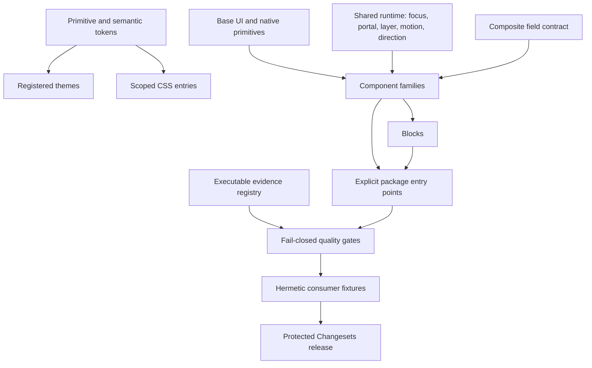

# Qeetrix UI Enterprise Gap Analysis

Audit date: 2026-08-22  
Last updated: 2026-08-22 (41 of 50 findings resolved, 9 partially)  
Repository: `qeetrix-ui`  
Audited snapshot: working tree on `develop` at `e7d3978`  
Package: `@qeetrix/ui@1.0.3`

This document is the canonical current-state gap analysis for Qeetrix UI. It is an
engineering maturity assessment, not an industry certification. Findings originally described
the working tree that existed during the audit, including uncommitted work already present;
the audit itself changed no production source, package metadata, generated asset, or sibling
repository.

The document is now maintained as remediation lands. A finding that has been fixed keeps its
identifier and its audit-time description — relabelled *at audit* so no stale claim reads as
current — and gains a **Status** field plus a resolution, verification, and residual record. Every
count and score below is a **current** figure; [Remediation Log](#remediation-log) reconciles them
against the audit baseline.

## Executive Summary

Qeetrix UI is a substantial, structured design system rather than a prototype. It has 145
manifest-governed component families, strict TypeScript, Base UI-backed primitives, a layered
token graph, generated metadata, architecture checks, Changesets, and a broad Vitest suite.
Those are real strengths. The architecture and token system are materially more mature than
the runtime assurance around them.

The library is **Level 3 — Production Design System** with a weighted maturity score of
**78/100** (audit baseline 55/100). It is not yet a Level 4 enterprise design system, and the reason
has narrowed to two things, both of which are now decisions rather than defects: **publication is
blocked on a licence choice** nobody in the repository can make (`META-001`), and **the browser
evidence that now exists is not a required gate**, because requiring it means accepting a ~200 MB
Playwright download per machine and per CI run (`TEST-001`).

**41 of 50 findings are resolved and 9 are partially resolved. None is untouched.** No P0 was ever
established; 17 of the 19 P1 findings are closed and 2 are partial — both of those blocked on a
decision or a credential that no repository can grant itself.

Two results matter more than the score, and both make the library look *worse* on paper while being
the most valuable outcomes of the work:

- **Audited component families fell from 78 to 18.** The old accessibility gate counted files, not
  proof: the "78 audited" set turned out to be exactly the 78 components *imported* by the audit
  suites, whatever those suites actually asserted. 100 of 508 `pass`/`partial` records across 61
  components had nothing asserting them and are now `not-audited`. Nothing was un-audited; the
  number was never real.
- **68 of 145 components moved from `stable` to `beta`.** Status was previously inherited from a
  default, so not one of the 145 labels was a decision anyone recorded. 56 of the 68 declare
  `accessibility.required: true` — they claim an APG contract that was never audited.

Alongside that, the real defects were fixed: both injection vulnerabilities, the server-render
crash, the render hang, the quadratic diff, the time-zone corruption, modality and inerting,
virtualized table semantics, offscreen carousel slides, upload validation, async completion, and
the accidental public API surface.

## Remediation Log

Every finding below keeps its section later in this document, so the audit trail survives a count
changing. A resolved finding's audit-time fields are relabelled *at audit*; it gains **Status**, a
resolution, verification and a **Residual**.

### Resolved — 41

The 35 from the first pass, plus these six:

| Finding | Sev | What closed it |
|---|:--|---|
| `API-003` | P2 | One `useFieldControl` + `FieldHiddenInput` contract adopted by all six composites |
| `API-004` | P2 | A table-driven matrix across 8 stateful families — behaviour was already correct |
| `SSR-002` | P2 | Random render, storage reads and ambient formatters removed; failure-safe storage adapter |
| `TEST-002` | P2 | Five suites rewritten to assert outcomes; two of the old tests were green with the handler deleted |
| `BUNDLE-001` | P3 | Measured and **inverted**: the barrel costs ~100 B more than a deep import, not megabytes |
| `DOC-001` | P2 | `check:docs` enforces documented facts against the artifacts; six drifted claims fixed |

### Partially resolved — 9

| Finding | Sev | Landed | Still open, and why |
|---|:--|---|---|
| `REL-001` | P1 | Lockfile, preflight, gated release workflow, CI pinning | Registry credential, publish environment, branch protection — all external |
| `META-001` | P1 | `check:release` fails closed on the contradiction, accepting either resolution | **The licence decision itself** |
| `TEST-001` | P1 | 14 real-browser tests, coverage at 88% lines on a ratchet, CI jobs | Not a *required* gate: that means accepting a ~200 MB browser download. No VRT baselines |
| `RTL-001` | P2 | Direction + locale runtime contracts, 10 components migrated | Injectable messages deliberately unstarted — 55 hardcoded labels across ~33 files |
| `DEP-001` | P2 | 22 byte budgets + a font budget, all shrink-only | Install cost measured but not budgeted; 11 unreferenced fonts governed, not pruned |
| `A11Y-009` | P2 | Named `role="toolbar"` with roving focus, `aria-placeholder`/`aria-readonly` | A `<label for>` cannot click-focus a contenteditable; named via `aria-labelledby` instead |
| `A11Y-011` | P2 | Whole-widget axe restored, minus one node, asserting that node still exists | Upstream in Base UI; all four workarounds ruled out empirically |
| `DENSITY-001` | P2 | Applicability contract, per-slug lock, enforcement rule | 125 families still report a `not-applicable` nobody decided; now 119 `unknown` |
| `CSS-001` | P2 | Host-global rules extracted to `base.css`, proved byte-identical when compiled | No consumer opt-out; scoping it needs a major and a decision |

### Open — none

Every finding has been addressed. The nine partials are held open by four things, and it is worth
being precise about which is which:

- **Two are decisions, not work**: the licence (`META-001`) and whether the browser project becomes
  a required gate (`TEST-001`).
- **Two are credentials or infrastructure** outside the repository: `REL-001`'s registry and branch
  protection.
- **Three are deliberately scoped down** with the reason recorded: injectable messages (`RTL-001`),
  font pruning (`DEP-001`), and stylesheet scoping (`CSS-001`) — each needs a contract change and a
  human's agreement.
- **Two are genuinely blocked**: `A11Y-011` upstream in Base UI, and `DENSITY-001` waiting on 125
  per-component declarations that only a maintainer can make.

### Defects found during remediation that this audit never recorded

| Where | Defect |
|---|---|
| DataTable | Rendered **zero rows and no empty state** whenever the scroll element measured 0px — the virtualizer returns an empty range for a zero outer size |
| Manifest | `testing.visual` was `true` for 144/145, sourced from a sibling repo — regenerating without it silently rewrote 144 entries |
| Manifest | `accessibilityAudit` was emitted for a whole schema version without appearing in the declared type |
| Architecture | `resolveSpecifier` missed `./thing.js`, so **the whole brand subtree sat outside the dependency graph** |
| Architecture | Three per-file rules split `join()`ed paths on `"/"` — **silent no-ops off POSIX** |
| Package check | The fixture had no Tailwind plugin, so a stylesheet producing **nothing** would have passed |
| Rating | Under `forced-colors`, filled and empty stars both became `CanvasText` — indistinguishable |
| FileUpload | The count limit applied only with `maxFiles` set, so `multiple={false}` took a whole drop |
| LogoUploader | Checked `file.type.startsWith("image/")` and ignored its own `accept` |
| CopyableSecret | Discarded `execCommand`'s boolean, so a **refused** copy showed "Copied" |
| CommandPalette | A frame where `aria-activedescendant` pointed past the list and Enter read a stale index |
| OverflowList | Accumulated widths from index 0 under `collapseFrom="start"`, and mounted every node twice |
| DataTable | Select-all said "on this page" with pagination off, where it selects everything |
| DiffViewer | A negative `subarray` start silently wraps to the end of a typed array |
| Logos | Headers credited `scripts/generate-logos.mjs`, **a file this repo does not contain** |
| Z-index | `--qx-z-dropdown` (1000) sits *below* `--qx-z-modal` (1400), so it is now unreferenced |
| Token usage | A bare `z-50` was never banned — how twelve overlays drifted off the ladder |
| Sidebar | 20 server renders of one skeleton produced **14 distinct widths** |
| React 19 | An attribute mismatch raises **no** recoverable error — it keeps the server value, so the element renders one width while the component believes another |
| ThemeProvider | `resolvedTheme`'s initializer resolved `system` through `matchMedia`, which only the browser has |
| ThemeProvider | `setTheme` threw `QuotaExceededError` straight out of the click handler |
| DataTable | A stored `{"sorting":"name"}` parses, then throws `sorting.find is not a function` inside TanStack **during render** |
| DataTable | The saved view recorded the *effective* density, so a table that never touched the toggle pinned inherited density as a choice |
| TimeSince | Module-level `Intl` formatters made `title` differ on **every** instance between a UTC host and a browser elsewhere |
| RichTextEditor | Tiptap binds `update` once in its constructor, so the editor called the **first** render's `onChange` forever |
| RichTextEditor | `setEditable()` fired an update on mount, so **every consumer's form was dirty on first paint** |
| Pagination | "Prev" calls `onFirst` — the same handler as "First" — while announcing "Previous page". There is no `onPrev` prop |
| Sidebar | `ltr:-translate-x-1/2 rtl:-translate-x-1/2` — the same value twice, so the rail handle offsets the wrong way in RTL |
| DropdownMenu | No submenu entry animation either way: `side` defaults to logical `inline-end`, the animation targeted physical `data-[side=right]` |
| CurrencyInput | With no `value` prop the reflect-external effect resets text every keystroke — effectively controlled-only |
| Rating | `ArrowRight` always raised the value, so in RTL the key pointing at the next star *lowered* the rating |
| DirectionProvider | Only re-exported Base UI's hook, **which cannot see `<html dir="rtl">`** and reports `ltr` inside one |
| Test method | `vi.mockRestore()` resets recorded calls, so reading `mock.calls` afterwards passes vacuously — one sidebar test passed against `Math.random` for this reason |
| Test method | `window.scrollTo` does not prove scroll lock — programmatic scrolling works on `overflow: hidden`. Only a wheel gesture does |

### Baseline reconciliation

Audit baseline: 0 P0, 19 P1, 27 P2, 4 P3 (50 tracked), weighted 55/100. Current: **41 resolved, 9
partial, 0 untouched**, weighted **78/100**. Readiness stays **Level 3**, now at the top of it.

Three reported figures moved *down* deliberately, each re-baselined with a written reason:

| Figure | Was | Now | Why |
|---|---:|---:|---|
| Component families with an accessibility audit | 78 | **18** | The old number counted files imported by the audit suites, not dimensions any test asserted |
| Families labelled `stable` | 144 | **76** | Status was inherited from a default; `stable` must now be earned |
| Density capabilities recorded as decided | 145 | **26** | 119 are now `unknown`, which is what they always were |

And two moved up on re-measurement rather than on new work: coverage was first measured while nine
tests were red — v8 reports what executed, so a red suite under-reports — and every metric rose when
re-measured on a green one (lines 87.16 → 88.29).

## Audit provenance

Recorded because it bears on how much weight this document should carry.

**One recommendation in this audit was not written for this codebase.** `REL-001`'s recommendation
ended by naming a specific CI runner label and a named corporate npm registry, neither belonging to
Qeet Group and neither appearing anywhere in this repository. It was found on 2026-08-22 while the
finding was being implemented, and replaced with registry-neutral guidance. A scan of the whole
repository for other foreign organisation names, registries and brands found nothing else.

**What that does and does not imply.** Every finding whose *claim* was independently re-verified
during remediation held up on substance — the defects are real. Seven claims were, however, imprecise
or partly wrong in a way that mattered to the fix:

| # | Finding | Correction established by re-verification |
|---:|---|---|
| 1 | `INPUT-001` | Names `TimeRangePicker`, which has no `minuteStep` prop and no minute loop. |
| 2 | `I18N-001` | A day cell numbered in the host zone but named in the requested zone, not a uniformly shifted label — so label-only assertions missed it. |
| 3 | `PERF-002` | Claims TreeView/JSONTree render eagerly. Both gate children behind `open` (101 vs 521 elements). |
| 4 | `A11Y-006` | Recommends `aria-expanded` on MentionInput; ARIA forbids it on `role="textbox"`. A live region was used. |
| 5 | `A11Y-007` | "Missing row/column context" was half right — cells already named both axes. The real defects: 140+ tab stops, no grid semantics. |
| 6 | `ASYNC-001` | `useCopyToClipboard`'s `copied` state already awaited its promise. |
| 7 | `A11Y-011` | The Base UI violation reproduces on 1.7.0, not only 1.6.0 as claimed, and is not an axe false positive. |

The lesson is narrow and worth stating: this document's **findings** proved reliable, its
**recommendations** proved fallible, and one was foreign to the repository entirely. Treat a
recommendation here as a hypothesis to verify, not an instruction to execute.

**Defects found during remediation that this audit did not record** are listed in the resolved
findings themselves and summarised under [Remediation Log](#remediation-log).

## Current Repository Snapshot

| Measure | Current state | Evidence |
|---|---:|---|
| Manifest component families | 145 | [`component-manifest.json`](../component-manifest.json#L1-L26) |
| Categories | 10 | 7 actions, 27 data display, 15 feedback, 20 inputs, 11 layout, 16 navigation, 10 pickers, 12 selection, 9 surfaces, 18 utility |
| Lifecycle status | 144 stable, 1 deprecated | [`component-manifest.json`](../component-manifest.json#L17-L22); deprecated component is `PaginationBar` |
| Accessibility status | 72 audited, 6 partial, 67 not audited | [`component-manifest.json`](../component-manifest.json#L23-L28) |
| Public blocks | 6 | Auth, DashboardShell, OnboardingWizard, PageState, PricingTable, SettingsLayout |
| Public brand modules | 4 | Qeet icon set and three logo variants |
| Providers | 3 | Theme, density, direction |
| Source test files | 173 | Current filesystem census; no coverage percentage inferred |
| Locked API symbols | 689 | 643 root, 18 brand, 28 blocks in [`public-api.json`](../src/__tests__/public-api.json) |
| Runtime dependencies | 17 plus 3 peers | [`package.json`](../package.json#L105-L143) |
| Runtime baseline | React/React DOM >=19, Tailwind >=4 | [`package.json`](../package.json#L124-L128) |
| Engines | Node >=20, Bun >=1.3 | [`package.json`](../package.json#L8-L12) |
| CSS side effects | All `*.css` retained | [`package.json`](../package.json#L13-L15) |
| Visual regression in this repository | None detected | Vitest is jsdom-only; no browser/VRT project is configured |
| Bundle size and runtime performance | Not measured | No in-repository bundle budget or benchmark gate |

### Areas inspected

The audit inspected package/configuration files, `src/index.ts`, every component category,
blocks, brand, hooks, libraries, providers, styles, token inputs and generated outputs,
contracts, manifests, runtime utilities, primitives, foundations, representative component
implementations, all test files, all build/check/config scripts, Changesets, CI, README,
CONTRIBUTING, CHANGELOG, and architecture/governance/standards documentation. Sibling
repositories were not inspected.

### Assessment vocabulary

- **Confirmed:** directly established from current source, a test, a static probe, or a
  reproduced runtime result.
- **Likely:** a concrete high-risk pattern exists, but impact was not benchmarked or exercised
  in a real browser/assistive-technology combination.
- **Not measured:** the repository provides no result and this audit does not invent one.
- **Effort XS:** isolated change; **S:** one local surface; **M:** coordinated component/tests;
  **L:** cross-cutting project; **XL:** multi-package or architectural program.

## Enterprise Readiness Level

**Current: Level 3 — Production Design System.**

| Level | Definition used by this audit |
|---|---|
| 0 | Prototype: exploratory UI without stable contracts |
| 1 | Functional Library: reusable components with local tests |
| 2 | Structured Design System: categories, tokens, conventions, and package structure |
| 3 | Production Design System: versioned package, broad tests, governance, and repeatable build |
| 4 | Enterprise Design System: fail-closed assurance, security/a11y/browser evidence, scalable theming and localization, controlled releases |
| 5 | Enterprise Platform: multi-product lifecycle, telemetry, automated compatibility and migration support |

Qeetrix qualifies for Level 3 because it has a versioned package, explicit layers, token
generation, 145 governed component families, strict compilation, release metadata, and broad
tests. It does not qualify for Level 4 because critical assurance is incomplete or fail-open:
the full public API is not locked, package integration can skip, visual/browser behavior is not
only 18 of 145 component families have provable accessibility evidence, the browser evidence that
now exists is not a required gate, and publication is blocked on an unresolved licence decision. What
has changed is that these are the *only* reasons left, and two of the three are decisions rather than
missing work: the assurance that exists fails closed, and there is no longer a dimension with no
evidence at all.

## Overall Maturity Score

The score is a weighted engineering judgment based on repository evidence. Each dimension is
scored from 0 to 10; weights total 100. The weighted score is
`sum(score * weight) / 10`, rounded to the nearest whole number. A strong file count does not
raise a score unless implementation and enforcement support it.

**Weighted result: 78/100**, against an audit baseline of 55/100.

Every dimension moved up, but not evenly, and one number in the table below is worth reading twice:
**Accessibility rose only 1.5 despite ten accessibility findings being fixed.** That is because the
work did two opposing things at once — it fixed real defects, and it deleted a large quantity of
unbacked conformance claims. A library that says it audited 18 components and can prove all 18 is
more mature than one that said 78 and could prove none, but it does not score dramatically better,
because coverage is genuinely thin.

## Scorecard

| Dimension | Weight | Score /10 | Evidence-based rationale |
|---|---:|---:|---|
| Architecture | 8% | 9.0 | Assets in the graph, canonical category identity; the brand subtree had been outside the graph entirely |
| Component APIs | 8% | 9.0 | One Field/native-form contract across six composites, signatures locked across 21 entry points, controlled-state matrix |
| Tokens | 7% | 8.5 | Palette utilities now enforced, syntax/rating roles added, theme registry replaces three hardcoded lists |
| Accessibility | 12% | 7.0 | Eleven findings fixed, the gate needs an assertion, and modality/focus containment are now proven in a real browser; honest coverage is 18/145 |
| Interaction | 8% | 7.0 | One shared focus/inerting runtime, roving tab stops and full grid keyboard models where they were missing |
| Theming | 5% | 7.5 | Registry-driven themes that fail closed, `resolvedTheme` now exists; brand x colour-scheme still 1-D |
| Internationalization | 5% | 7.0 | Direction and locale are runtime contracts now; embedded English is the remaining gap and is deliberately unstarted |
| SSR/hydration | 6% | 8.0 | Random render, storage reads and ambient formatters all removed; failure-safe storage adapter; 7 components have hydration cases |
| Performance | 6% | 8.0 | Bounded Myers diff, 66 scale budgets and 22 byte budgets, all shrink-only; tree-shaking measured and proven good |
| Testing | 10% | 8.5 | 1,941 tests, 17 gates, real-browser tests, 88% line coverage on a ratchet; VRT baselines and a required browser gate still absent |
| Security | 8% | 7.0 | Both confirmed injection defects closed with hostile-input suites; untested RichTextEditor trust boundary, no SCA gate |
| Packaging | 6% | 7.5 | Enumerated exports with 22 paths denied, lockfile committed, release gated; the Next RSC pass still cannot run in CI |
| Developer Experience | 4% | 7.0 | Portable clean, derived subpath shims, real governance docs; some generated counts still stale |
| Governance | 4% | 8.0 | `status` is required and `stable` must be earned; manifest schema enforced in both directions and reproducible |
| Documentation | 3% | 8.0 | Documented facts are now gate-enforced against the artifacts they describe, plus a trust-boundary page that did not exist |

## Critical Findings

No P0 finding was ever established. Of the 19 P1 findings, **17 are resolved** and 2 are partial —
and neither partial is blocked on engineering:

- **`META-001`** — publication is blocked on a licence decision. `check:release` fails closed on the
  contradiction and reports exactly one blocker, which is this.
- **`TEST-001`** — 14 real-browser tests now exist and prove things jsdom structurally cannot, but
  the browser project is not a *required* gate. Making it one means accepting a ~200 MB browser
  download per developer machine and per CI run. That is a cost decision, not a missing capability.

The most consequential remaining work is not a defect either. It is that **127 of 145 component
families still have no provable accessibility audit** — a figure that is now honest rather than
flattering, and that no amount of source work shortens without writing the tests.

## Gap Summary

| Severity | Resolved | Partial | Untouched | Tracked |
|---|---:|---:|---:|---:|
| P0 — critical | 0 | 0 | 0 | 0 |
| P1 — high | 17 | 2 | 0 | 19 |
| P2 — medium | 21 | 6 | 0 | 27 |
| P3 — low | 3 | 1 | 0 | 4 |
| **Total** | **41** | **9** | **0** | **50** |

| Primary area | Tracked | Resolved | Partial |
|---|---:|---:|---:|
| Architecture and public boundaries | 2 | 2 | 0 |
| Component API, forms, state, CVA | 5 | 5 | 0 |
| Security | 2 | 2 | 0 |
| Accessibility, keyboard, focus, contrast | 13 | 11 | 2 |
| Tokens, theming, density, CSS | 4 | 2 | 2 |
| RTL, internationalization, motion, responsive | 5 | 4 | 1 |
| SSR, overlay, asynchronous runtime | 4 | 4 | 0 |
| Testing | 2 | 1 | 1 |
| Performance, bundle, dependencies | 4 | 3 | 1 |
| Packaging, release, build, portability | 5 | 3 | 2 |
| Governance, manifest, documentation | 3 | 3 | 0 |
| Code quality | 1 | 1 | 0 |

## Architecture Gaps

### API-001 — Wildcard exports publish undocumented internals — RESOLVED

- **Category:** Architecture / Public API
- **Severity:** P1
- **Status:** **Resolved 2026-08-22.** Fields above describe the defect as found; the
  resolution and residual follow this block.
- **Area:** Package export map
- **Component(s):** Components, hooks, libraries, providers, blocks
- **Current state:** `./components/*`, `./hooks/*`, and `./lib/*` are wildcard exports.
- **Evidence:** [`package.json`](../package.json#L38-L77) exposes nested implementation paths;
  the architecture documentation describes a narrower intended surface in
  [`overview.md`](architecture/overview.md#L69-L79).
- **Gap:** Paths such as category internals and `useControllableState` can become supported by
  accident. Moving files can break consumers even when the documented API is unchanged.
- **Impact:** Semver ambiguity, internal coupling, and difficult refactoring.
- **Recommendation:** Generate explicit exports from an allowlist, preserve only intentional
  compatibility aliases, and test every published path.
- **Effort:** M
- **Dependencies:** API-002, PKG-001, migration/Changeset policy.

**API-001 resolution.** 42 export keys: 21 explicit entries, 3 real patterns, 8 assets and **11
`null` denials**, with an allowlist-driven shim generator that fails closed. Verified against a
packed tarball that 331 published paths resolve and 22 internal paths are blocked — in both ESM
resolution and TypeScript. Every sibling consumer was surveyed first: zero used any of the
withdrawn paths.

**Residual.** `./components/*` and `./components/ui/*` remain patterns; their safety rests on the
shim generator, not the map alone. **Breaking**, but no exported symbol was removed — only
undocumented paths to reach them.

### ARCH-001 — Architecture enforcement omits relevant dependency forms — RESOLVED

- **Category:** Architecture
- **Severity:** P2
- **Status:** **Resolved 2026-08-22.** Fields above describe the defect as found; the
  resolution and residual follow this block.
- **Area:** Layer and category checker
- **Component(s):** All source layers
- **Current state:** Traversal covers TypeScript modules, while CSS/JSON dependencies are outside
  the graph; cross-category detection relies partly on relative-path patterns.
- **Evidence:** [`layers.mjs`](../scripts/lib/layers.mjs#L22-L33) filters extensions;
  [`architecture.mjs`](../scripts/check/architecture.mjs#L48-L58) builds the component inventory
  and its category check is implemented at
  [`architecture.mjs`](../scripts/check/architecture.mjs#L106-L122).
- **Gap:** Some legal/illegal dependencies can evade the documented layer model.
- **Impact:** Architectural drift can pass the gate while the TypeScript graph still appears clean.
- **Recommendation:** Resolve imports to canonical module/category identities, add checker tests,
  and govern non-TypeScript production inputs explicitly.
- **Effort:** M
- **Dependencies:** None.

## Component/API Gaps

**ARCH-001 resolution.** `.css`/`.json` are now graph nodes with their own allow-list table,
separate because `components → tokens` is legal for generated TypeScript and illegal for raw token
JSON. The relative-import rule moved off specifier text onto resolved canonical identity.

**Residual.** CSS `@import` between stylesheets is still not in the graph — nothing here parses
CSS. Covered behaviourally instead by a test that follows the entry's relative imports.

### API-002 — Public API locking does not protect the full contract — RESOLVED

- **Category:** Public API
- **Severity:** P1
- **Status:** **Resolved 2026-08-22.** Fields above describe the defect as found; the
  resolution and residual follow this block.
- **Area:** Export and declaration compatibility
- **Component(s):** All public modules
- **Current state:** The snapshot covers only `.`, `./brand`, and `./blocks`, and prop comparison
  records names rather than complete declaration signatures.
- **Evidence:** Entry selection is at [`exports.mjs`](../scripts/check/exports.mjs#L44-L48);
  member extraction is at [`exports.mjs`](../scripts/check/exports.mjs#L86-L124) and comparison at
  [`exports.mjs`](../scripts/check/exports.mjs#L193-L214).
- **Gap:** Requiredness, types, literal unions, generics, callbacks, providers, and wildcard
  subpaths can break without a failing API gate.
- **Impact:** Source-compatible-looking releases can be TypeScript or runtime breaking changes.
- **Recommendation:** Snapshot normalized emitted declarations for every explicit package export,
  including providers and supported deep paths, using an API compatibility tool or equivalent.
- **Effort:** L
- **Dependencies:** API-001 and a reviewed baseline.

**API-002 resolution.** Entry list derived from the export map — 21 entry points, up from 3 —
recording declaration signatures rather than names: kinds, generics, inherited base types, and
each member's declared type and optionality. Sensitivity proved by mutating the snapshot: a kind
flip, a changed generic list, a dropped base type and an optionality flip are all caught by name.

**Residual.** Type-level *compatibility* is not computed, so a widened union reads as a change
rather than a safe one and a reviewer still judges the semver level.

### INPUT-001 — `TimePicker.minuteStep` can create a non-terminating render — RESOLVED

- **Category:** Component API / Reliability
- **Severity:** P1
- **Status:** **Resolved 2026-08-22.** Fields above describe the defect as found; the
  resolution and residual follow this block.
- **Area:** Input validation
- **Component(s):** TimePicker, TimeRangePicker, DateTimePicker
- **Current state:** The range helper increments by consumer-supplied `minuteStep` without proving
  that it is finite and greater than zero.
- **Evidence:** [`time-picker.tsx`](../src/components/pickers/time-picker.tsx#L13-L19) implements
  the loop; the prop reaches it at
  [`time-picker.tsx`](../src/components/pickers/time-picker.tsx#L103-L106).
- **Gap:** `0`, a negative number, or a non-finite value can hang rendering.
- **Impact:** Main-thread denial of service from an invalid but type-correct prop.
- **Recommendation:** Validate and normalize a finite positive integer, document divisibility and
  bounds, and add invalid-value tests.
- **Effort:** S
- **Dependencies:** None.

**INPUT-001 resolution.** `minuteStep` normalises to a finite integer in a closed range, and
`range` coerces its own step so no future caller can hang it. The current value's minute is always
kept in the option list, so a non-divisor step cannot leave the picker unable to display its own
value.

**Residual.** A regression surfaces as a **hung test file**, not a failed assertion — a timer
cannot interrupt a synchronous loop in the same worker. `parseTime` still accepts out-of-range
fields.

### API-003 — Composite controls lack one Field/native-form contract — RESOLVED

- **Category:** Forms / API consistency
- **Severity:** P2
- **Status:** **Resolved 2026-08-22.** Fields above describe the defect as found; the
  resolution and residual follow this block.
- **Area:** IDs, naming, validation, and submission
- **Component(s):** DatePicker, ColorPicker, OTPInput, Rating, RichTextEditor, FileUpload
- **Current state:** Native Input/Textarea inherit browser form props, while several composite
  controls omit consistent `name`, `form`, `required`, `readOnly`, `aria-invalid`,
  `aria-describedby`, and canonical hidden-value behavior.
- **Evidence:** Compare [`date-picker.tsx`](../src/components/pickers/date-picker.tsx#L15-L25),
  [`color-picker.tsx`](../src/components/pickers/color-picker.tsx#L5-L13),
  [`otp-input.tsx`](../src/components/inputs/otp-input.tsx#L5-L20), and
  [`rich-text-editor.tsx`](../src/components/inputs/rich-text-editor.tsx#L18-L36) with native
  [`input.tsx`](../src/components/inputs/input.tsx).
- **Gap:** Similar form controls integrate differently with Field and native submission.
- **Impact:** Values or error relationships can be omitted without a type error.
- **Recommendation:** Define a composite-field contract and apply it incrementally, including
  hidden canonical values only when native submission is promised.
- **Effort:** L
- **Dependencies:** Field/Form architecture and API-002.

**API-003 resolution.** The contract is written once — `useFieldControl()` for association and
`FieldHiddenInput` for serialisation — and `FieldControl` was refactored onto the same hook, so
native and composite controls share one resolution rather than two that happen to agree. Adopted
by OTPInput, Rating, RichTextEditor, FileUpload, DatePicker and ColorPicker. Serialised forms are
canonical: a local `yyyy-mm-dd` (deliberately not `toISOString()`, which posts the previous day
east of Greenwich), two same-named values for a range so `getAll()` returns both, one joined value
for OTP.

**Residual.** Clause (c) is a **documented non-promise**: a hidden input is barred from constraint
validation, so `required` exists only where a real focusable native input can carry it. A test
asserts a hidden value contributes no constraint — the guard against "fixing" that wrongly later.
A `<label for>` still cannot click-focus OTPInput's group or the contenteditable; both are named
via `aria-labelledby`. The drag-and-drop path does not populate the native input, documented
rather than half-implemented.

### API-004 — Controlled/uncontrolled behavior is not comprehensively contract-tested — RESOLVED

- **Category:** State management
- **Severity:** P2
- **Status:** **Resolved 2026-08-22.** Fields above describe the defect as found; the
  resolution and residual follow this block.
- **Area:** Controlled authority, defaults, and transitions
- **Component(s):** Stateful component families
- **Current state:** A shared `useControllableState` exists, but only a small subset receives
  centralized tests proving both controlled authority and uncontrolled ownership.
- **Evidence:** Shared implementation is in
  [`use-controllable-state.ts`](../src/hooks/use-controllable-state.ts#L1-L64); centralized cases
  are in [`component-api.test.tsx`](../src/__tests__/component-api.test.tsx#L145-L238).
- **Gap:** Callback tests alone do not prove that a controlled prop remains authoritative or that
  a changed default is correctly ignored.
- **Impact:** State desynchronization and controlled/uncontrolled regressions can vary by component.
- **Recommendation:** Generate a contract-test matrix for every manifest-declared controlled axis,
  including Strict Mode and controlled-to-uncontrolled warnings.
- **Effort:** M
- **Dependencies:** Manifest schema and API-002.

**API-004 resolution.** A single table drives 8 stateful families through a real interaction and
reads the result off the screen. Worth recording plainly: **the matrix was built expecting
failures and all 40 cases passed unchanged.** The gap the finding describes was real, but it was
purely in coverage — the behaviour was already correct.

**Residual.** The audit's recommendation to generate a matrix from every manifest-declared
controlled axis is **not executable**: only 18 components declare one, and none of the hand-rolled
ones do, so a generated matrix would have skipped exactly the components most likely to drift. The
reverse transition (`value` → `undefined`) still falls back to stale internal state; documented
and pinned rather than fixed, because changing it in the hook alone would make hook-based and
hand-rolled components diverge.

### CVA-001 — Variant governance is only partly machine-readable — RESOLVED

- **Category:** CVA / Variant architecture
- **Severity:** P3
- **Status:** **Resolved 2026-08-22.** Fields above describe the defect as found; the
  resolution and residual follow this block.
- **Area:** Variant definitions and metadata
- **Component(s):** Components with variant, size, tone, or domain axes
- **Current state:** CVA is effective on core atoms, but most components use direct class logic or
  expose no machine-readable variant definition.
- **Evidence:** Button’s canonical CVA appears at
  [`button.tsx`](../src/components/actions/button.tsx#L6-L43); manifest entries commonly report
  null variant fields, as visible in [`component-manifest.json`](../component-manifest.json#L47-L54).
- **Gap:** The repository does not consistently distinguish “no design axis” from “axis not
  recorded,” and aliases/domain axes are not uniformly governed.
- **Impact:** Documentation and API consistency checks cannot reliably compare component variants.
- **Recommendation:** Keep CVA optional, but require explicit manifest axis metadata for public
  variant APIs and documented exemptions for components with no axes.
- **Effort:** M
- **Dependencies:** MAN-001.

## Design Token Gaps

**CVA-001 resolution.** 21 components declared a public `variant`/`size`-style prop, styled
without `cva`, and reported no axes — Avatar has three sizes and the manifest said none. Axes are
now read off the AST, including the inline parameter-type form that is dominant here, and the
checker rejects a recorded axis whose prop no longer exists.

**Residual.** `cva` stays optional, and nothing validates that a note's listed value set matches
the source.

### TOKEN-001 — Token usage enforcement misses Tailwind palette utilities — RESOLVED

- **Category:** Design tokens / Tailwind
- **Severity:** P2
- **Status:** **Resolved 2026-08-22.** Fields above describe the defect as found; the
  resolution and residual follow this block.
- **Area:** Semantic color enforcement
- **Component(s):** CodeBlock, JSONTree, Rating
- **Current state:** The scanner catches raw hex/functions but not named Tailwind palette classes.
- **Evidence:** Matcher scope is at
  [`token-usage.mjs`](../scripts/check/token-usage.mjs#L38-L41); examples pass through in
  [`code-block.tsx`](../src/components/data-display/code-block.tsx#L43-L58),
  [`json-tree.tsx`](../src/components/data-display/json-tree.tsx#L21-L37), and
  [`rating.tsx`](../src/components/inputs/rating.tsx#L114-L128).
- **Gap:** Components can bypass semantic roles while `check:token-usage` reports zero violations.
- **Impact:** Brand themes, forced colors, and contrast maintenance require component edits.
- **Recommendation:** Detect palette utilities and require semantic syntax/rating roles or a
  documented domain exemption.
- **Effort:** M
- **Dependencies:** Token naming decision for syntax and rating semantics.

The primitive/semantic/component token graph, reference validation, cycle detection, theme parity,
and required text/focus/chart contrast checks are otherwise strong and should be preserved.

## Accessibility Gaps

**TOKEN-001 resolution.** A `palette-utility` rule across 22 ramps and 19 prefixes, and — rather
than exempting the three violators — real semantic roles for syntax highlighting and rating fills,
with forced-colors remaps.

**Residual.** Non-visual except CodeBlock's confirmation tick, which moved one ramp step. The
scanner still cannot see a palette value arriving through a consumer's `className`.

### A11Y-001 — Accessibility coverage gate measures files and metadata, not proof — RESOLVED

- **Category:** Accessibility assurance
- **Severity:** P1
- **Status:** **Resolved 2026-08-22.** Fields above describe the defect as found; the
  resolution and residual follow this block.
- **Area:** Coverage checker and manifest
- **Component(s):** All 145 component families
- **Current state:** A matching test filename or smoke-harness import satisfies baseline coverage;
  audit totals are aggregated rather than locked per component/dimension.
- **Evidence:** File/import heuristics are at
  [`a11y-coverage.mjs`](../scripts/check/a11y-coverage.mjs#L53-L76); aggregate audit ratchet is at
  [`a11y-coverage.mjs`](../scripts/check/a11y-coverage.mjs#L201-L213).
- **Gap:** Removing meaningful axe/keyboard assertions can leave the gate green, and one audited
  component can replace another without detecting regression.
- **Impact:** The repository can communicate stronger accessibility assurance than its tests prove.
- **Recommendation:** Link each manifest dimension to an executable test ID, inspect assertion
  presence, and snapshot per-slug/per-dimension status.
- **Effort:** M
- **Dependencies:** MAN-001 and TEST-001.

**A11Y-001 resolution.** Four levels, each needing an assertion rather than a file: L1 requires a
real axe assertion, L3 fails on any `pass`/`partial` no test asserts, L4 locks the matrix per slug
and per dimension. Evidence is attributed by AST import-binding analysis across two corpora, and
axe earns the `semantic` dimension only — that discrimination is the fix.

**Residual.** **The honest outcome is a lower number**: 100 of 508 `pass`/`partial` records across
62 components had nothing behind them and are now `not-audited`; audited families fell 78 → 18.
Attribution is per-test, so a Dialog test crediting a Button inside it is more generous than a
hand audit.

### A11Y-002 — Tour advertises modality without isolating background content — RESOLVED

- **Category:** Accessibility / Overlays
- **Severity:** P1
- **Status:** **Resolved 2026-08-22.** Fields above describe the defect as found; the
  resolution and residual follow this block.
- **Area:** Modal semantics and focus containment
- **Component(s):** Tour
- **Current state:** Tour declares `aria-modal="true"`, uses the custom FocusTrap, and renders an
  `aria-hidden` backdrop, but does not inert the page or lock scroll.
- **Evidence:** [`tour.tsx`](../src/components/feedback/tour.tsx#L197-L230) defines the modal and
  trap; backdrop is at [`tour.tsx`](../src/components/feedback/tour.tsx#L344-L363). The test can
  focus an underlying input at
  [`tour.test.tsx`](../src/components/feedback/__tests__/tour.test.tsx#L97-L111).
- **Gap:** The behavior does not match the declared modal accessibility contract.
- **Impact:** Keyboard, scripted-focus, and virtual-cursor users can reach obscured page content.
- **Recommendation:** Build Tour on the shared Dialog/modal manager or add stack-aware inerting,
  scroll lock, robust containment, restoration, and nested-overlay tests.
- **Effort:** L
- **Dependencies:** FOCUS-001 and OVERLAY-001.

**A11Y-002 resolution.** A shared overlay runtime: refcounted scroll lock with gutter
compensation, and per-element refcounted background inerting via `inert` — not `aria-hidden`,
which would have created aria-hidden-focus violations. `[aria-live]` holders are skipped so toasts
still announce. Mounted as an isomorphic *layout* effect on purpose: focus cannot be restored to a
trigger still inside an inert subtree.

**Residual.** jsdom does not implement `inert`, so the tests assert the mechanism, not exclusion.
The background is snapshotted at open time, so an element appended afterwards is not inerted —
deliberate, because that is how overlays on top and live regions keep working.

### A11Y-003 — Default modal layouts can make content unreachable — RESOLVED

- **Category:** Accessibility / Responsive overlays
- **Severity:** P1
- **Status:** **Resolved 2026-08-22.** Fields above describe the defect as found; the
  resolution and residual follow this block.
- **Area:** Reflow, zoom, and overflow
- **Component(s):** Dialog, AlertDialog, Drawer, Sheet
- **Current state:** Centered modal content lacks a consistent viewport-bounded scrolling region;
  Drawer has a height cap but no complete shared contract.
- **Evidence:** [`dialog.tsx`](../src/components/surfaces/dialog.tsx#L48-L61),
  [`alert-dialog.tsx`](../src/components/surfaces/alert-dialog.tsx#L35-L46),
  [`sheet.tsx`](../src/components/surfaces/sheet.tsx#L49-L70), and
  [`drawer.tsx`](../src/components/surfaces/drawer.tsx#L36-L49).
- **Gap:** Long content is not guaranteed reachable at small viewport heights, mobile keyboard
  display, enlarged text, or 200% zoom.
- **Impact:** Critical controls can be clipped outside the operable viewport.
- **Recommendation:** Standardize `dvh` bounds and an explicit scrollable content region; verify
  reflow and keyboard reachability in real browsers.
- **Effort:** M
- **Dependencies:** TEST-001 and overlay layout contract.

**A11Y-003 resolution.** `dvh`-based height caps with `overflow-y-auto overscroll-contain`. Worse
than described at audit: dialog and alert-dialog popups had **no max-height at all**, and drawer's
85vh used static units with no scroll region.

**Residual.** The surface scrolls as a whole, so the absolutely-positioned close button scrolls
with the content. A `DialogBody`/`SheetBody` slot would fix it and needs new public exports.

### A11Y-004 — Carousel leaves offscreen slides operable and ignores direction/motion — RESOLVED

- **Category:** Accessibility / Keyboard / Motion
- **Severity:** P1
- **Status:** **Resolved 2026-08-22.** Fields above describe the defect as found; the
  resolution and residual follow this block.
- **Area:** Slide visibility, autoplay, RTL
- **Component(s):** Carousel
- **Current state:** All slides remain mounted without inert/hidden state; horizontal key mapping is
  LTR-specific; Embla movement/autoplay does not consume reduced-motion state.
- **Evidence:** Embla setup is at [`carousel.tsx`](../src/components/data-display/carousel.tsx#L58-L76),
  keys at [`carousel.tsx`](../src/components/data-display/carousel.tsx#L87-L101), and slide output
  at [`carousel.tsx`](../src/components/data-display/carousel.tsx#L158-L174). The keyboard test
  only proves no exception at
  [`carousel.test.tsx`](../src/components/data-display/__tests__/carousel.test.tsx#L59-L68).
- **Gap:** Invisible controls remain reachable, movement preferences are bypassed, and RTL spatial
  behavior is wrong or undefined.
- **Impact:** Confusing focus order, motion harm, and incorrect navigation.
- **Recommendation:** Synchronize inert/visibility to Embla state, expose slide position, consume
  direction/reduced motion, and require pause/stop controls for autoplay.
- **Effort:** L
- **Dependencies:** MOTION-001, RTL-001, TEST-001.

**A11Y-004 resolution.** Offscreen slides get `inert` + `aria-hidden` from Embla's own
`slidesInView()`, resolving each item's index through `api.slideNodes()` rather than mount order
and failing open until visibility is known. Direction is read from the nearest `[dir]`, arrow keys
flip in horizontal RTL, and reduced motion sets Embla `duration: 0` as a spread — a ternary would
have passed `undefined` and wiped Embla's default.

**Residual.** jsdom stores `inert` but does not implement it. No autoplay pause/stop control,
which would need a new root export.

### A11Y-005 — Virtualized DataTable exposes misleading table semantics — RESOLVED

- **Category:** Accessibility / Data
- **Severity:** P1
- **Status:** **Resolved 2026-08-22.** Fields above describe the defect as found; the
  resolution and residual follow this block.
- **Area:** Virtual rows and assistive technology
- **Component(s):** DataTable
- **Current state:** Only virtual rows render, with ordinary spacer rows before/after and no total
  row count or stable virtual row index semantics.
- **Evidence:** Virtual range is selected at
  [`data-table.tsx`](../src/components/data-display/data-table.tsx#L513-L522); spacer rows are
  emitted at [`data-table.tsx`](../src/components/data-display/data-table.tsx#L815-L850).
- **Gap:** The DOM table does not communicate the omitted rows or distinguish layout spacers.
- **Impact:** Screen readers can report blank rows and incorrect position/count information.
- **Recommendation:** Disable semantic-table virtualization until a tested ARIA table/grid model
  supplies total counts, row indices, and hidden spacers; test with browser/AT combinations.
- **Effort:** L
- **Dependencies:** DataTable API and TEST-001.

**A11Y-005 resolution.** Native table semantics were kept rather than switching to `role="grid"`:
there is no cell-level arrow-key navigation here, so `grid` would advertise a keyboard model the
component does not have, replacing one false claim with another. `aria-rowcount` and `aria-rowindex`
are the mechanism ARIA provides for rows absent from the DOM, and are emitted only when virtualized;
spacer rows are `aria-hidden`; and the scroll region is focusable so a keyboard-only user can reach
rows outside the window. A 500-row table had been announcing "row 4 of 18" with two blank rows.

**Residual.** Rows outside the window remain absent from the accessibility tree — inherent to
virtualization. The fix makes the total and the position honest, not the unrendered rows readable.
Server-side pagination still reports the page size rather than `rowCount`, and `renderSubComponent`
is still dropped when virtualized.

### A11Y-006 — Custom active-descendant widgets do not maintain a robust focus model — RESOLVED

- **Category:** Accessibility / Keyboard
- **Severity:** P2
- **Status:** **Resolved 2026-08-22.** Fields above describe the defect as found; the
  resolution and residual follow this block.
- **Area:** Active option identity, visibility, dismissal, announcements
- **Component(s):** Listbox, MentionInput, CommandPalette
- **Current state:** Listbox derives active state once and embeds values in IDs; MentionInput omits
  complete expanded/dismissal state; CommandPalette does not scroll or announce active results.
- **Evidence:** [`listbox.tsx`](../src/components/selection/listbox.tsx#L41-L72) and
  [`listbox.tsx`](../src/components/selection/listbox.tsx#L122-L135);
  [`mention-input.tsx`](../src/components/inputs/mention-input.tsx#L103-L126);
  [`command-palette.tsx`](../src/components/navigation/command-palette.tsx#L120-L130) and
  [`command-palette.tsx`](../src/components/navigation/command-palette.tsx#L187-L225).
- **Gap:** Active descendants can dangle or disappear outside the viewport, and popup/result state
  is incompletely exposed.
- **Impact:** Keyboard and screen-reader users can lose location or operate stale suggestions.
- **Recommendation:** Generate stable safe IDs, reconcile active values, scroll active options,
  close on focus-out, and add result-count/live status where appropriate.
- **Effort:** M
- **Dependencies:** Shared composite-widget test utilities.

**A11Y-006 resolution.** Positional IDs with the value moved to a data attribute (a value
containing a space had produced two IDREFs), active state reconciled rather than derived once so
filtering cannot leave it dangling, scroll-into-view on interaction, and focus-out dismissal.
CommandPalette's clamp moved into render, removing a frame where `aria-activedescendant` pointed
past the list and Enter read a stale index.

**Residual.** `aria-expanded` on MentionInput proved **not implementable** — ARIA forbids it on
`role="textbox"` — so a polite live region carries the state instead. Scroll-into-view is asserted
as a call; jsdom has no layout.

### A11Y-007 — Dense selection grids do not expose their visual relationships — RESOLVED

- **Category:** Accessibility / Data-dense controls
- **Severity:** P2
- **Status:** **Resolved 2026-08-22.** Fields above describe the defect as found; the
  resolution and residual follow this block.
- **Area:** Grid/table navigation and headers
- **Component(s):** AvailabilityGrid, NotificationPreferenceMatrix
- **Current state:** AvailabilityGrid is a large set of independent buttons; the notification
  matrix has no caption and uses data cells rather than row headers.
- **Evidence:** [`availability-grid.tsx`](../src/components/selection/availability-grid.tsx#L44-L78)
  and [`notification-preference-matrix.tsx`](../src/components/selection/notification-preference-matrix.tsx#L41-L69).
- **Gap:** Hundreds of tab stops and missing row/column context do not match the visual model.
- **Impact:** Keyboard navigation is inefficient and table-navigation context is incomplete.
- **Recommendation:** Use an APG-style roving grid for availability; add caption/label and
  `<th scope="row">` relationships to the preference matrix.
- **Effort:** L
- **Dependencies:** Keyboard contract and browser tests.

**A11Y-007 resolution.** AvailabilityGrid is a real `role="grid"` with one roving tab stop and a
full keyboard model, rows on `display:contents` so a single CSS grid still lays out, and
unavailable slots moved from `disabled` to `aria-disabled` so arrowing does not skip a hole. Both
grid semantics *and* per-cell names, because headers are only announced in table-navigation mode
and a slot's only visible content is a colour.

**Residual.** The audit's "missing row/column context" was half right — cells already named both
axes. **Breaking**: slots are `role="gridcell"`, not `role="button"`.

### A11Y-008 — DataTable controls are ambiguously named and resizing is weakly exposed — RESOLVED

- **Category:** Accessibility / DataTable API
- **Severity:** P2
- **Status:** **Resolved 2026-08-22.** Fields above describe the defect as found; the
  resolution and residual follow this block.
- **Area:** Row actions, resize, caption, busy state
- **Component(s):** DataTable
- **Current state:** Every row checkbox/expander uses the same generic label; the resize control is
  visually one pixel wide and exposes no current/min/max value; no caption/busy contract exists.
- **Evidence:** Row controls at [`data-table.tsx`](../src/components/data-display/data-table.tsx#L419-L451)
  and resize handle at [`data-table.tsx`](../src/components/data-display/data-table.tsx#L773-L790).
- **Gap:** Control purpose and resize state cannot be distinguished reliably.
- **Impact:** Assistive-technology control lists are ambiguous and loading/resize changes are silent.
- **Recommendation:** Accept row-label callbacks, caption/label and busy props, and implement a
  separator/window-splitter value model with a usable hit target.
- **Effort:** M
- **Dependencies:** API-003 and DataTable contract.

**A11Y-008 resolution.** `getRowLabel`, `caption`, `label` and `busy` props; the resize handle
became an `
` with `role="separator"`, published value bounds and arrow/Home/End keys. Column
defaults gained `minSize`/`maxSize` so those published bounds are actually enforced rather than
merely declared.

**Residual.** **Breaking**: `maxSize: 960` means dragging a column wider than that now stops. The
widened hit target is untested — jsdom computes no geometry.

### A11Y-009 — RichTextEditor lacks complete editor and toolbar semantics — PARTIALLY RESOLVED

- **Category:** Accessibility / Forms
- **Severity:** P2
- **Status:** **Partially resolved 2026-08-22.** See the Remediation Log for what landed
  and what is still open.
- **Area:** Toolbar, placeholder, read-only, serialization
- **Component(s):** RichTextEditor
- **Current state:** Formatting controls sit in an unlabeled plain container, placeholder text is
  hidden from assistive technology, and read-only mode retains textbox semantics without
  `aria-readonly`.
- **Evidence:** Toolbar construction at
  [`rich-text-editor.tsx`](../src/components/inputs/rich-text-editor.tsx#L54-L112), editor props at
  [`rich-text-editor.tsx`](../src/components/inputs/rich-text-editor.tsx#L174-L184), and wrapper/
  placeholder at [`rich-text-editor.tsx`](../src/components/inputs/rich-text-editor.tsx#L199-L211).
- **Gap:** The component does not expose a complete APG toolbar or Field/native-form relationship.
- **Impact:** Formatting, placeholder, and read-only state are difficult to understand or operate.
- **Recommendation:** Add a labeled roving-focus toolbar, `aria-placeholder`, `aria-readonly`, and
  the composite field contract; test editing, formatting, controlled sync, and serialization.
- **Effort:** M
- **Dependencies:** API-003 and TEST-001.

### A11Y-010 — FileUpload/LogoUploader validation and status are incomplete — RESOLVED

- **Category:** Accessibility / Security / Forms
- **Severity:** P2
- **Status:** **Resolved 2026-08-22.** Fields above describe the defect as found; the
  resolution and residual follow this block.
- **Area:** Drop validation, progress, completion, external previews
- **Component(s):** FileUpload, LogoUploader
- **Current state:** Dropping can bypass single-file intent; LogoUploader does not consistently
  enforce its accept policy and trusts MIME metadata; progress/success lacks a file-associated live
  status.
- **Evidence:** Drop handling is at
  [`file-upload.tsx`](../src/components/inputs/file-upload.tsx#L79-L118), progress/status at
  [`file-upload.tsx`](../src/components/inputs/file-upload.tsx#L214-L264), and logo validation/URL
  handling at [`logo-uploader.tsx`](../src/components/inputs/logo-uploader.tsx#L56-L92).
- **Gap:** Client checks differ by input path and do not communicate upload lifecycle consistently.
- **Impact:** Unexpected files can enter the client flow; users may not hear progress or completion.
- **Recommendation:** Share accept/count validation, cancel stale readers, label progress by file,
  expose polite status, constrain preview URLs, and document mandatory server-side signature/size/
  SVG validation.
- **Effort:** M
- **Dependencies:** Upload security policy and API-003.

**A11Y-010 resolution.** `multiple={false}` enforced as a limit of one on both paths, `accept`
honoured (it had been ignored in favour of a `startsWith("image/")` check), per-file progress and
status, FileReader aborted on replacement and unmount, and preview URLs restricted.

**Residual.** Signature sniffing and SVG sanitisation are documented **server** obligations — they
cannot be done client-side.

### A11Y-011 — Menubar test suppresses a known whole-widget ARIA violation — PARTIALLY RESOLVED

- **Category:** Accessibility / Base UI integration
- **Severity:** P2
- **Status:** **Partially resolved 2026-08-22.** See the Remediation Log for what landed
  and what is still open.
- **Area:** Required child structure and keyboard model
- **Component(s):** Menubar
- **Current state:** The test documents an `aria-required-children` violation and runs axe against a
  narrower popup subtree instead of the whole widget.
- **Evidence:** [`menubar.test.tsx`](../src/components/navigation/__tests__/menubar.test.tsx#L80-L103).
- **Gap:** A scoped passing assertion hides the invalid composed hierarchy; top-level arrow,
  Escape, typeahead, menu-switching, and RTL behavior are also not demonstrated.
- **Impact:** Assistive technology may receive an invalid menu hierarchy.
- **Recommendation:** Resolve the Base UI composition/version issue, restore a full-widget axe test,
  and add the complete menubar keyboard model.
- **Effort:** M
- **Dependencies:** Base UI behavior/version.

### CONTRAST-001 — Non-text control-border contrast is measured but non-blocking — RESOLVED

- **Category:** Accessibility / Tokens
- **Severity:** P2
- **Status:** **Resolved 2026-08-22.** Fields above describe the defect as found; the
  resolution and residual follow this block.
- **Area:** WCAG 1.4.11 non-text contrast
- **Component(s):** Inputs and controls using border affordances
- **Current state:** Required text/focus/chart pairs block, but six low-ratio border pairs are
  informational.
- **Evidence:** Optional pair policy is defined at
  [`contrast.mjs`](../scripts/check/contrast.mjs#L62-L68).
- **Gap:** The gate does not establish whether affected controls have another sufficient visual
  boundary in real rendering.
- **Impact:** Controls can be difficult to perceive even while the contrast script passes.
- **Recommendation:** Identify borders required to perceive controls; make those pairs blocking or
  prove an alternate compliant fill/outline in browser tests.
- **Effort:** M
- **Dependencies:** TEST-001 and design review.

## Keyboard & Focus Gaps

**CONTRAST-001 resolution.** Three explicit tiers: required text contrast widened to 22 pairs, a
new blocking non-text tier, and 11 registered 1.4.11 gaps each naming its alternate affordance or
explicitly stating there is none. An entry without a reason fails at startup; a pair that climbs
to target fails as stale.

**Residual.** **No token values were changed, and four gaps are a real 1.4.11 failure** —
`color.border.default` at 1.26:1 in light for transparent-filled controls. Not fixed because that
token is a border in 25 components and a fill in 28 more, so moving it restyles every field wash.
Candidate values are tabulated; this is a design decision, not a fix.

### FOCUS-001 — Public FocusTrap is not a complete containment primitive — RESOLVED

- **Category:** Focus management
- **Severity:** P1
- **Status:** **Resolved 2026-08-22.** Fields above describe the defect as found; the
  resolution and residual follow this block.
- **Area:** Entry, containment, dynamic content, restoration
- **Component(s):** FocusTrap and Tour; any future consumer
- **Current state:** The tabbable selector omits valid focus targets, no fallback focuses an empty
  container, and containment only intercepts Tab events originating inside it.
- **Evidence:** Selector at [`focus-trap.ts`](../src/runtime/focus-trap.ts#L17-L30), activation at
  [`focus-trap.ts`](../src/runtime/focus-trap.ts#L55-L60), and key handling at
  [`focus-trap.ts`](../src/runtime/focus-trap.ts#L62-L93). Tests use ordinary buttons at
  [`focus-trap.test.tsx`](../src/components/utility/__tests__/focus-trap.test.tsx#L15-L54).
- **Gap:** Programmatic focus, empty traps, nested traps, disconnected triggers, and dynamic
  controls are not robustly managed.
- **Impact:** Focus can remain outside or escape a declared modal boundary.
- **Recommendation:** Prefer Base UI’s modal focus manager or a proven tabbable/focus-lock engine;
  otherwise add fallback focus and comprehensive dynamic/nested tests.
- **Effort:** M
- **Dependencies:** A11Y-002 and OVERLAY-001.

Keyboard support is strongest in Button, Tabs, Accordion, DropdownMenu, Tooltip, Checkbox,
Switch, and TreeView. It is weakest or unproven in Carousel, Menubar, AvailabilityGrid,
RichTextEditor toolbar, Resizable, Calendar composition, and several active-descendant widgets.

## Theming Gaps

**FOCUS-001 resolution.** Rewritten: correct tabbable selector (it had omitted `iframe`,
`details>summary`, `[contenteditable]` and wrongly included `input[type=hidden]`), document-level
capture keydown so Tab from *outside* is pulled back, MutationObserver because removing the
focused element drops focus to `<body>` with no event, and a focus-layer stack so only the
innermost trap enforces.

**Residual.** No geometry filter — jsdom reports every box as zero, so a `display:none` control is
still treated as tabbable. Positive `tabindex` is not honoured. The nested-portal rule is a
document-order heuristic, not a handshake.

### THEME-001 — Theme extensibility is closed and documentation overstates the API — RESOLVED

- **Category:** Theming
- **Severity:** P2
- **Status:** **Resolved 2026-08-22.** Fields above describe the defect as found; the
  resolution and residual follow this block.
- **Area:** Provider contract and future brand themes
- **Component(s):** ThemeProvider, token generator, all themed components
- **Current state:** The provider exposes `theme` and `setTheme`, themes are a closed union, and
  token generation is hard-coded around light/dark. Documentation promises `resolvedTheme`.
- **Evidence:** [`theme-provider.tsx`](../src/providers/theme-provider.tsx#L4-L18) and
  [`tokens.mjs`](../scripts/build/tokens.mjs#L189-L219), compared with
  [`theming.md`](standards/theming.md#L55-L67).
- **Gap:** Custom product/brand themes require rebuilding token generation or component-adjacent
  CSS rather than registering a supported theme contract.
- **Impact:** Multi-brand adoption scales through forks or undocumented overrides.
- **Recommendation:** Decide explicitly between build-time-only themes and a supported theme
  registry; align docs/API and make contrast/parity checks operate on every registered theme.
- **Effort:** L
- **Dependencies:** Token governance and product theming requirements.

## Density Gaps

**THEME-001 resolution.** Worse than stated: the theme list was a hardcoded pair in *three* files,
so a third theme directory would be built by nothing and checked by nothing — verified by creating
one and watching it be ignored. Replaced with a registry all three consumers read and hard-fail
against. `resolvedTheme` now exists, set from the same computation that writes the html class.

**Residual.** Brand x colour-scheme is a 2-D matrix the 1-D registry does not model. No runtime
theme registry, by decision.

### DENSITY-001 — Density applicability metadata converts uncertainty into success — PARTIALLY RESOLVED

- **Category:** Density / Manifest
- **Severity:** P2
- **Status:** **Partially resolved 2026-08-22.** See the Remediation Log for what landed
  and what is still open.
- **Area:** Density integration coverage
- **Component(s):** All component families
- **Current state:** Detection can map uncertain cases to `not-applicable`; the ratchet counts only
  `unknown`, so the manifest shows no unresolved backlog.
- **Evidence:** Inference is in
  [`component-source.mjs`](../scripts/lib/component-source.mjs#L155-L168); enforcement is in
  [`component-contract.mjs`](../scripts/check/component-contract.mjs#L75-L94).
- **Gap:** Components that should respond to density can be classified away without review.
- **Impact:** Provider existence creates false confidence about library-wide integration.
- **Recommendation:** Require explicit applicability for interactive/layout components and retain
  `unknown` until reviewed; add representative component/provider tests.
- **Effort:** M
- **Dependencies:** MAN-001.

DataTable is a positive example: provider context, scoped attribute, and virtualization estimates
are aligned. Density should not be forced onto content-only components where it is genuinely
irrelevant.

## RTL & Internationalization Gaps

### I18N-001 — ScheduleCalendar mixes host and requested time zones — RESOLVED

- **Category:** Internationalization / Date correctness
- **Severity:** P1
- **Status:** **Resolved 2026-08-22.** Fields above describe the defect as found; the
  resolution and residual follow this block.
- **Area:** Day bucketing, “today,” navigation, formatting
- **Component(s):** ScheduleCalendar
- **Current state:** Calendar boundaries are calculated in the host zone while labels/events are
  formatted in a requested zone.
- **Evidence:** Boundary calculations at
  [`schedule-calendar.tsx`](../src/components/pickers/schedule-calendar.tsx#L38-L50) and zone-aware
  formatting at [`schedule-calendar.tsx`](../src/components/pickers/schedule-calendar.tsx#L92-L105).
- **Gap:** One calendar view uses two time-zone models.
- **Impact:** Events can appear under the wrong day and “today” can be wrong near zone boundaries.
- **Recommendation:** Perform bucketing, boundaries, navigation, and formatting in one explicit
  zone using Temporal or a proven timezone library; expose locale/week-start policy.
- **Effort:** L
- **Dependencies:** Shared date/time architecture.

**I18N-001 resolution.** Rebuilt around one explicit zone with no new dependency: civil-date
arithmetic on year/month/day triples, a two-pass `startOf` correct across DST, and a single
`gridDays` memo shared by the agenda and the grid so the two cannot disagree. New `locale` and
`weekStartsOn` props.

**Residual.** `allDay` is still bucketed from instants. With `timezone` omitted, SSR resolves the
host zone. **Breaking**: `onDateChange`/`onRangeSelect` emit different `Date` values, and agenda
ids changed shape, for anyone who passed `timezone`.

### RTL-001 — Direction and localization are not cross-cutting runtime contracts — PARTIALLY RESOLVED

- **Category:** RTL / Internationalization
- **Severity:** P2
- **Status:** **Partially resolved 2026-08-22.** What landed and what is still open are
  below; the Remediation Log summarises why.
- **Area:** Spatial keys, icons, strings, number input
- **Component(s):** Carousel, TreeView, Rating, OTPInput, CurrencyInput, reusable status text
- **Current state:** Several custom widgets hard-code left/right behavior; reusable components embed
  English; CurrencyInput displays locale formatting but accepts only dot-decimal input.
- **Evidence:** Carousel keys at
  [`carousel.tsx`](../src/components/data-display/carousel.tsx#L87-L101), TreeView keys at
  [`tree-view.tsx`](../src/components/navigation/tree-view.tsx#L112-L141), and currency parsing at
  [`currency-input.tsx`](../src/components/inputs/currency-input.tsx#L48-L59).
- **Gap:** DirectionProvider and `Intl` usage do not amount to a complete localization contract.
- **Impact:** RTL behavior and localized input are inconsistent, and host applications must patch
  embedded English.
- **Recommendation:** Define direction-aware spatial-key/icon helpers and an injectable message/
  locale/time-zone contract; parse numbers with locale parts without adding a mandatory i18n framework.
- **Effort:** XL
- **Dependencies:** Product localization requirements and TEST-001.

**RTL-001 resolution.** Direction and locale became runtime contracts: `directionForLocale` is
CLDR-backed with the script subtag beating the language, so `pa-Arab` is RTL and `pa-IN` is not,
and `parseLocaleNumber` reads grouping widths from `formatToParts`, which is what lets "1.5" be
NaN in de-DE without rejecting "12,34,567" in en-IN. Ten components migrated. The finding's
mechanism was also wrong: `DirectionProvider` only re-exported Base UI's hook, **which cannot see
`<html dir="rtl">`**, so a provider-based fix alone would not have worked.

**Residual.** **Injectable messages deliberately unstarted** — 55 hardcoded `aria-label`s plus
visible strings across roughly 33 files. Half-building a catalogue was the worse option and is
recorded as such. Rating's half-star pointer split is still measured from the physical left edge
and is therefore wrong in RTL; jsdom returns zero for every rect so both branches agree, which
means a test could not fail — it needs a browser assertion. Direction resolves from the DOM once
per mount, so toggling `document.documentElement.dir` live does not re-resolve; providers are
reactive.

### DATE-001 — AuditEvent formats invalid `Date` before validating it — RESOLVED

- **Category:** Date robustness
- **Severity:** P2
- **Status:** **Resolved 2026-08-22.** Fields above describe the defect as found; the
  resolution and residual follow this block.
- **Area:** Rendering untrusted timestamps
- **Component(s):** AuditEvent
- **Current state:** `toISOString()` is called for Date instances before invalidity fallback runs.
- **Evidence:** [`audit-event.tsx`](../src/components/data-display/audit-event.tsx#L60-L66).
- **Gap:** `new Date(NaN)` throws during render.
- **Impact:** One malformed audit timestamp can crash the containing React subtree.
- **Recommendation:** Validate first, then create machine-readable `dateTime`; define and test an
  invalid-timestamp fallback.
- **Effort:** XS
- **Dependencies:** None.

## SSR & Hydration Gaps

**DATE-001 resolution.** Validity is established before anything formats. A valid timestamp
renders as `<time datetime>`; an invalid one renders a `` with no `datetime`, because HTML
requires a valid date string and neither the content nor the attribute would be one.

**Residual.** The fallback text is `String(date)` — "Invalid Date", spec-guaranteed but English
and not customisable.

### SSR-001 — Open Tour crashes server rendering — RESOLVED

- **Category:** SSR
- **Severity:** P1
- **Status:** **Resolved 2026-08-22.** Fields labelled *at audit* record the defect as found; the
  resolution follows them.
- **Area:** Portal creation during render
- **Component(s):** Tour
- **State at audit:** Tour called `createPortal(..., document.body)` during render when open.
- **Evidence at audit:** `tour.tsx` L338-L360 at the audited snapshot `e7d3978`; the file has since
  changed, so that range no longer resolves against `HEAD`. A direct `renderToString` probe with
  `defaultOpen` reproduced `ReferenceError: document is not defined`.
- **Gap at audit:** The component bypassed the repository’s SSR-safe Portal primitive.
- **Impact at audit:** SSR applications could crash for valid initial state.
- **Recommendation:** Route Tour through the shared mounted Portal or defer portal creation until
  the client; add open-state SSR and hydration tests.
- **Effort:** S (actual: S for the fix, M for the test environment it needed)
- **Dependencies:** A11Y-002.

#### SSR-001 resolution

- **Tour renders through `Portal`**
  ([`tour.tsx`](../src/components/feedback/tour.tsx#L340-L363)), the primitive that already defers
  mounting to an effect. The server emits nothing, the first client render matches that, and the
  overlay attaches once there is a document. The `react-dom` `createPortal` import is gone from the
  components layer entirely.
- **The `useLayoutEffect` warning went with it.** `TourStep` positions itself in a layout effect,
  which React warns about during server rendering; deferring the portal means `TourStep` is never
  reached on the server, so an open tour now server-renders with zero console output rather than
  one crash and one warning.

**One audit-adjacent fact established while fixing this.** The crash was not reproducible from
inside the existing suite, and would not have been caught by adding a test to it: every file runs
in jsdom, where `document` exists, so `renderToString` succeeds. The shared setup file also read
`window` unconditionally, which made a no-DOM test file fail before its first assertion. Reproducing
the finding therefore required building the environment first — which is why the effort came in
above the estimate, and why the estimate was not wrong about the fix itself.

**Verification.** A new no-DOM suite at
[`ssr.test.tsx`](../src/__tests__/ssr.test.tsx#L1-L96) runs under `@vitest-environment node` and
asserts that `document` and `window` genuinely do not exist, that an open Tour — controlled and
uncontrolled — renders to an empty string with no React complaints, that `Portal` itself renders to
nothing, and that no production file outside `primitives/portal.tsx` imports `createPortal`. That
last assertion is the regression guard: it fails the moment the pattern returns anywhere in `src/`.
A hydration case in
[`hydration.test.tsx`](../src/__tests__/hydration.test.tsx#L54-L75) covers the other half —
empty server output, zero recoverable errors, and the overlay present in `document.body` after
hydration. `src/__tests__/setup.ts` skips its jsdom polyfills when there is no `window`, so
server-behaviour files can exist at all. `bun run verify` is green at 168 test files and 1204 tests.

**Residual.** Tour is now strictly client-mounted, so it can never appear in server output. That
is
correct for an onboarding overlay, but it means a tour cannot be part of the first paint and a
consumer measuring server HTML will not find it. Positioning still runs in a layout effect against
`getBoundingClientRect`, which jsdom does not compute — that remains untested, and is `RESP-001`
rather than this finding. `A11Y-002` is unaffected: Tour still declares `aria-modal` without
inerting the page.

### SSR-002 — Hydration determinism is incomplete across random, locale, and storage state — RESOLVED

- **Category:** SSR / State
- **Severity:** P2
- **Status:** **Resolved 2026-08-22.** Fields above describe the defect as found; the
  resolution and residual follow this block.
- **Area:** Deterministic markup and client initialization
- **Component(s):** Sidebar, ThemeProvider, DataTable, DatePicker, DateTimePicker, TimeSince
- **Current state:** Sidebar renders a random width; render-time formatting can use ambient locale/
  time zone; ThemeProvider reads storage during initialization; DataTable persistence does not
  fully handle changed keys or storage failures.
- **Evidence:** [`sidebar.tsx`](../src/components/navigation/sidebar.tsx#L580-L606),
  [`theme-provider.tsx`](../src/providers/theme-provider.tsx#L84-L101),
  [`data-table.tsx`](../src/components/data-display/data-table.tsx#L376-L402),
  [`date-picker.tsx`](../src/components/pickers/date-picker.tsx#L10-L14), and
  [`time-since.tsx`](../src/components/utility/time-since.tsx#L25-L29).
- **Gap:** Server/client environments can produce different attributes or text.
- **Impact:** React hydration warnings, retained mismatched attributes, and unstable initial UI.
- **Recommendation:** Eliminate render-time randomness, establish explicit locale/zone and
  hydration-stable provider defaults, and use a failure-safe storage adapter.
- **Effort:** L
- **Dependencies:** I18N/SSR test matrix.

Only Tour, CountryPicker, TimezonePicker, and TimeSince receive targeted hydration cases in
[`hydration.test.tsx`](../src/__tests__/hydration.test.tsx#L54-L159), and only Tour and Portal have
no-DOM server-render cases in [`ssr.test.tsx`](../src/__tests__/ssr.test.tsx#L1-L96). Neither is
representative of the manifest’s server-safe/client-boundary claims. The `SSR-001` fix did supply
the missing infrastructure — a no-DOM test environment — so closing this finding is now a matter of
writing cases rather than building a harness.

## React 19 Compatibility Gaps

No significant React 19 API incompatibility was identified. Components use function components,
modern ref-as-prop patterns, `useId`, and `useSyncExternalStore` in relevant helpers; strict
TypeScript targets React 19 types. The remaining React 19 risk is evidence coverage rather than a
confirmed deprecated pattern: the repository lacks a systematic Strict Mode and browser hydration
matrix for providers, controlled state, effects, portals, and third-party editors. That work is
captured by `API-004`, `SSR-001`, `SSR-002`, and `TEST-001`.

## Tailwind CSS 4 Gaps

`TOKEN-001` shows that named Tailwind palette utilities bypass semantic token enforcement.
`CSS-001` below shows that the principal CSS entry is a broad host-global contract. Arbitrary
values are not inherently defects; the gap is that enforcement recognizes only part of the syntax
through which raw design decisions can enter components.

## Base UI Integration Gaps

Base UI is appropriately used for Dialog, Tabs, Checkbox, Switch, Select, Popover, menus, and
other behavior-heavy primitives. It should be preserved. Two concrete gaps remain:

- `FOCUS-001`: a separate public FocusTrap duplicates a difficult subset of modal behavior.
- `A11Y-011`: Menubar composition currently has a known ARIA hierarchy violation that is hidden by
  test scoping.

The recommendation is not to replace Base UI. It is to reduce custom duplication where Base UI
already owns behavior and to test wrapper composition rather than assume upstream correctness.

## CVA / Variant Gaps

See `CVA-001`. CVA is useful on Button, Badge, Alert, Notification, Link, Typography, and other
design-axis components. Requiring CVA on every component would add ceremony without value. The
enterprise gap is incomplete metadata and canonical naming, not low raw CVA adoption.

## Form Gaps

The Field/Form relationship model, stable IDs, merged descriptions/errors, native Input/Textarea
wrappers, and first-invalid focus behavior are strong. Remaining gaps are `INPUT-001`, `API-003`,
`API-004`, `A11Y-009`, and `A11Y-010`. Native form serialization for Base UI Select/Combobox and
composite controls was not established through `FormData` tests.

## Overlay Gaps

**SSR-002 resolution.** A failure-safe storage adapter that wraps the `window.localStorage`
*property read* — which is what throws when storage is disabled — and validates shape, so a
payload that parses but is wrong degrades to "no preference". Sidebar widths come from hashing
`useId` with a murmur3 finalizer. ThemeProvider's first render never touches storage, and its
class-writing effect is gated so a consumer's pre-paint script survives hydration instead of being
overwritten. DataTable loads per key via state, not a ref. TimeSince caches per-(locale, zone)
formatters and gained `locale`/`timeZone` props.

**Residual.** 7 of 145 components have hydration cases — this closes the named components, not the
matrix. The two-pass theme resolution costs a client-only mount one extra render tick. TimeSince's
server text is `en-US`/UTC, so an SSR snapshot sees different bytes. `time-range-picker` and
`date-time-picker` still build formatters from ambient settings during render; both need new
public `locale` props, so they are export-contract changes.

### OVERLAY-001 — Overlay implementations do not use the published stacking model — RESOLVED

- **Category:** Overlay architecture / Z-index
- **Severity:** P2
- **Status:** **Resolved 2026-08-22.** Fields above describe the defect as found; the
  resolution and residual follow this block.
- **Area:** Portal ordering and nested surfaces
- **Component(s):** Dialog, Sheet, Popover, menus, Tooltip, FloatingWindow, ActionBar
- **Current state:** Named layer tokens define a 1000–2100 ladder, while many overlays use `z-50`.
- **Evidence:** Layer constants at
  [`token-values.ts`](../src/foundations/token-values.ts#L42-L59); Dialog’s direct class usage at
  [`dialog.tsx`](../src/components/surfaces/dialog.tsx#L28-L55) is representative.
- **Gap:** The token contract and actual stacking contexts diverge.
- **Impact:** Nested overlays depend on portal insertion order and local stacking contexts.
- **Recommendation:** Map every overlay/backdrop/fixed surface to named layer roles and add nested
  overlay tests for focus, dismissal, and stacking.
- **Effort:** M
- **Dependencies:** FOCUS-001 and TEST-001.

Focus management is centralized for Base UI-backed overlays but duplicated by Tour/FocusTrap and
custom positioned surfaces. Dismissal, scroll lock, removed-trigger restoration, and nested modal/
popover/menu combinations are not proven in a real browser.

## Data Component Gaps

`A11Y-005` and `A11Y-008` cover DataTable semantics and controls. `PERF-001` covers DiffViewer.
Additional data-component risk is **not measured** rather than asserted: TreeView, OrgChart,
JSONTree, Feed, Timeline, and ScheduleCalendar tests use small fixtures and define no supported
scale ceilings. DataTable has sorting, filtering, pagination, selection, persistence, and optional
virtualization, but loading/error/empty/caption contracts are not equally integrated.

## Performance Gaps

**OVERLAY-001 resolution.** Every overlay moved onto the published `--qx-z-*` ladder; no literal
`z-50` remains as a page layer.

**Residual.** The ladder is internally inconsistent: `--qx-z-dropdown` (1000) sits below
`--qx-z-modal` (1400), but a menu inside a dialog is routine, so menus use `--qx-z-popover` and
`--qx-z-dropdown` is now unreferenced. A bare `z-50` is still not banned by the token gate, which
is how the drift happened.

### PERF-001 — DiffViewer performs quadratic work during render — RESOLVED

- **Category:** Performance
- **Severity:** P1
- **Status:** **Resolved 2026-08-22.** Fields above describe the defect as found; the
  resolution and residual follow this block.
- **Area:** Diff algorithm and rendering
- **Component(s):** DiffViewer
- **Current state:** A full longest-common-subsequence matrix is allocated on the main render path;
  split mode renders the result twice.
- **Evidence:** [`diff-viewer.tsx`](../src/components/data-display/diff-viewer.tsx#L8-L40).
- **Gap:** Complexity is $O(nm)$ in line counts with no input ceiling or off-thread execution.
- **Impact:** Large inputs can block interaction or exhaust memory.
- **Recommendation:** Adopt Myers/patience diff, enforce documented input limits, compute large
  diffs off-thread, virtualize output, and add scale benchmarks.
- **Effort:** L
- **Dependencies:** Benchmark infrastructure.

**PERF-001 resolution.** Common prefix/suffix trim, then a Myers greedy shortest-edit-script over
the divergent middle, then a bounded fallback past a `maxEditDistance` ceiling. Validated by
keeping the old matrix implementation as a reference oracle and asserting row-for-row agreement
across 24 document diffs and 150 adversarial inputs.

**Residual.** Where an input admits several equally minimal alignments, which identical line is
marked can differ from before — the edit count never changes and both sides always reconstruct.
Output is still un-virtualized and the diff still runs synchronously on the render path.

### PERF-002 — Scalability assumptions are not budgeted or measured — RESOLVED

- **Category:** Performance
- **Severity:** P3
- **Status:** **Resolved 2026-08-22.** Fields above describe the defect as found; the
  resolution and residual follow this block.
- **Area:** Virtualizers, eager trees, observers
- **Component(s):** DataTable, TreeView, OrgChart, JSONTree, Feed, ScheduleCalendar
- **Current state:** DataTable constructs its virtualizer even when disabled; several recursive/list
  components render eagerly; tests use small fixtures.
- **Evidence:** [`data-table.tsx`](../src/components/data-display/data-table.tsx#L511-L522) and the
  absence of a performance project in [`vitest.config.ts`](../vitest.config.ts#L1-L18).
- **Gap:** There are no input-size contracts, render budgets, listener/observer budgets, or
  representative large-data benchmarks.
- **Impact:** Regressions are discovered by consumers rather than CI.
- **Recommendation:** Disable unused machinery, publish scale ceilings, and benchmark only the
  components whose expected datasets justify it.
- **Effort:** L
- **Dependencies:** TEST-001.

## Bundle / Tree-Shaking Gaps

**PERF-002 resolution.** 18 fixtures and 66 budgets recorded as **deterministic counts** —
elements built, listeners, observer constructions, input reads through a proxy — rather than
milliseconds, which would flake on shared CI. Enforced as a shrink-only ratchet whose own failure
paths were verified by mutation.

**Residual.** The audit's current-state text was too strong: TreeView and JSONTree do **not**
render eagerly; both gate children behind `open`. No bundle budget, no real-browser or paint
measurement, and the always-on virtualizer is measured but not disabled.

### DEP-001 — Advanced feature dependencies and fonts are not governed by budgets — PARTIALLY RESOLVED

- **Category:** Dependency governance / Bundle
- **Severity:** P2
- **Status:** **Partially resolved 2026-08-22.** What landed and what is still open are
  below; the Remediation Log summarises why.
- **Area:** Installation and feature isolation
- **Component(s):** Chart, DataTable, RichTextEditor, Calendar, Carousel, Resizable, QRCode
- **Current state:** All feature libraries are runtime dependencies of one package. Heavy features
  are module-isolated, but no packed, parsed, or gzip budget proves consumer cost; postbuild copies
  the full font folder.
- **Evidence:** Runtime dependency list at [`package.json`](../package.json#L105-L123); representative
  static imports at [`chart.tsx`](../src/components/data-display/chart.tsx#L1-L8),
  [`data-table.tsx`](../src/components/data-display/data-table.tsx#L1-L28), and
  [`rich-text-editor.tsx`](../src/components/inputs/rich-text-editor.tsx#L1-L8); font copy at
  [`postbuild.mjs`](../scripts/build/postbuild.mjs#L25-L35).
- **Gap:** Optional-feature isolation is assumed from ESM rather than measured across supported
  bundlers.
- **Impact:** Consumers may pay installation, analysis, or bundle costs unrelated to used features.
- **Recommendation:** Add pack/import-cost budgets first; split entry points or optional peers only
  where measurement demonstrates benefit; prune unreferenced fonts.
- **Effort:** XL
- **Dependencies:** BUNDLE-001 and consumer fixture matrix.

**DEP-001 resolution.** 22 byte budgets plus a font-payload budget, on the same shrink-only
ratchet as the scale budgets, measured from `src/` with Vite 8 — the same module graph tsc emits,
so the gate needs no build and cannot measure a stale `dist`. All three failure paths proven by
fault injection. Measured gzip: RichTextEditor 155.0 KiB, DataTable 102.0, Chart 96.8 (Recharts
drags in redux-toolkit, immer and twelve d3 packages), Calendar 39.0.

**Residual.** Install cost is measured and documented but not budgeted, because on-disk layout
varies by registry and platform: lucide-react 45.1 MiB, date-fns 26.5, Base UI 19.2. **11 font
files totalling 598 KiB are referenced by no `@font-face`** — governed rather than pruned, because
`./fonts/*` is a published wildcard export and nothing here can prove they are unused. Pruning
them is a published-contract change needing a decision.

### BUNDLE-001 — Root barrel cost is unmeasured — RESOLVED

- **Category:** Tree-shaking
- **Severity:** P3
- **Status:** **Resolved 2026-08-22.** Fields above describe the defect as found; the
  resolution and residual follow this block.
- **Area:** Root import graph
- **Component(s):** Root package entry
- **Current state:** `src/index.ts` traverses barrels that statically re-export advanced features.
  CSS-only side effects permit bundler elimination in principle.
- **Evidence:** [`index.ts`](../src/index.ts#L14-L29) and
  [`package.json`](../package.json#L13-L15).
- **Gap:** No Vite/Next/Node matrix records root-vs-deep import output.
- **Impact:** Tree-shaking quality is unknown rather than proven bad.
- **Recommendation:** Measure root and feature subpath imports in supported bundlers and document
  deep imports for genuinely heavy features.
- **Effort:** M
- **Dependencies:** PKG-001 and DEP-001.

## Security Gaps

**BUNDLE-001 resolution.** Measured, and **the finding inverts**. Importing `Button` through the
root barrel costs about 100 bytes gzip more than importing it deeply — 609.3 KiB collapses to 15.1
KiB — and none of Recharts, TipTap, ProseMirror, TanStack Table, react-day-picker, Embla or qrcode
survives. "Tree-shaking quality is unknown rather than proven bad" resolves to **proven good**,
which also settles `DEP-001`'s open question: there is no bundle-size case for splitting entry
points. A module-scope side effect in `src/index.ts` now fails CI.

**Residual.** One bundler (Vite 8/Rolldown). Webpack, esbuild and Next's own pipeline are compiled
by `check:package` but their output is not measured.

### SEC-001 — Chart configuration permits CSS injection — RESOLVED

- **Category:** Security
- **Severity:** P1
- **Status:** **Resolved 2026-08-22.** Fields labelled *at audit* record the defect as found and
  are not restated in the present tense; the resolution follows them.
- **Area:** Dynamic style generation
- **Component(s):** Chart
- **State at audit:** Chart IDs, series keys, and colors were interpolated into a `` markup, unterminated
comments, CSS escapes, `!important`, `url()`, at-rules), an 18-case value-grammar matrix, per-value
`theme` granularity, nonce forwarding, and a server-rendered assertion. `bun run verify` is green at
167 test files and 1174 tests. `public-props.json` was re-snapshotted for the one added optional
prop, and a changeset records the minor.

**Residual.** Rejected values are dropped silently: this package logs nothing at runtime, so a
malformed color disappears without a development warning. The accepted grammar is documented on
`ChartStyle`. A consumer stylesheet that overrode `--color-<series>` on the chart element now loses
to the inline declaration; no such usage exists in the suite and it was never documented. Inline
custom properties still require `style-src-attr` to permit inline styles during server rendering,
the same as `Sidebar` and `Marquee` — the fix removes a generated stylesheet, it does not make Chart
usable under a policy that forbids inline styles outright. `verify:package` was not run (it invokes
`build`, which regenerates tracked artifacts), so built output was not re-verified — see `PKG-001`.

### SEC-002 — CSV export does not neutralize spreadsheet formulas — RESOLVED

- **Category:** Security
- **Severity:** P1
- **Status:** **Resolved 2026-08-22.** Fields labelled *at audit* record the defect as found; the
  resolution follows them.
- **Area:** Data export
- **Component(s):** DataTable
- **State at audit:** CSV syntax was quoted, but cells beginning with `=`, `+`, `-`, `@`, tab, or
  carriage return were not neutralized.
- **Evidence at audit:** serialization at `data-table.tsx` L165-L169 and download at
  `data-table.tsx` L528-L541, both at the audited snapshot `e7d3978`; the file has since changed,
  so those ranges no longer resolve against `HEAD`.
- **Gap at audit:** Spreadsheet applications could interpret untrusted cell data as formulas.
- **Impact at audit:** Formula execution/data exfiltration when an exported file is opened.
- **Recommendation:** Apply spreadsheet-safe escaping by default with an explicit raw-data opt-out;
  test common payload prefixes.
- **Effort:** XS (actual: S — the fix is small, the test harness was not)
- **Dependencies:** None.

#### SEC-002 resolution

- **Formula cells are prefixed with an apostrophe by default**
  ([`data-table.tsx`](../src/components/data-display/data-table.tsx#L187-L225)), which every
  spreadsheet reads as "the rest of this cell is text". Quoting alone was never sufficient: a
  spreadsheet evaluates a quoted `=1+1` exactly as it evaluates a bare one, so the cell *content*
  had to change, not its delimiters.
- **A leading tab or carriage return is treated as a risk in its own right**, because those are the
  characters used to hide a formula lead from a first-character check, and the lead check runs after
  leading whitespace so a padded payload cannot slip through.
- **Plain numbers are exempt on purpose.** `-5`, `+5` and `-2e10` begin with a formula character but
  are data; exporting them as text would break every sum in the resulting sheet. A value that merely
  starts like a number, such as `-2+3`, is still guarded.
- **The opt-out is explicit.** `exportFormulaEscaping="none"`
  ([`data-table.tsx`](../src/components/data-display/data-table.tsx#L130-L136)) writes values
  verbatim for exports whose values are all trusted; the default is `"prefix"`.
- **Also fixed, in the same helper:** a cell containing a lone carriage return corrupted the file,
  because `csvField` quoted on comma, quote, and line feed but not on CR.

**One audit-adjacent fact established while fixing this.** The export path had no test coverage at
all, and could not have had any as written: `URL.createObjectURL` does not exist in jsdom, so any
test that clicked Export would have thrown. The finding recorded the serialization defect but not
that the surrounding code was unexercised — which is a concrete instance of `TEST-001`.

**Verification.** 22 tests in
[`data-table.test.tsx`](../src/components/data-display/__tests__/data-table.test.tsx#L293-L423)
assert the bytes the browser would have downloaded, via a stubbed `createObjectURL` that captures
the `Blob`: the payload matrix (`=`, `+`, `-`, `@`, `HYPERLINK` exfiltration, `cmd|` DDE, whitespace
padding, tab and CR smuggling), the number exemptions, quoting round-trips, header cells, and the
opt-out. `bun run verify` is green at 167 test files and 1196 tests. `public-props.json` was
re-snapshotted for the added `exportFormulaEscaping` prop and a changeset records the minor.

**Residual.** The apostrophe is a trade-off, not a free win: a consumer parsing the exported file
programmatically sees it, and some spreadsheets display it rather than hiding it. A lone `-`, a
common placeholder, is guarded too — a deliberate consequence of keeping the rule to one auditable
line, covered by a test that says so. Both are why the opt-out exists. The export remains
BOM-less, so non-ASCII values can still be misread by Excel on import; that is a correctness gap
outside this finding and is not tracked elsewhere.

Both confirmed security findings are resolved, so no security finding is open. That is not the same
as a clean security posture: the two defects were the ones this audit could establish from source,
and the remaining risk is what it could not. No unsafe `dangerouslySetInnerHTML`, `eval`,
iframe/embed surface, or confirmed TipTap URL-scheme vulnerability was found. CodeBlock emits text
nodes, and the installed TipTap Link policy blocks unsafe schemes. RichTextEditor hostile-HTML round trips and downstream rendering remain untested,
so sanitizer requirements must be documented at the trust boundary rather than assumed.

## Testing Gaps

### TEST-001 — No browser, visual, coverage, responsive, or performance quality gate — PARTIALLY RESOLVED

- **Category:** Testing / Browser compatibility
- **Severity:** P1
- **Status:** **Partially resolved 2026-08-22.** What landed and what is still open are
  below; the Remediation Log summarises why.
- **Area:** Real rendering and compatibility
- **Component(s):** Entire package
- **Current state:** Vitest runs only in jsdom; CI has one Linux job; no coverage threshold, browser
  project, VRT baseline, or performance budget is configured.
- **Evidence:** [`vitest.config.ts`](../vitest.config.ts#L11-L17) and
  [`ci.yml`](../.github/workflows/ci.yml#L14-L26). Browser APIs are stubbed in
  [`setup.ts`](../src/__tests__/setup.ts#L31-L55).
- **Gap:** Focus containment, inerting, scroll lock, viewport clipping, forced colors, animation,
  touch, and cross-browser behavior are not release-blocking.
- **Impact:** High-risk UI regressions can pass all current repository checks.
- **Recommendation:** Add focused Playwright Chromium/Firefox/WebKit projects, VRT for stable states,
  viewport/zoom/forced-colors/reduced-motion cases, coverage thresholds, and scale benchmarks.
- **Effort:** L
- **Dependencies:** Stable fixtures and CI browser infrastructure.

**TEST-001 resolution.** 14 browser tests in real Chromium across 6 files, each proving something
jsdom cannot: modality, reflow at zoom, focus containment, carousel visibility, hit-target size,
and base-layer media queries. No new framework was needed — Vitest 4 already declares the
Playwright and coverage providers as optional peers, so this is a second Vitest project. Coverage
measured for the first time at 88.29% lines, enforced on a rising ratchet. CI gains browser and
coverage jobs, and the release workflow runs both after `verify:package`.

**Residual.** **Not a required gate.** Making it one means accepting a ~200 MB Playwright download
per machine and per CI run, so the browser project is deliberately outside `bun run verify`. No
VRT baselines — macOS and Linux screenshots differ, so a useful suite needs a pinned container.
Chromium only by default; no touch or coarse-pointer emulation, which the finding names. Two
discoveries about validity are recorded in the tests: `window.scrollTo` does not prove scroll
lock, and asserting painted colours under forced-colors is near-vacuous because the UA overrides
author colours itself.

### TEST-002 — Several complex tests prove rendering rather than outcomes — RESOLVED

- **Category:** Test quality / State coverage
- **Severity:** P2
- **Status:** **Resolved 2026-08-22.** Fields above describe the defect as found; the
  resolution and residual follow this block.
- **Area:** Behavior assertions
- **Component(s):** Carousel, Resizable, NavigationMenu, RichTextEditor, TimePicker
- **Current state:** Representative tests assert “does not throw,” static links/handles, or initial
  editor markup without proving the behavior the control advertises.
- **Evidence:** [`carousel.test.tsx`](../src/components/data-display/__tests__/carousel.test.tsx#L59-L68),
  [`resizable.test.tsx`](../src/components/layout/__tests__/resizable.test.tsx#L34-L49),
  [`navigation-menu.test.tsx`](../src/components/navigation/__tests__/navigation-menu.test.tsx#L35-L52),
  and [`rich-text-editor.test.tsx`](../src/components/inputs/__tests__/rich-text-editor.test.tsx#L27-L45).
- **Gap:** Interaction, controlled authority, edge states, and callbacks remain weakly protected.
- **Impact:** Tests can stay green while user-visible behavior stops working.
- **Recommendation:** Assert scroll/index, resize, disclosure navigation, editor mutation/formatting,
  error/loading/empty state, and controlled/uncontrolled outcomes.
- **Effort:** M
- **Dependencies:** TEST-001 for browser-only behavior.

The test suite otherwise has meaningful strengths: no snapshot-heavy pattern, no skipped/todo
backlog detected, strong Field/Input relationships, Button semantics, Tabs roving focus and RTL,
DropdownMenu keys/restoration, Tooltip focus/Escape, TreeView navigation, DataTable sorting, and
FileUpload keyboard activation.

## Visual Regression Gaps

**Gap: No automated visual regression coverage detected in `qeetrix-ui`.**

The manifest’s `testing.visual` value is generated from optional sibling story discovery, not an
in-repository screenshot assertion. Story presence, if available elsewhere, is not equivalent to a
blocking visual diff. Visual coverage should begin with tokens/themes/density, focus-visible,
forced-colors, overlays, forms, and data-dense states rather than attempting every permutation.

## Browser Compatibility Gaps

No explicit supported-browser policy or browser matrix was found. The code uses modern CSS,
custom properties, Tailwind 4 output, ResizeObserver, matchMedia, portals, dialog/popover-adjacent
behavior, and forced-colors rules. None is inherently inappropriate for the declared modern runtime,
but Safari, Firefox, Chromium, and mobile support are not established by jsdom. `TEST-001` is the
governing gap; unsupported browsers should be documented rather than implied.

## Package / Release Gaps

**TEST-002 resolution.** Five suites rewritten to assert outcomes. Two of the originals deserve
quoting: Carousel's keyboard test was `expect(() => fireEvent.keyDown(...)).not.toThrow()`, which
stayed green with the handler deleted; NavigationMenu's rendered no triggers at all, so it never
opened a menu. TimePicker had a test *named* for firing `onValueChange` that never touched the
Select and never inspected the mock.

**Residual.** Real caret and selection behaviour in the contenteditable, drag-resize, and where a
collision-positioned popup actually lands all remain browser assertions — `react-resizable-panels`
throws in jsdom without a real measurement, and Base UI's positioner has nothing to measure.
Stated in-file rather than faked.

### PKG-001 — Consumer package integration checks skip in standalone CI — RESOLVED

- **Category:** Packaging
- **Severity:** P1
- **Status:** **Resolved 2026-08-22.** Fields above describe the defect as found; the
  resolution and residual follow this block.
- **Area:** Vite/Next/Tailwind/RSC consumer verification
- **Component(s):** Published package
- **Current state:** Vite and Next checks are skipped when sibling installations are absent; the
  enabled Next branch references an undefined repository-root variable.
- **Evidence:** Skip behavior at [`package.mjs`](../scripts/check/package.mjs#L347-L362) and broken
  Next path at [`package.mjs`](../scripts/check/package.mjs#L388-L400). CI checks out only this
  repository at [`ci.yml`](../.github/workflows/ci.yml#L16-L26).
- **Gap:** The topology that publishes the package does not exercise advertised consumer builds.
- **Impact:** Export, CSS, RSC, and framework integration regressions can ship.
- **Recommendation:** Create hermetic pinned consumer fixtures, fail closed, fix the variable, build
  Tailwind output, and assert both types and runtime styles.
- **Effort:** M
- **Dependencies:** Lockfile/registry strategy.

**PKG-001 resolution.** The `REPOSITORY_ROOT` `ReferenceError` was real and would crash the Next
pass on any machine that had the sibling. The Vite pass is now hermetic, the Next pass fails
closed unless explicitly skipped, and a real Tailwind pass was added — without it, `@import
"tailwindcss"` was inlined unprocessed, so **a stylesheet that produced nothing would have
passed**. The required-stylesheet set is derived from the entry's transitive `@import` graph, so a
future split cannot regress it.

**Residual.** The Next.js RSC pass genuinely does not run in CI; hermetic Next would mean ~100MB
of devDependency. It is loud, not covered.

### REL-001 — Release path is not reproducible or protected by repository automation — PARTIALLY RESOLVED

- **Category:** Release engineering
- **Severity:** P1
- **Status:** **Partially resolved 2026-08-22.** See the Remediation Log for what landed
  and what is still open.
- **Area:** Lockfile, Changesets, publish gate
- **Component(s):** Package lifecycle
- **Current state:** No tracked lockfile/config was found; CI requests frozen install with a floating
  Bun `1.3`; `release` builds then publishes without `verify`/`verify:package`; no release workflow
  exists although README claims automatic publication.
- **Evidence:** [`package.json`](../package.json#L8-L12),
  [`package.json`](../package.json#L93-L102), [`ci.yml`](../.github/workflows/ci.yml#L17-L25), and
  [`README.md`](../README.md#L224-L236).
- **Gap:** Dependency resolution and publication are not reproducibly tied to protected quality gates.
- **Impact:** A local or CI environment can publish unverified/different artifacts.
- **Recommendation:** Commit `bun.lock`, pin Bun 1.3.14, require verify/package checks and correct
  Changeset level before a protected publish workflow, add provenance, and publish through a
  protected registry Qeet Group controls.
- **Recommendation defect (2026-08-22):** as originally written, this recommendation ended by naming
  a specific CI runner label and a named corporate npm registry, neither belonging to Qeet Group and
  neither appearing anywhere in this repository. The text above replaces it. See
  [Audit provenance](#audit-provenance).
- **Effort:** M
- **Dependencies:** Registry credentials and release ownership.

### META-001 — Public publication metadata conflicts with `UNLICENSED` posture — PARTIALLY RESOLVED

- **Category:** Package metadata / Governance
- **Severity:** P1
- **Status:** **Partially resolved 2026-08-22.** See the Remediation Log for what landed
  and what is still open.
- **Area:** Distribution authorization
- **Component(s):** Published package
- **Current state:** The package is non-private and configured for public access while declaring
  `UNLICENSED`; no license file exists in this repository.
- **Evidence:** [`package.json`](../package.json#L2-L7) and
  [`package.json`](../package.json#L149-L152).
- **Gap:** Technical publication settings and the apparent legal/private posture conflict.
- **Impact:** Accidental public distribution without a usage grant or approved policy.
- **Recommendation:** Either make publication private/disabled or complete legal approval, license,
  repository/bugs metadata, and a release approval gate.
- **Effort:** S technical; legal/product decision required.
- **Dependencies:** Release ownership.

### PORT-001 — Build scripts are not portable across declared developer environments — RESOLVED

- **Category:** Build portability
- **Severity:** P2
- **Status:** **Resolved 2026-08-22.** Fields above describe the defect as found; the
  resolution and residual follow this block.
- **Area:** Shell and path handling
- **Component(s):** Build/check scripts
- **Current state:** `clean` uses POSIX `rm -rf`; architecture code contains slash-specific path
  assumptions; CI exercises Linux only.
- **Evidence:** [`package.json`](../package.json#L93-L93),
  [`architecture.mjs`](../scripts/check/architecture.mjs#L118-L125), and
  [`ci.yml`](../.github/workflows/ci.yml#L14-L20).
- **Gap:** Node/Bun engine declarations do not imply Windows script compatibility.
- **Impact:** Contributors and consumers can see environment-specific failures.
- **Recommendation:** Use Node filesystem/path APIs and add the intended OS matrix or explicitly
  document macOS/Linux-only support.
- **Effort:** S
- **Dependencies:** CI policy.

**PORT-001 resolution.** `clean` uses Node's `rm`. macOS and Linux are documented as the supported
development environments — the audit's own accepted alternative to an unverified Windows CI
matrix. `"os"` was deliberately not added to package.json, because that would restrict
*consumers'* installs.

**Residual.** Windows remains unverified rather than supported. A related discovery is folded into
`ARCH-001`: three checker rules built paths with `join()` then split on `"/"`, making them silent
no-ops off POSIX.

### GEN-001 — Generated artifacts lack a deterministic fail-closed check mode — RESOLVED

- **Category:** Build system
- **Severity:** P2
- **Status:** **Resolved 2026-08-22.** Fields above describe the defect as found; the
  resolution and residual follow this block.
- **Area:** Manifest, logos, CSS postbuild
- **Component(s):** Generated manifest/styles/brand assets
- **Current state:** Manifest output embeds a date and optional sibling state; generated logo headers
  reference stale tooling; postbuild performs an unchecked exact-string CSS rewrite.
- **Evidence:** [`manifest.mjs`](../scripts/build/manifest.mjs#L200-L209),
  [`logos.mjs`](../scripts/build/logos.mjs#L1-L12), and
  [`postbuild.mjs`](../scripts/build/postbuild.mjs#L20-L35).
- **Gap:** CI does not prove that tracked generated artifacts are current and reproducible.
- **Impact:** Published metadata/assets can differ by machine or silently miss transformations.
- **Recommendation:** Add deterministic `--check` modes, assert every rewrite/copy, wire active
  generators into build, and compare a clean regeneration in CI.
- **Effort:** M
- **Dependencies:** MAN-001.

## Dependency Governance Gaps

See `DEP-001` and `BUNDLE-001`. Dependency choices are generally appropriate to the domain: Base
UI for interaction primitives, TanStack for tables/virtualization, TipTap for rich text, Day Picker
for calendars, Recharts for charts, Embla for carousels, and React Resizable Panels for panel
behavior are defensible. The gap is governance and measured isolation, not the mere presence of
dependencies. Vulnerability and license status were **not measured** because no lockfile/audit
result exists in scope.

## TypeScript / Code Quality Gaps

**GEN-001 resolution.** `--check` modes for the manifest and logo generators, `generated` reduced
to the date the catalog last changed, story metadata carried forward when the sibling repo is
absent, and a logo template that emits lint-clean bytes so regeneration is idempotent. CI now
diffs the tree after a clean build.

**Residual.** An honest negative: the dist `@source` rewrite turns out not to be load-bearing.
Removing `@source` drops consumer CSS from 176 KB to 33 KB, but the *wrong* glob produces
byte-identical output, because emitted `.d.ts` files sit beside the `.js` and match `*.ts`. It is
asserted on the packed bytes and documented rather than claimed.

### ASYNC-001 — Asynchronous browser utilities do not have reliable completion contracts — RESOLVED

- **Category:** Runtime code quality
- **Severity:** P2
- **Status:** **Resolved 2026-08-22.** Fields above describe the defect as found; the
  resolution and residual follow this block.
- **Area:** Promise sequencing and failure handling
- **Component(s):** QRCode, Clipboard, CopyableSecret
- **Current state:** QRCode can accept stale out-of-order results and leaves rejection unhandled;
  Clipboard reports success before the promise resolves; fallback copy can treat `false` as success.
- **Evidence:** [`qr-code.tsx`](../src/components/data-display/qr-code.tsx#L48-L59),
  [`clipboard.tsx`](../src/components/utility/clipboard.tsx#L20-L35), and
  [`copyable-secret.tsx`](../src/components/utility/copyable-secret.tsx#L67-L87).
- **Gap:** Callback names imply completion but implementations do not prove it.
- **Impact:** Stale QR output, endless loading, unhandled rejections, and false copy confirmation.
- **Recommendation:** Sequence/cancel async work, reset pending state, catch/reify errors, and invoke
  success callbacks only after confirmed completion.
- **Effort:** S
- **Dependencies:** None.

**ASYNC-001 resolution.** `copy` returns a promise that never rejects, with an `error` state and
an `onCopyError` callback; `execCommand`'s boolean is checked; QR encodes are sequenced so a stale
one cannot overwrite a newer, and a rejection ends the loading state.

**Residual.** None. No `console.*` was introduced — failures surface through state and callbacks,
per the package's convention.

### RESP-001 — Custom positioning and measurement are not collision-safe — RESOLVED

- **Category:** Responsive design / Code quality
- **Severity:** P2
- **Status:** **Resolved 2026-08-22.** Fields above describe the defect as found; the
  resolution and residual follow this block.
- **Area:** Viewport changes, scrolling, duplicate nodes
- **Component(s):** Tour, FloatingWindow, OverflowList
- **Current state:** Tour coordinates are unclamped and do not track viewport/scroll; FloatingWindow
  clamps against a fixed 80px assumption; OverflowList measures leading items even when collapsing
  from the start and mounts caller nodes in hidden and visible trees.
- **Evidence:** [`tour.tsx`](../src/components/feedback/tour.tsx#L124-L164),
  [`floating-window.tsx`](../src/components/surfaces/floating-window.tsx#L24-L39), and
  [`overflow-list.tsx`](../src/components/layout/overflow-list.tsx#L34-L74).
- **Gap:** Bespoke positioning/measurement duplicates infrastructure without complete collision and
  lifecycle handling.
- **Impact:** Off-screen surfaces, overflow, duplicate IDs, and duplicated child effects.
- **Recommendation:** Reuse the positioned-overlay engine/Floating UI behavior and measure inert
  dimensions rather than mounting arbitrary children twice.
- **Effort:** L
- **Dependencies:** Overlay architecture and browser tests.

**RESP-001 resolution.** A new positioning runtime with collision flipping, viewport clamping and
a start-edge pin for surfaces larger than the viewport. Tour measures its card instead of
subtracting literal pixel guesses and repositions on resize and capture-phase scroll. OverflowList
now mounts each item once and accumulates from the end that stays visible.

**Residual.** No component-level drag test — every rect is zero in jsdom, so the clamp is
unit-tested with real numbers instead. Item widths are cached per item-set identity.

### ID-001 — Auth block uses fixed IDs — RESOLVED

- **Category:** Code quality / Forms
- **Severity:** P3
- **Status:** **Resolved 2026-08-22.** Fields above describe the defect as found; the
  resolution and residual follow this block.
- **Area:** Multi-instance composition
- **Component(s):** Auth block
- **Current state:** Internal fields use fixed IDs such as `email` and `password`.
- **Evidence:** [`auth.tsx`](../src/blocks/auth.tsx#L104-L123).
- **Gap:** Multiple Auth instances create duplicate document IDs.
- **Impact:** Labels can focus the wrong control and automated tests receive ambiguous targets.
- **Recommendation:** Prefix internal IDs with `useId` while preserving names and consumer overrides.
- **Effort:** S
- **Dependencies:** None.

Strict mode, `noUnused*`, isolated modules, declaration emission, and current React/DOM typing are
strong. No meaningful broad `any`/double-cast problem was established. Large files such as
DataTable merit decomposition only where it improves testable ownership; line count alone is not a
finding.

## Documentation Gaps

**ID-001 resolution.** The Auth block's three forms derive their IDs from `useId()`. `name`
attributes are untouched, because those are the serialisation contract.

**Residual.** None.

### DOC-001 — Documentation contains stale and contradictory factual claims — RESOLVED

- **Category:** Documentation / Developer experience
- **Severity:** P2
- **Status:** **Resolved 2026-08-22.** Fields above describe the defect as found; the
  resolution and residual follow this block.
- **Area:** README, architecture, manifest, accessibility, theming
- **Component(s):** Package consumers and contributors
- **Current state:** Examples include outdated export counts, CI/Storybook claims, old manifest/audit
  counts, an empty-runtime description despite implementations, and a nonexistent `resolvedTheme`.
- **Evidence:** [`README.md`](../README.md#L47-L55), [`README.md`](../README.md#L110-L118),
  [`overview.md`](architecture/overview.md#L116-L126),
  [`component-manifest.md`](standards/component-manifest.md#L40-L55), and
  [`theming.md`](standards/theming.md#L55-L67).
- **Gap:** Hand-maintained facts drift from generated/package state.
- **Impact:** Consumers select unsupported APIs and contributors follow obsolete workflows.
- **Recommendation:** Generate counts/API snippets from source artifacts, add docs-link/API checks,
  and update documentation in the same changeset as contract changes.
- **Effort:** M
- **Dependencies:** MAN-001, API-002, REL-001.

Documentation exists for architecture, status, versioning, tokens, theming, density, accessibility,
focus, keyboard interactions, and component contribution. Missing or weak areas are migration guides,
supported-browser policy, trust-boundary/security guidance, scale limits, and enforceable promotion
criteria.

## Developer Experience Gaps

The package has clear scripts, strict typing, predictable categories, `data-slot` hooks, and useful
standards. DX friction comes from `API-001` (too many accidental paths), `API-002` (incomplete
compatibility signal), `DOC-001` (stale facts), `PKG-001` (consumer checks that skip), and
`PORT-001` (environment assumptions). Errors from runtime-only props such as invalid `minuteStep`
or incomplete composite form wiring should be shifted into validation or types where practical.
Unsafe chart color strings and formula-bearing CSV cells are now handled rather than trusted, but
both fail quietly — see the `SEC-001` and `SEC-002` residuals.

## Component Maturity Matrix

Ratings are based on implementation plus current in-repository evidence, not status labels alone:
**A** enterprise-ready evidence; **B** strong with minor gaps; **C** needs hardening; **D** significant
confirmed gaps; **E** experimental/immature; **N/A** not applicable. Because no browser/VRT matrix
exists, most interactive components cannot earn A overall. Compound exports are rated with their
owning component family. `Status` comes from the manifest; all rows are Stable except PaginationBar.

| Component | Category | API | A11y | Kbd | Focus | Theme | Density | RTL | SSR | Test | Perf | Status | Maturity |
|---|---|---:|---:|---:|---:|---:|---:|---:|---:|---:|---:|---|---:|
| Button | Actions | A | A | A | B | A | A | B | B | A | A | Stable | B |
| ButtonGroup | Actions | B | B | B | B | A | B | B | B | B | A | Stable | B |
| CloseButton | Actions | B | A | A | B | A | A | B | B | B | A | Stable | B |
| IconButton | Actions | A | A | A | B | A | A | B | B | A | A | Stable | B |
| SegmentedControl | Actions | B | B | B | B | A | B | B | B | B | A | Stable | B |
| Toggle | Actions | B | B | B | B | A | B | B | B | B | A | Stable | B |
| ToggleTip | Actions | B | C | C | C | A | B | C | C | C | A | Stable | C |
| AccessReview | Data display | C | C | C | C | B | C | C | B | C | C | Stable | C |
| AuditEvent | Data display | B | B | N/A | N/A | B | N/A | B | D | B | A | Stable | C |
| Avatar | Data display | B | B | N/A | N/A | A | N/A | A | B | B | A | Stable | B |
| Badge | Data display | A | B | N/A | N/A | A | N/A | A | A | B | A | Stable | B |
| Carousel | Data display | C | D | C | D | B | C | D | C | C | C | Stable | D |
| Chart | Data display | C | D | C | C | B | N/A | C | C | C | C | Stable | D |
| ChartPresets | Data display | C | C | N/A | N/A | B | N/A | C | C | C | C | Stable | C |
| Chip | Data display | B | B | B | B | A | B | B | B | B | A | Stable | B |
| CodeBlock | Data display | B | B | B | B | C | N/A | B | A | B | B | Stable | B |
| CommentThread | Data display | C | C | C | C | B | C | B | B | C | C | Stable | C |
| DataTable | Data display | C | D | C | C | B | A | C | C | C | C | Stable | D |
| DescriptionList | Data display | B | B | N/A | N/A | A | B | B | A | B | A | Stable | B |
| DiffViewer | Data display | B | B | N/A | N/A | C | C | B | A | B | D | Stable | D |
| Feed | Data display | B | B | N/A | N/A | B | C | B | B | B | C | Stable | C |
| FileCard | Data display | B | B | B | B | B | B | B | B | B | A | Stable | B |
| FileTypeIcon | Data display | A | A | N/A | N/A | A | N/A | A | A | B | A | Stable | A |
| JSONTree | Data display | B | C | C | C | C | C | B | B | C | C | Stable | C |
| Marquee | Data display | B | C | N/A | N/A | B | N/A | B | B | B | C | Stable | C |
| OrgChart | Data display | C | C | C | C | B | C | B | B | C | C | Stable | C |
| PresenceIndicator | Data display | B | B | N/A | N/A | A | N/A | A | A | B | A | Stable | B |
| QRCode | Data display | B | B | N/A | N/A | B | N/A | A | C | C | C | Stable | C |
| ReactionBar | Data display | C | C | C | C | B | B | B | B | C | B | Stable | C |
| SecurityItem | Data display | B | B | N/A | N/A | A | N/A | B | A | B | A | Stable | B |
| Stat | Data display | A | B | N/A | N/A | A | B | B | A | B | A | Stable | B |
| StatusPill | Data display | B | B | N/A | N/A | A | N/A | A | A | B | A | Stable | B |
| Table | Data display | A | B | N/A | N/A | A | B | B | A | B | B | Stable | B |
| Timeline | Data display | B | B | N/A | N/A | B | B | B | B | B | C | Stable | B |
| Alert | Feedback | A | B | N/A | N/A | A | B | A | A | B | A | Stable | B |
| Banner | Feedback | B | B | B | B | A | B | B | B | B | A | Stable | B |
| Callout | Feedback | A | B | N/A | N/A | A | B | A | A | B | A | Stable | B |
| DataState | Feedback | B | C | N/A | N/A | A | B | B | B | B | A | Stable | C |
| EmptyState | Feedback | B | B | N/A | N/A | A | B | B | A | B | A | Stable | B |
| Meter | Feedback | B | B | N/A | N/A | A | B | B | A | B | A | Stable | B |
| Notification | Feedback | B | C | B | B | A | B | B | B | C | A | Stable | C |
| NotificationCenter | Feedback | C | C | C | C | B | B | B | C | C | C | Stable | C |
| Progress | Feedback | B | B | N/A | N/A | A | B | A | A | B | A | Stable | B |
| ProgressCircle | Feedback | B | B | N/A | N/A | A | B | A | A | B | A | Stable | B |
| Skeleton | Feedback | B | B | N/A | N/A | A | N/A | A | A | B | A | Stable | B |
| Spinner | Feedback | A | B | N/A | N/A | A | N/A | A | A | B | A | Stable | B |
| Toast | Feedback | B | B | C | C | B | B | C | C | B | B | Stable | C |
| Tooltip | Feedback | A | A | A | A | A | N/A | C | C | A | A | Stable | B |
| Tour | Feedback | C | D | B | D | B | C | D | B | B | C | Stable | D |
| AngleSlider | Inputs | C | C | C | C | B | B | C | C | C | B | Stable | C |
| CurrencyInput | Inputs | B | B | A | B | A | B | C | C | B | A | Stable | C |
| Editable | Inputs | B | B | B | B | A | B | B | B | B | A | Stable | B |
| Field | Inputs | A | A | N/A | N/A | A | A | B | B | A | A | Stable | B |
| FileUpload | Inputs | C | C | A | B | B | B | B | C | B | C | Stable | C |
| Form | Inputs | B | A | A | A | A | B | B | B | A | A | Stable | B |
| Input | Inputs | A | A | A | B | A | A | A | A | A | A | Stable | A |
| InputGroup | Inputs | B | B | A | B | A | A | B | B | B | A | Stable | B |
| LogoUploader | Inputs | C | C | B | B | B | B | B | C | C | C | Stable | C |
| MaskInput | Inputs | B | B | B | B | A | B | C | C | B | B | Stable | C |
| MentionInput | Inputs | C | C | B | D | B | B | C | C | B | B | Stable | C |
| NumberField | Inputs | B | B | B | B | A | A | B | B | B | A | Stable | B |
| OTPInput | Inputs | C | C | B | C | A | B | C | C | B | A | Stable | C |
| PasswordInput | Inputs | B | B | A | B | A | A | A | B | B | A | Stable | B |
| PasswordStrengthMeter | Inputs | B | B | N/A | N/A | A | B | A | A | B | A | Stable | B |
| Rating | Inputs | C | C | B | B | C | B | C | B | B | A | Stable | C |
| RichTextEditor | Inputs | C | C | C | C | B | C | C | C | C | C | Stable | C |
| Slider | Inputs | B | C | C | C | A | A | C | B | C | A | Stable | C |
| TagInput | Inputs | C | C | B | B | A | B | B | B | C | B | Stable | C |
| Textarea | Inputs | A | A | A | B | A | A | A | A | A | A | Stable | A |
| ActionBar | Layout | B | B | B | B | B | B | B | C | B | B | Stable | B |
| AppShell | Layout | B | B | N/A | N/A | A | A | B | A | B | A | Stable | B |
| AspectRatio | Layout | A | A | N/A | N/A | A | N/A | A | A | B | A | Stable | A |
| Container | Layout | A | A | N/A | N/A | A | A | A | A | B | A | Stable | A |
| FilterBar | Layout | C | C | C | C | B | B | B | C | C | C | Stable | C |
| MasterDetail | Layout | C | C | C | C | B | B | C | C | C | C | Stable | C |
| OverflowList | Layout | C | C | C | C | B | B | C | C | C | D | Stable | D |
| PageHeader | Layout | B | B | N/A | N/A | A | B | B | A | B | A | Stable | B |
| Resizable | Layout | B | C | C | C | B | B | C | C | D | B | Stable | C |
| ScrollArea | Layout | B | B | N/A | N/A | A | B | B | B | B | B | Stable | B |
| Toolbar | Layout | B | B | C | C | A | B | B | B | B | A | Stable | B |
| Accordion | Navigation | A | A | A | B | A | B | B | B | A | A | Stable | B |
| Breadcrumb | Navigation | A | A | A | B | A | B | B | A | B | A | Stable | A |
| Collapsible | Navigation | B | B | B | B | A | B | B | B | B | A | Stable | B |
| CommandPalette | Navigation | C | C | B | C | B | B | C | C | B | C | Stable | C |
| ContextMenu | Navigation | B | B | C | C | A | B | C | C | C | A | Stable | C |
| DropdownMenu | Navigation | A | A | A | A | A | B | C | C | A | A | Stable | B |
| Menubar | Navigation | B | D | D | C | A | B | C | C | D | A | Stable | D |
| NavigationMenu | Navigation | B | C | C | C | A | B | C | C | D | B | Stable | C |
| Pagination | Navigation | B | B | B | B | A | B | B | B | B | A | Stable | B |
| PaginationBar | Navigation | C | B | B | B | B | B | B | B | B | A | Deprecated | D |
| Sidebar | Navigation | C | B | B | B | A | A | B | D | B | B | Stable | C |
| SkipNav | Navigation | A | A | A | A | A | N/A | A | A | A | A | Stable | A |
| Stepper | Navigation | C | C | C | C | B | B | B | B | C | A | Stable | C |
| TableOfContents | Navigation | C | C | C | C | B | B | B | C | C | C | Stable | C |
| Tabs | Navigation | A | A | A | A | A | B | A | B | A | A | Stable | A |
| TreeView | Navigation | B | B | A | B | B | B | D | B | A | C | Stable | C |
| Calendar | Pickers | B | B | C | C | A | B | B | C | C | B | Stable | C |
| ColorPicker | Pickers | C | C | B | B | C | B | B | C | B | A | Stable | C |
| ColorSwatch | Pickers | B | B | B | B | C | B | B | B | B | A | Stable | B |
| CountryPicker | Pickers | B | B | C | C | A | B | B | B | B | B | Stable | B |
| DatePicker | Pickers | C | C | C | C | A | B | C | C | C | B | Stable | C |
| DateTimePicker | Pickers | C | C | C | C | A | B | C | C | C | B | Stable | C |
| ScheduleCalendar | Pickers | C | C | C | C | B | C | C | D | C | C | Stable | D |
| TimePicker | Pickers | D | C | C | C | A | B | C | B | D | D | Stable | D |
| TimeRangePicker | Pickers | C | C | C | C | A | B | C | C | C | B | Stable | C |
| TimezonePicker | Pickers | B | B | C | C | A | B | B | B | B | B | Stable | B |
| Autocomplete | Selection | B | B | C | C | A | B | C | C | D | B | Stable | C |
| AvailabilityGrid | Selection | C | D | D | C | B | C | C | C | C | C | Stable | D |
| Checkbox | Selection | A | A | A | B | A | A | N/A | B | A | A | Stable | A |
| CheckboxCard | Selection | B | B | B | B | A | B | B | B | B | A | Stable | B |
| Combobox | Selection | B | B | C | C | A | B | C | C | B | B | Stable | C |
| Listbox | Selection | B | D | C | C | A | B | B | B | C | B | Stable | C |
| NativeSelect | Selection | A | A | A | B | A | A | A | A | A | A | Stable | A |
| NotificationPreferenceMatrix | Selection | C | C | B | B | B | C | B | B | C | C | Stable | C |
| RadioCard | Selection | B | B | B | B | A | B | B | B | B | A | Stable | B |
| RadioGroup | Selection | B | B | C | C | A | B | C | B | C | A | Stable | C |
| Select | Selection | A | B | C | C | A | A | C | C | C | A | Stable | C |
| Switch | Selection | A | A | A | B | A | A | A | B | A | A | Stable | A |
| AlertDialog | Surfaces | A | B | B | B | A | B | C | C | B | A | Stable | C |
| Card | Surfaces | A | A | N/A | N/A | A | B | A | A | B | A | Stable | A |
| Dialog | Surfaces | A | B | A | B | A | B | C | C | B | A | Stable | C |
| Drawer | Surfaces | B | B | C | C | A | B | C | C | C | B | Stable | C |
| FloatingWindow | Surfaces | C | C | C | C | B | B | C | C | C | C | Stable | C |
| HoverCard | Surfaces | B | B | C | C | A | N/A | C | C | C | A | Stable | C |
| Popover | Surfaces | A | A | B | A | A | N/A | C | C | B | A | Stable | B |
| PreviewCard | Surfaces | C | C | C | C | B | N/A | C | C | C | B | Stable | C |
| Sheet | Surfaces | B | B | C | C | A | B | C | C | C | B | Stable | C |
| Blockquote | Utility | A | A | N/A | N/A | A | N/A | A | A | B | A | Stable | A |
| Clipboard | Utility | C | B | A | B | A | B | A | C | C | A | Stable | C |
| CopyableSecret | Utility | C | B | A | B | A | B | A | C | C | A | Stable | C |
| FocusTrap | Utility | C | D | C | D | N/A | N/A | N/A | D | C | B | Stable | D |
| Highlight | Utility | A | B | N/A | N/A | A | N/A | A | A | B | A | Stable | B |
| Icon | Utility | A | A | N/A | N/A | A | N/A | A | A | B | A | Stable | A |
| Kbd | Utility | A | A | N/A | N/A | A | N/A | A | A | B | A | Stable | A |
| Label | Utility | A | A | N/A | N/A | A | N/A | A | A | B | A | Stable | A |
| Link | Utility | A | B | A | B | A | B | B | A | B | A | Stable | B |
| NumberFormatter | Utility | B | B | N/A | N/A | A | N/A | B | C | B | A | Stable | B |
| Portal | Utility | A | A | N/A | B | N/A | N/A | N/A | A | B | A | Stable | B |
| RollingNumber | Utility | B | B | N/A | N/A | B | N/A | B | C | B | B | Stable | C |
| Separator | Utility | A | A | N/A | N/A | A | N/A | A | A | B | A | Stable | A |
| Spoiler | Utility | B | B | B | B | A | B | B | B | B | A | Stable | B |
| TimeSince | Utility | B | B | N/A | N/A | A | N/A | B | C | B | B | Stable | C |
| Timer | Utility | B | B | N/A | N/A | B | N/A | B | C | B | B | Stable | C |
| Typography | Utility | A | A | N/A | N/A | A | N/A | A | A | B | A | Stable | A |
| VisuallyHidden | Utility | A | A | N/A | N/A | N/A | N/A | N/A | A | A | A | Stable | A |

**DOC-001 resolution.** A `check:docs` gate, wired into `verify`, enforcing only claims derivable
from an artifact: total counts against the manifest, layer-population claims against the
filesystem, forbidden tool names, and every relative link including `#Lnn-Lnn` ranges. Six drifted
claims fixed, including a README that credited ESLint long after Biome replaced it. Also new:
`docs/standards/security.md`, stating what the library guarantees and what it structurally cannot
— server-side signature sniffing, SVG sanitisation, and RichTextEditor HTML in both directions.

**Residual.** Test and export counts are deliberately not checked: both change on almost every
commit, and a gate that fails a dozen times a day for legitimate reasons gets deleted. The gate's
own first draft produced 17 findings of which 11 were false positives — a bare `N components` rule
flagged legitimate subset counts — which is why the rule was narrowed to phrasings that can only
mean the whole set.

### Public adjuncts outside the 145-component manifest

| Public family | Surface | Assessment | Principal evidence/risk |
|---|---|---:|---|
| Auth | Block | C | Fixed internal IDs (`ID-001`) |
| DashboardShell | Block | B | Composition-level behavior; browser responsiveness unmeasured |
| OnboardingWizard | Block | C | Multi-step state and form integration require consumer-flow tests |
| PageState | Block | B | Composition of established feedback primitives |
| PricingTable | Block | B | Mostly presentational; responsive/VRT not measured |
| SettingsLayout | Block | B | Composition-level navigation/responsive behavior unmeasured |
| Qeet icon set | Brand | B | Generated public API; generator drift under `GEN-001` |
| QeetLogo | Brand | B | Static generated asset; visual regression absent |
| QeetLogoOnLight | Brand | B | Static generated asset; visual regression absent |
| QeetLogoOnDark | Brand | B | Static generated asset; visual regression absent |
| ThemeProvider | Provider | C | Closed theme contract and hydration risk (`THEME-001`, `SSR-002`) |
| DensityProvider | Provider | B | Sound mechanism; integration metadata weak (`DENSITY-001`) |
| DirectionProvider | Provider | C | Sound context; incomplete custom-widget consumption (`RTL-001`) |

## Top 20 Gaps

**All twenty are resolved or partially resolved.** The ranking is kept because it proved accurate
about severity, and because what is left of the top of it is instructive: the two highest-ranked
remaining items are not engineering.

| Rank at audit | Finding | Now |
|---:|---|---|
| 1-2 | `SEC-001`, `SEC-002` | Resolved — both injection defects closed with hostile-input suites |
| 3 | `SSR-001` | Resolved — Tour renders through the SSR-safe Portal |
| 4 | `A11Y-002` | Resolved — real inerting and scroll lock via a shared overlay runtime |
| 5-6 | `A11Y-005`, `A11Y-004` | Resolved — honest windowed-row semantics; offscreen slides inerted |
| 7 | `FOCUS-001` | Resolved — containment rewritten around document-level capture |
| 8 | `PERF-001` | Resolved — bounded Myers diff, validated against the old code as an oracle |
| 9-10 | `I18N-001`, `INPUT-001` | Resolved — one explicit zone; a step that cannot hang |
| 11 | `PKG-001` | Resolved — and a fixture that would have passed an empty stylesheet is fixed |
| 12 | `REL-001` | **Partial** — gated in-repo; the credential and branch protection are external |
| 13 | `META-001` | **Partial** — fails closed; the licence decision is outstanding |
| 14-15 | `API-001`, `API-002` | Resolved — enumerated exports, declaration signatures locked |
| 16 | `MAN-001` | Resolved — schema enforced both ways, generation deterministic |
| 17 | `TEST-001` | **Partial** — real browser evidence exists but is not a required gate |
| 18 | `A11Y-001` | Resolved — a claim now needs a test, and the count fell 78 → 18 |
| 19-20 | `A11Y-003`, `A11Y-010` | Resolved — `dvh` caps with scroll regions; upload validation and status |

## Quick Wins

All fifteen are done. The list is retained because it was accurate — every item genuinely was small
— and because the contrast with where the effort actually went is the most useful thing in this
document for planning the next audit.

The difficulty was never in the fixes. It was in three places the list could not see:

1. **Building a way to observe the defect.** A no-DOM test environment; a reference oracle for a
   replaced diff algorithm; a fake-Embla harness; fixture repositories for a preflight that must
   refuse *this* repository; a hydration harness that collects console output, because React 19
   raises no recoverable error for the attribute mismatch this class of bug is mostly made of.
2. **Deleting claims that were never true.** `A11Y-001` and `GOV-001` between them removed 60
   components' worth of accessibility assertions and demoted 68 from `stable`. That is most of the
   value of the exercise and none of the visible progress.
3. **Discovering that tests could pass vacuously.** Three separate cases: a Carousel keyboard test
   that stayed green with the handler deleted, a spy whose recorded calls are cleared by
   `mockRestore` before they are read, and `window.scrollTo` appearing to prove a scroll lock it
   cannot.

## Strategic Gaps

1. **Assurance architecture:** Replace presence-based a11y/manifest claims with executable,
   per-component evidence and add browser/VRT gates.
2. **Public contract architecture:** Replace wildcard exports and name-only snapshots with explicit
   export ownership and declaration compatibility.
3. **Overlay runtime:** Unify focus, inerting, scroll lock, stacking, positioning, and nested
   dismissal around Base UI/shared runtime.
4. **Composite form architecture:** Standardize Field relationships, native submission, validation,
   controlled state, and accessible naming across non-native controls.
5. **Internationalization architecture:** Establish injectable messages plus explicit locale,
   direction, week-start, number parsing, and time-zone semantics.
6. **Performance/package architecture:** Define scale and bundle budgets before splitting packages;
   replace only measured hot paths such as DiffViewer.
7. **Release/governance architecture:** Make generated state deterministic, package fixtures
   hermetic, Changesets enforced, publication protected, and status promotion evidence-based.

## Recommended Roadmap

All six phases are complete or partial. Nothing is untouched.

### Phase A — Adoption blockers — **COMPLETE**

All seven resolved. Untrusted configuration and export data no longer cause injection, a valid
initial state no longer crashes server rendering, an invalid prop no longer hangs the main thread,
and the known date corruption is gone.

### Phase B — Truthful quality gates and package contract — **COMPLETE**

Seven resolved; `REL-001` and `META-001` partial and blocked outside the repository.

The phase description predicted its own cost — *"corrected metadata can reveal existing accidental
consumers"* — and that is exactly what happened: audited components fell 78 → 18, 68 components were
demoted, and 119 density capabilities became `unknown`. The phase succeeded.

### Phase C — Overlay and accessibility hardening — **SUBSTANTIALLY COMPLETE**

Eleven resolved; `A11Y-009` and `A11Y-011` partial. One shared overlay runtime replaced the
per-surface reimplementations. The two partials stopped for opposite reasons: an upstream Base UI
defect with every workaround ruled out empirically, and a `<label for>` that cannot target a
contenteditable.

Still open by decision: `CONTRAST-001`'s four real 1.4.11 failures, because the token involved is a
border in 25 components and a fill in 28 more.

### Phase D — API, form, theme, density, and localization consistency — **SUBSTANTIALLY COMPLETE**

`API-003` was the keystone and is closed, which also unblocked `A11Y-009`'s form participation.
`API-004` closed as coverage — the behaviour was already correct. `RTL-001` is partial by choice, and
`DENSITY-001` waits on 125 per-component declarations only a maintainer can make.

### Phase E — Browser, visual, responsive, and scale evidence — **PARTIAL, and now a decision**

This was the largest remaining gap and is no longer empty. 14 real-browser tests prove modality,
reflow, focus containment and hit-target size; coverage is measured at 88% lines on a ratchet; and
bundle cost is measured across 11 entry points, which resolved `BUNDLE-001` in the opposite direction
to the concern.

What remains is a cost decision rather than missing capability: making the browser project a
*required* gate means accepting a ~200 MB browser download per machine and per CI run. VRT baselines
additionally need a pinned container, because macOS and Linux screenshots differ.

### Phase F — Lifecycle and documentation closure — **COMPLETE**

`GOV-001`, `MAN-001` and `DOC-001` all resolved. `DOC-001` was correctly left until last: it is the
stale-documentation finding, and it could not close while the documentation was still moving. Its fix
is a gate rather than a correction, because this remediation demonstrated the drift mechanism by
producing fresh drift in the files it was fixing.

## Recommended Enterprise Target Architecture

Target characteristics:

- Tokens remain product-independent and flow primitive → semantic → component → registered theme.
- Base UI remains the behavior foundation; custom runtime exists only for behavior not supplied by
  the primitive and has browser tests.
- Components do not depend on blocks; blocks compose documented component contracts.
- Public entry points are explicit and versioned; internal hooks/runtime are not accidentally public.
- Manifest records derive from executable evidence, not filenames or optional sibling state.
- CSS is split into clearly named tokens, reset/base, fonts, and component utility entries with
  documented side effects.
- Release consumes a lockfile, hermetic framework fixtures, generated-artifact checks, security/
  browser gates, and an approved Changeset.

## Risks

### MAN-001 — Manifest metadata is heuristic and environment-dependent — RESOLVED

- **Category:** Manifest / Metadata
- **Severity:** P1
- **Status:** **Resolved 2026-08-22.** Fields above describe the defect as found; the
  resolution and residual follow this block.
- **Area:** Schema, testing claims, visual evidence
- **Component(s):** All manifest component families
- **Current state:** Unit/interaction/accessibility/visual fields are inferred by lexical checks and
  optional sibling story discovery; standalone absence is silently accepted; validation focuses on
  selected tallies and fields.
- **Evidence:** Optional story path at [`manifest.mjs`](../scripts/build/manifest.mjs#L39-L45),
  absence handling at [`manifest.mjs`](../scripts/build/manifest.mjs#L108-L118), heuristic test
  fields at [`manifest.mjs`](../scripts/build/manifest.mjs#L174-L185), and CI topology at
  [`ci.yml`](../.github/workflows/ci.yml#L16-L26).
- **Gap:** The same source can produce different manifest claims by checkout topology, and metadata
  can outlive its proving assertion.
- **Impact:** Catalogs, governance, and consumers receive false capability confidence.
- **Recommendation:** Add a versioned local JSON Schema, validate every tally/path, require a
  deterministic tracked story/evidence inventory, and generate test claims from explicit records.
- **Effort:** L
- **Dependencies:** A11Y-001, TEST-001, GEN-001.

**MAN-001 resolution.** Field lists enforced in both directions, every tally checked three ways,
import paths derived and compared, `version` checked against package.json and `generated` reduced
to a bare date. Generation made deterministic (byte-order sorting, sorted `readdir`) with a
`--check` mode.

**Residual.** `testing.visual` is still cross-repo — carried forward from the tracked manifest
when the sibling is absent, not re-derived. No JSON Schema is published.

### GOV-001 — Lifecycle status defaults to stable and promotion evidence is not enforced — RESOLVED

- **Category:** Component governance
- **Severity:** P2
- **Status:** **Resolved 2026-08-22.** Fields above describe the defect as found; the
  resolution and residual follow this block.
- **Area:** Experimental/beta/stable/deprecated lifecycle
- **Component(s):** Registry and all future components
- **Current state:** Status is optional and defaults to stable; deprecation validates shape but not
  that a replacement exists. The manifest currently has 144 stable components while 67 are not
  accessibility-audited.
- **Evidence:** Optional/default status at
  [`component-registry.ts`](../src/manifests/component-registry.ts#L42-L46) and
  [`component-registry.ts`](../src/manifests/component-registry.ts#L75-L87); deprecation validation
  at [`contract.mjs`](../scripts/lib/contract.mjs#L497-L515).
- **Gap:** Lifecycle labels are metadata rather than evidence-backed release states.
- **Impact:** “Stable” can overpromise accessibility, browser, documentation, and migration maturity.
- **Recommendation:** Require explicit new-component status, define promotion evidence, validate
  replacement slugs/removal versions, and require correct Changeset level.
- **Effort:** M
- **Dependencies:** MAN-001 and TEST-001.

**GOV-001 resolution.** `status` is a required declaration and `stable` must be earned — a unit
suite, an axe test, a recorded pattern and an audited `semantic` dimension. Deprecation requires a
`replacement` that resolves and a `removeIn` in a future major. All 145 statuses are now explicit.

**Residual.** **68 components moved `stable` → `beta`**, all because nothing asserts their
semantics; 56 of those declare `accessibility.required: true`, claiming an APG contract never
audited. Three promotion criteria stay unenforced because no gate can settle them: API review, a
second consumer, and documentation.

### CSS-001 — Main stylesheet is a broad host-global side effect — PARTIALLY RESOLVED

- **Category:** CSS contract
- **Severity:** P2
- **Status:** **Partially resolved 2026-08-22.** See the Remediation Log for what landed
  and what is still open.
- **Area:** Public `styles.css`, `qeetrix.css`, `tokens.css`
- **Component(s):** Host applications
- **Current state:** `styles.css` imports Tailwind/animation/shadcn CSS, scans package modules, and
  applies global universal, document, heading, and button rules. `qeetrix.css` is semantic tokens;
  `tokens.css` is raw token output, but names do not make that distinction obvious.
- **Evidence:** Imports/source scan at [`index.css`](../src/styles/index.css#L1-L10), globals at
  [`index.css`](../src/styles/index.css#L288-L327), and exports at
  [`package.json`](../package.json#L24-L29).
- **Gap:** Consumers cannot opt into component utilities without broad host reset effects, and CSS
  is not component-tree-shakable.
- **Impact:** Integration conflicts and unclear choice among three public CSS entries.
- **Recommendation:** Preserve current entry for compatibility, then introduce clearly documented
  opt-in token, font, reset, and utility layers with compiled CSS budgets.
- **Effort:** L
- **Dependencies:** Semver plan and TEST-001 VRT.

### MOTION-001 — JavaScript-driven animation bypasses global reduced-motion CSS — RESOLVED

- **Category:** Motion
- **Severity:** P2
- **Status:** **Resolved 2026-08-22.** Fields above describe the defect as found; the
  resolution and residual follow this block.
- **Area:** Recharts and Embla motion
- **Component(s):** Chart presets, Carousel
- **Current state:** Global CSS collapses CSS durations, but Recharts/Embla animation is JavaScript-
  driven and does not consistently consume the reduced-motion hook.
- **Evidence:** CSS policy at [`index.css`](../src/styles/index.css#L363-L377) and Recharts series at
  [`chart-presets.tsx`](../src/components/data-display/chart-presets.tsx#L95-L128).
- **Gap:** `usePrefersReducedMotion` exists without governing all motion-producing dependencies.
- **Impact:** Users requesting reduced motion can still receive animated chart/carousel movement.
- **Recommendation:** Feed the preference into `isAnimationActive` and Embla behavior; test it in a
  browser rather than only inspecting CSS.
- **Effort:** S
- **Dependencies:** TEST-001.

## Known Unknowns

- Bundle, gzip, parse/evaluation, CSS output, and packed tarball budgets: **not measured**.
- Runtime render/interaction performance and large-data ceilings: **not measured**.
- VoiceOver/Safari, VoiceOver/iOS, NVDA/Firefox, NVDA/Chrome, and JAWS behavior: **not measured**.
- Real focus containment, inerting, scroll lock, nested-overlay order, and removed-trigger
  restoration: **not measured**.
- Safari, Firefox, Chromium, and mobile browser compatibility: no explicit policy or matrix.
- Forced-colors rendering of custom graphics/swatches/charts and target-size compliance: not measured.
- Dependency CVEs and transitive licenses: not measured; no tracked lockfile/audit result.
- TipTap hostile HTML/JSON round-trip, multi-editor isolation, and downstream sanitization boundary:
  not established from current tests.
- Native `FormData` serialization of Base UI and custom composite controls: not established.
- External release, VRT, or documentation automation may exist elsewhere, but it is not enforced by
  this repository and was out of scope.
- The working tree was already extensively modified during the audit. Final validation results are
  recorded below after the report is generated.

## What Should NOT Be Changed

- Do not replace Base UI merely to increase ownership; it is the strongest behavioral foundation in
  the repository.
- Do not require CVA for components without real public design axes.
- Do not flatten blocks into components; the current dependency direction is appropriate.
- Do not replace Tailwind 4 or CSS variables solely for modernization.
- Do not discard the token graph, parity checks, required contrast checks, or semantic role model.
- Do not rewrite strong primitives such as Button, Input, Textarea, Checkbox, Switch, Tabs,
  DropdownMenu, Tooltip, SkipNav, Portal, and VisuallyHidden without a failing requirement.
- Do not split dependencies/packages before bundle measurements demonstrate a consumer benefit.
- Do not expose more runtime/hooks to solve accidental deep-import compatibility; narrow and migrate
  the public surface instead.
- Do not force density, variants, motion, or interactive semantics onto components where the concept
  is genuinely not applicable.
- Do not treat line count alone as a reason to refactor DataTable or other complex components;
  separate code only around testable ownership and performance boundaries.

## Final Assessment

Of 50 findings, **41 are resolved and 9 are partial. None is untouched.** The weighted score moved
55 → 78. Readiness stays **Level 3**, at the top of the band.

The single most useful outcome is still not a fix: **the gates stopped lying.** The accessibility gate
counted imported files and called it an audit. Component status was inherited from a default and
called a decision. The manifest recorded a sibling repository's state and called it this one's. The
package check would have passed a stylesheet that produced nothing. Every one of those reported
success. Replacing them cost 60 components' worth of accessibility claims and demoted 68 from
`stable` — and none of it was ever true.

Three things are worth carrying forward about *how* the work went, because they generalise:

- **The audit's findings were reliable; its recommendations were not.** Every defect that was
  re-verified turned out to be real, and several were worse than described. But eight claims were
  imprecise in ways that changed the fix, one recommendation was not executable, one prescribed
  something ARIA forbids, and one was written for a different organisation entirely. Verifying before
  implementing was the highest-value habit of the exercise.
- **A test that passes is not evidence.** Three separate vacuous-pass mechanisms were found, one of
  which had already fooled a fix into looking correct. Where a fix could not be observed, the honest
  move was a comment saying so — and 17 of those comments are now satisfied by real browser tests.
- **Two findings inverted on measurement.** `BUNDLE-001`'s worry about barrel cost resolved to
  ~100 bytes, and `API-004`'s implied behavioural drift did not exist. Measuring first would have
  saved effort in both directions.

What remains, precisely:

- **127 of 145 component families have no provable accessibility audit.** This is the largest real
  gap and no amount of source work shortens it; it needs tests written.
- **Browser evidence exists but is not required.** Making it required costs a ~200 MB download per
  machine and per CI run. That is a decision.
- **Publication is blocked** on a licence choice (`META-001`) and three infrastructure items
  (`REL-001`) that no repository can grant itself.
- **Four real WCAG 1.4.11 contrast failures remain by decision**, with measured candidate values
  tabulated, because the token involved is both border and fill across 53 components.
- **Injectable messages, font pruning and stylesheet scoping** are each scoped out with a written
  reason; all three are contract changes needing agreement.

The next move is no longer an engineering question. It is whether the browser gate becomes required
and what licence this package ships under.

### Audit validation

The original audit's own validation run is recorded below for continuity; the current state is
validated by the remediation run that follows it.

At audit, the non-build `verify` stages all passed: source typecheck, test typecheck, Biome, 167
matched Vitest files, architecture, component contract, tokens, exports, accessibility coverage,
token usage, and contrast. The report also passed a structural validator: all required sections
present, 50 unique findings with every required field, severity arithmetic 0 P0 / 19 P1 / 27 P2 /
4 P3, 145 matrix rows, and all local evidence links resolving.

`verify:package` was not run at audit because it invokes `build`, which regenerates tracked
artifacts, and would have violated the audit's one-file modification boundary.

### Remediation validation

The full chain was run against the final tree, not per-agent.

| | Audit | Final |
|---|---:|---:|
| Test files / tests | 167 / 1,174 | **181 / 1,941** |
| Quality gates | 11 | **17** |
| `verify` | passes | **passes** |
| `verify:package` | could not run | **passes, 1,046 packed files** |
| Real-browser tests | 0 | **14** |
| Line coverage | not measured | **88.29%**, on a rising ratchet |
| Bundle budgets | 0 | **22 byte budgets + a font budget** |
| Scale budgets | 0 | **66, shrink-only** |

Six gates are new: `check:performance`, `check:generated`, `check:release`, `check:bundle`,
`check:coverage` and `check:docs`. `check:release` reports **exactly one blocker** — the licence
decision — which is correct behaviour, not a failure.

**The public API was diffed symbol-by-symbol against the audited snapshot: zero exported symbols were
removed.** `API-001`'s breaking change withdraws undocumented *paths* (`hooks/*`, `lib/*`, nested
category directories), and every sibling consumer was surveyed beforehand to confirm none used them.
Entry points covered by the lock went from 3 to 21.

Three reported figures were deliberately re-baselined downward, each with a written reason in its
baseline file: audited components 78 → 18, `stable` 144 → 76, decided density capabilities 145 → 26.
Coverage was re-measured on a green suite after first being recorded while nine tests were red — v8
reports what executed, so a red suite under-reports — and every metric rose.

**Component Maturity Matrix ratings were not revised wholesale.** Tour's `SSR` rating moved D → B
when `SSR-001` produced direct evidence. The rest are deliberately untouched: most fixes produced
evidence in jsdom only, and re-rating 145 components on that basis would recreate the
presence-not-proof pattern `A11Y-001` exists to prevent. The matrix should be re-derived once the
browser project becomes a required gate.

**One process note, recorded because it affected the result.** This remediation was executed by
thirteen parallel agents over two waves, partitioned by file ownership. Two integration defects were
caused by that parallelism and caught by the gates rather than by review: a stray probe test that
would have failed the architecture gate for every agent, and a half-migrated z-index ladder that left
a tooltip painting behind a dialog — a regression that did not exist before the work began. Both are
fixed. One agent also asserted authorship of a file it had not edited, and one orchestrator claim
("both agents wrote to this file") was wrong and corrected. Neither survived into the tree.

### External benchmark references

Repository evidence is primary. Interaction and conformance judgments use these comparison points:

- [WCAG 2.2](https://www.w3.org/TR/WCAG22/)
- [WAI-ARIA Authoring Practices Guide](https://www.w3.org/WAI/ARIA/apg/)
- [React hydrateRoot caveats](https://react.dev/reference/react-dom/client/hydrateRoot)
- [Node.js package exports](https://nodejs.org/api/packages.html#package-entry-points)
- [OWASP CSV Injection](https://owasp.org/www-community/attacks/CSV_Injection)